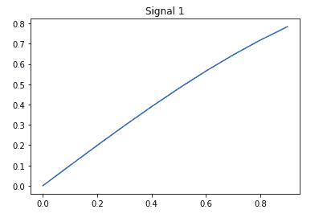
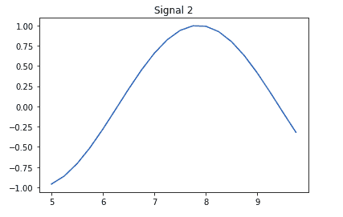
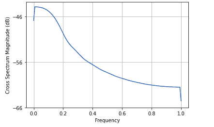

# 使用 Matplotlib 在 Python 中绘制交叉光谱密度

> 原文:[https://www . geeksforgeeks . org/绘图-跨光谱-python 中的密度-使用-matplotlib/](https://www.geeksforgeeks.org/plotting-cross-spectral-density-in-python-using-matplotlib/)

[**MATLAB lotlib**](https://www.geeksforgeeks.org/python-introduction-matplotlib/)是一个综合库，由用于数据可视化的模块组成，就像 MATLAB 一样。Pyplot 是使函数和方法可执行的另一个模块。

## 绘制交叉光谱密度

互谱密度比较两个信号，每个信号来自不同的源，同时考虑两个信号的幅度和相位差。在 Python 中，使用 Pyplot 模块的方法`[matplotlib.pyplot.csd()](https://www.geeksforgeeks.org/matplotlib-pyplot-csd-in-python/)`执行该功能

**语法:**

```py
matplotlib.pyplot.csd(x, y)
```

这里，x 和 y 是一维数组或具有数据的序列。

**让我们获取两个信号并绘制它们的 CSD:**

1.  信号 1 的时间周期为 0 至 1 秒，相位角为 0.1 弧度，频率使用`sin()`函数计算。
2.  同样，信号 2 的时间周期为 5 至 10 秒，相位角为 0.25 弧度。
3.  取这两个信号，我们画出它们的交叉谱密度。

**示例 1:** 绘制信号 1

```py
import numpy as np
import matplotlib.pyplot as plt

time = np.arange(0, 1, 0.1)
amp = np.sin(time)

plt.plot(time, amp)
plt.title("Signal 1")

plt.show()
```

**输出:**



**示例 2:** 绘制信号 2

```py
import numpy as np
import matplotlib.pyplot as plt

t = np.arange(5, 10, 0.25)
ampl = np.sin(t)

plt.plot(t, ampl)
plt.title("Signal 2")

plt.show()
```

**输出:**



**实施例 3:** 绘制交叉光谱密度

```py
import numpy as np
import matplotlib.pyplot as plt

# Signal 1
time = np.arange(0, 1, 0.1)
amp = np.sin(time)

# Signal 2
t = np.arange(5, 10, 0.25)
ampl = np.sin(t)

# Cross-spectral density
plt.csd(amp, ampl)

plt.show()
```

**输出:**



**示例 4:** 使用离散列表或数组

```py
import numpy as np
import matplotlib.pyplot as plt

a = np.arange(5)
b = np.arange(10, 30)

plt.csd(a, b)
plt.show()
```

**输出:**

