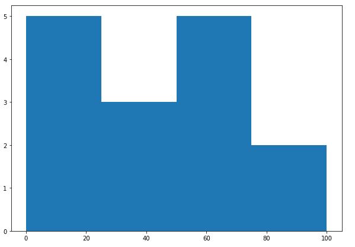
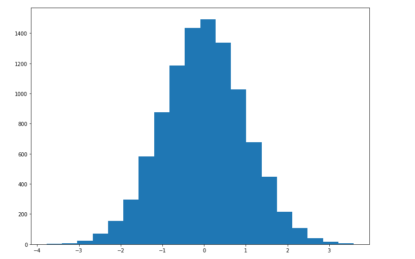
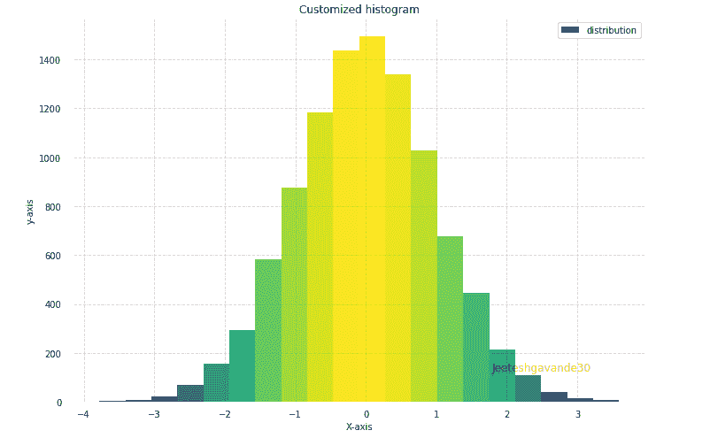

# 使用 Matplotlib 在 Python 中绘制直方图

> 原文:[https://www . geesforgeks . org/绘图-python 中的直方图-使用-matplotlib/](https://www.geeksforgeeks.org/plotting-histogram-in-python-using-matplotlib/)

直方图基本上用于表示以某些组的形式提供的数据。它是数值数据分布图形表示的精确方法。这是一种条形图，其中 X 轴表示面元范围，Y 轴给出频率信息。

## 创建直方图

要创建直方图，第一步是创建范围的 bin，然后将整个范围的值分布到一系列区间中，并计算每个区间中的值。箱被清楚地标识为连续的、不重叠的变量区间。matplotlib.pyplot.hist()函数用于计算和创建 x 的直方图。

下表显示了 matplotlib.pyplot.hist()函数接受的参数:

<figure class="table">

| 属性 | 参数 |
| --- | --- |
| x | 数组或数组序列 |
| 垃圾箱 | 可选参数包含整数、序列或字符串 |
| 密度 | 可选参数包含布尔值 |
| 范围 | 可选参数表示箱的上限和下限 |
| 主机类型 | 用于创建直方图类型的可选参数[条形图、条形图堆叠图、阶梯图、阶梯填充图]，默认为“条形图” |
| 排列 | 可选参数控制直方图的绘制[左、右、中] |
| 砝码 | 可选参数包含与 x 维度相同的权重数组 |
| 底部 | 每个箱柜总线的位置 |
| 宽度 | 可选参数，即条形相对于箱宽的相对宽度 |
| 颜色 | 用于设置颜色或颜色规格序列的可选参数 |
| 标签 | 与多个数据集匹配的可选参数字符串或字符串序列 |
| 原木 | 用于设置对数刻度直方图轴的可选参数 |

</figure>

让我们创建一些随机值的基本直方图。下面的代码创建了一些随机值的简单直方图:

## 蟒蛇 3

```
from matplotlib import pyplot as plt
import numpy as np

# Creating dataset
a = np.array([22, 87, 5, 43, 56,
              73, 55, 54, 11,
              20, 51, 5, 79, 31,
              27])

# Creating histogram
fig, ax = plt.subplots(figsize =(10, 7))
ax.hist(a, bins = [0, 25, 50, 75, 100])

# Show plot
plt.show()
```

**输出:**



## 直方图的定制

Matplotlib 提供了一系列不同的自定义直方图的方法。
matplotlib.pyplot.hist()函数本身提供了很多属性，借助这些属性我们可以修改一个直方图。hist()函数提供了一个 patches 对象，该对象提供了对所创建对象的属性的访问，使用它我们可以根据自己的意愿修改绘图。

**例 1:**

## 蟒蛇 3

```
import matplotlib.pyplot as plt
import numpy as np
from matplotlib import colors
from matplotlib.ticker import PercentFormatter

# Creating dataset
np.random.seed(23685752)
N_points = 10000
n_bins = 20

# Creating distribution
x = np.random.randn(N_points)
y = .8 ** x + np.random.randn(10000) + 25

# Creating histogram
fig, axs = plt.subplots(1, 1,
                        figsize =(10, 7),
                        tight_layout = True)

axs.hist(x, bins = n_bins)

# Show plot
plt.show()
```

**输出:**



**示例 2:** 下面的代码修改了上面的直方图，以获得更好的视图和准确的读数。

## 蟒蛇 3

```
import matplotlib.pyplot as plt
import numpy as np
from matplotlib import colors
from matplotlib.ticker import PercentFormatter

# Creating dataset
np.random.seed(23685752)
N_points = 10000
n_bins = 20

# Creating distribution
x = np.random.randn(N_points)
y = .8 ** x + np.random.randn(10000) + 25
legend = ['distribution']

# Creating histogram
fig, axs = plt.subplots(1, 1,
                        figsize =(10, 7),
                        tight_layout = True)

# Remove axes splines
for s in ['top', 'bottom', 'left', 'right']:
    axs.spines[s].set_visible(False)

# Remove x, y ticks
axs.xaxis.set_ticks_position('none')
axs.yaxis.set_ticks_position('none')

# Add padding between axes and labels
axs.xaxis.set_tick_params(pad = 5)
axs.yaxis.set_tick_params(pad = 10)

# Add x, y gridlines
axs.grid(b = True, color ='grey',
        linestyle ='-.', linewidth = 0.5,
        alpha = 0.6)

# Add Text watermark
fig.text(0.9, 0.15, 'Jeeteshgavande30',
         fontsize = 12,
         color ='red',
         ha ='right',
         va ='bottom',
         alpha = 0.7)

# Creating histogram
N, bins, patches = axs.hist(x, bins = n_bins)

# Setting color
fracs = ((N**(1 / 5)) / N.max())
norm = colors.Normalize(fracs.min(), fracs.max())

for thisfrac, thispatch in zip(fracs, patches):
    color = plt.cm.viridis(norm(thisfrac))
    thispatch.set_facecolor(color)

# Adding extra features   
plt.xlabel("X-axis")
plt.ylabel("y-axis")
plt.legend(legend)
plt.title('Customized histogram')

# Show plot
plt.show()
```

**输出:**

