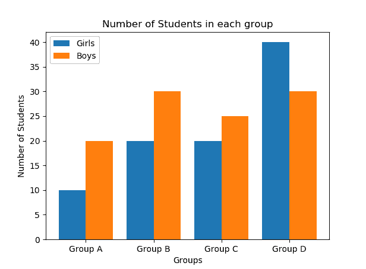
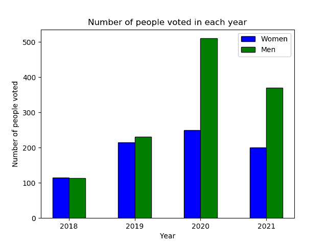
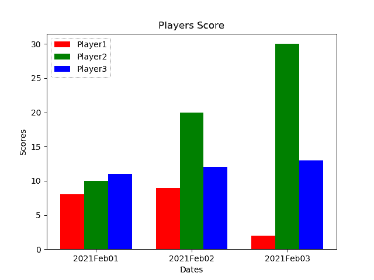

# 使用 Python 中的 Matplotlib 绘制多个条形图

> 原文:[https://www . geesforgeks . org/绘图-多条形图-使用-matplotlib-in-python/](https://www.geeksforgeeks.org/plotting-multiple-bar-charts-using-matplotlib-in-python/)

多条形图也称为**分组条形图**。条形图或条形图具有许多自定义设置，例如多条形图、堆叠条形图和水平条形图。多条形图通常用于比较不同的实体。本文讨论绘制多个条形图。

**示例 1:** 简单多条形图

在这个例子中，我们将看到如何使用 matplotlib 绘制多个条形图，这里我们绘制多个条形图来可视化每个组中的男孩和女孩的数量。

**进场:**

1.  导入所需的库，如 numpy 和 matplotlib，前者用于使用数组进行数值计算，后者用于数据可视化。
2.  用于绘制多个条形图的数据被纳入列表。
3.  numpy 库中的 np.arange()函数用于创建一系列值。在我们的示例中，我们根据组的数量来创建 X 轴值。
4.  使用 plt.bar()函数绘制多个条形图。
5.  为了避免每个组中的条重叠，条从 X 轴偏移-0.2 个单位和+0.2 个单位。
6.  每组条的宽度取 0.4 个单位。
7.  最后，在每组中绘制男孩和女孩的多个条形图。

**代码:**

## 蟒蛇 3

```
import numpy as np 
import matplotlib.pyplot as plt 

X = ['Group A','Group B','Group C','Group D']
Ygirls = [10,20,20,40]
Zboys = [20,30,25,30]

X_axis = np.arange(len(X))

plt.bar(X_axis - 0.2, Ygirls, 0.4, label = 'Girls')
plt.bar(X_axis + 0.2, Zboys, 0.4, label = 'Boys')

plt.xticks(X_axis, X)
plt.xlabel("Groups")
plt.ylabel("Number of Students")
plt.title("Number of Students in each group")
plt.legend()
plt.show()
```

**输出:**



**例 2:**2018-2021 年男女投票人数

**进场:**

1.  导入所需的库，如 numpy 和 matplotlib，前者用于使用数组进行数值计算，后者用于数据可视化。
2.  多个条形图的男性和女性数据被纳入一个列表，以便于绘图。
3.  numpy 库中的 np.arange()函数用于创建一系列值。
4.  使用 matplotlib 库中的 plt.bar()函数绘制多个条形图。
5.  为了避免每个组中的条重叠，在本例中，条从 X 轴偏移了 0.25 个单位。
6.  每组杆的宽度取 0.25 个单位。
7.  X 轴标签(年)和 X 轴刻度是根据我们的可视化要求绘制的。
8.  最后，绘制了每年投票的男性和女性人数的多条形图。

**代码:**

## 蟒蛇 3

```
import numpy as np
import matplotlib.pyplot as plt

Women = [115, 215, 250, 200]
Men = [114, 230, 510, 370]

n=4
r = np.arange(n)
width = 0.25

plt.bar(r, Women, color = 'b',
        width = width, edgecolor = 'black',
        label='Women')
plt.bar(r + width, Men, color = 'g',
        width = width, edgecolor = 'black',
        label='Men')

plt.xlabel("Year")
plt.ylabel("Number of people voted")
plt.title("Number of people voted in each year")

# plt.grid(linestyle='--')
plt.xticks(r + width/2,['2018','2019','2020','2021'])
plt.legend()

plt.show()
```

**输出:**



**示例 3:不同玩家在不同日期的分数**

**进场:**

1.  导入所需的库，如 numpy 和 matplotlib，前者用于使用数组进行数值计算，后者用于数据可视化。
2.  numpy 库中的 np.arange()函数用于创建一个值范围(这里是 3 个值)。
3.  使用 matplotlib 库中的 plt.bar()函数绘制多个条形图。在本例中，日期绘制在 X 轴上，球员得分绘制在 Y 轴上。
4.  为了避免每个组中的条重叠，这些条从前一个条偏移了 0.25 个单位。
5.  每组条形的宽度取 0.25 个不同颜色的单位。
6.  在我们的可视化中，X 轴标签和 X 刻度是根据需要绘制的。
7.  最后，绘制了不同玩家在不同日期的得分的多条形图。

**代码:**

## 蟒蛇 3

```
import numpy as np
import matplotlib.pyplot as plt

N = 3
ind = np.arange(N) 
width = 0.25

xvals = [8, 9, 2]
bar1 = plt.bar(ind, xvals, width, color = 'r')

yvals = [10, 20, 30]
bar2 = plt.bar(ind+width, yvals, width, color='g')

zvals = [11, 12, 13]
bar3 = plt.bar(ind+width*2, zvals, width, color = 'b')

plt.xlabel("Dates")
plt.ylabel('Scores')
plt.title("Players Score")

plt.xticks(ind+width,['2021Feb01', '2021Feb02', '2021Feb03'])
plt.legend( (bar1, bar2, bar3), ('Player1', 'Player2', 'Player3') )
plt.show()
```

**输出:**

