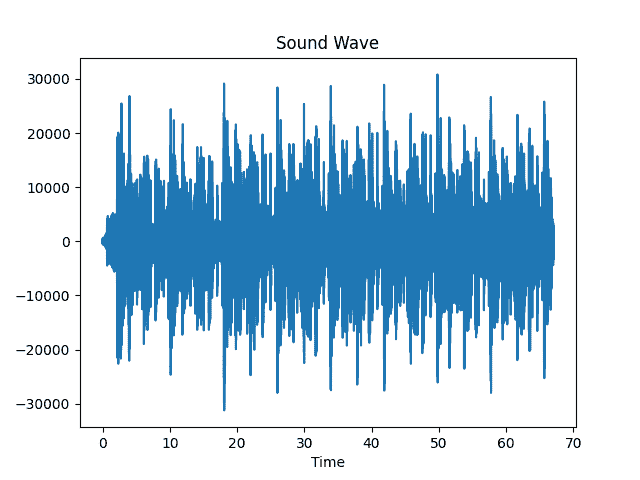

# 使用 Python 和 Matplotlib 在图形上绘制各种声音

> 原文:[https://www . geeksforgeeks . org/标绘-各种声音在图形上-使用-python-and-matplotlib/](https://www.geeksforgeeks.org/plotting-various-sounds-on-graphs-using-python-and-matplotlib/)

在本文中，我们将探索使用 Python 和 Matplotlib 可视化声波的方法。

### 需要的模块

**1。**[**Matplotlib**](https://www.geeksforgeeks.org/python-introduction-matplotlib/)**:**使用以下命令安装 Matplotlib:

```py
pip install matplotlib

```

**2。**[**Numpy**](https://www.geeksforgeeks.org/numpy-in-python-set-1-introduction/)**:**Numpy 安装自动安装 Matplotlib。但是，如果您遇到任何导入错误，请使用下面的命令安装 Numpy

```py
pip install numpy

```

**注意:**如果你和我一样在 Linux 上，那么你可能需要使用 **pip3** 而不是 **pip** 或者你可以创建一个虚拟环境并运行上面的命令。

### 方法

*   导入 matplotlib、Numpy、wave 和 sys 模块。
*   使用 *wave.open()* 方法打开音频文件。
*   使用*读取帧*()功能读取打开的声波的所有帧。
*   使用 *getframrate* ()功能将帧速率存储在变量中。
*   最后，使用帧速率以秒为单位绘制 x 轴。
*   使用 matplotlib.figure()函数绘制派生图形
*   按照要求使用标签。

下面是实现。

## 蟒蛇 3

```py
# imports
import matplotlib.pyplot as plt
import numpy as np
import wave, sys

# shows the sound waves
def visualize(path: str):

    # reading the audio file
    raw = wave.open(path)

    # reads all the frames 
    # -1 indicates all or max frames
    signal = raw.readframes(-1)
    signal = np.frombuffer(signal, dtype ="int16")

    # gets the frame rate
    f_rate = raw.getframerate()

    # to Plot the x-axis in seconds 
    # you need get the frame rate 
    # and divide by size of your signal
    # to create a Time Vector 
    # spaced linearly with the size 
    # of the audio file
    time = np.linspace(
        0, # start
        len(signal) / f_rate,
        num = len(signal)
    )

    # using matlplotlib to plot
    # creates a new figure
    plt.figure(1)

    # title of the plot
    plt.title("Sound Wave")

    # label of x-axis
    plt.xlabel("Time")

    # actual ploting
    plt.plot(time, signal)

    # shows the plot 
    # in new window
    plt.show()

    # you can also save
    # the plot using
    # plt.savefig('filename')

if __name__ == "__main__":

    # gets the command line Value
    path = sys.argv[1]

    visualize(path)
```

**输出:**



所以，我们完成了编码，现在是关键时刻。让我们看看它是否真的有效。您可以尝试任何音频文件，但要确保它必须是一个 **wav** 文件。如果您有一些其他的文件类型，那么您可以使用 **ffmpeg** 将其转换为 wav 文件。如果你想，那么请随意下载我们将使用的音频文件。你可以使用这个[链接](https://file-examples.com/wp-content/uploads/2017/11/file_example_WAV_1MG.wav)下载，但是也可以尝试其他文件。
要运行代码，需要在命令行中传递音频文件的路径。为此，请在您的终端中键入以下内容:

```py
python soundwave.py sample_audio.wav

```

需要注意的是，Python 文件的名称是 **soundwave.py** ，音频文件的名称是 **sample_audio.wav** 。你需要根据你的系统改变这些。现在，一个新的窗口应该已经弹出，应该会看到一个声波图。如果你用过我的音频，那么你的剧情应该是这样的。