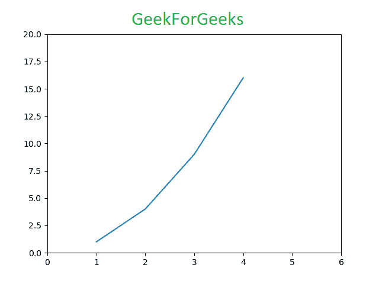
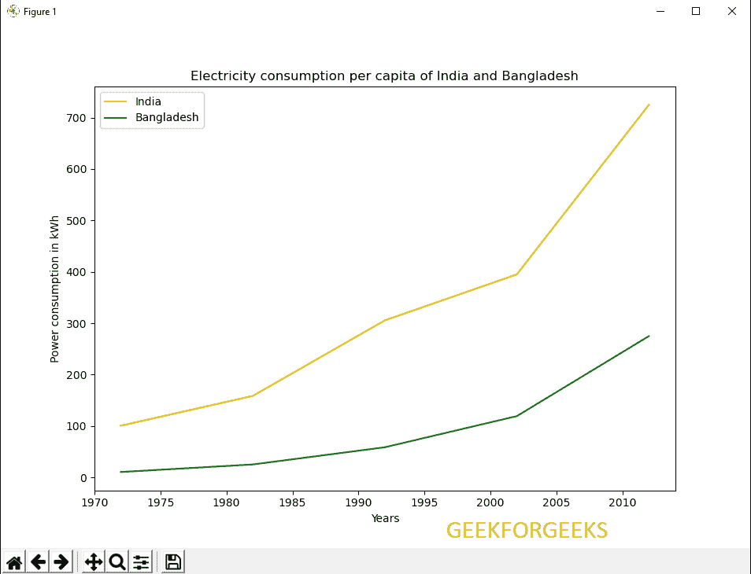
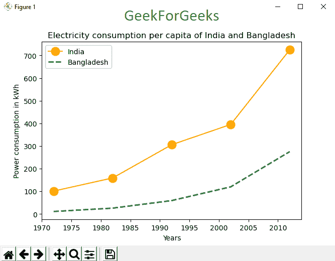

# matplot lib

中的 Pyplot

> 哎哎哎::1230【https://www . geeksforgeeks . org/pyplot-in-matplot lib/

**Matplotlib** 是一个绘图库，用于在 Python 中创建静态、动画和交互式可视化。Matplotlib 可用于 Python 脚本、Python 和 IPython 外壳、web 应用服务器以及各种图形用户界面工具包，如 Tkinter、awxPython 等。

**注:**更多信息请参考[Python Matplotlib–概述](http://geeksforgeeks.org/python-matplotlib-an-overview/)

#### 装置

要使用 Pyplot，我们必须首先下载 matplotlib 模块。最好的方法是–

```py
pip install matplotlib
```

## Pyplot

**Pyplot** 是一个 Matplotlib 模块，提供类似 MATLAB 的界面。Matplotlib 被设计成和 MATLAB 一样好用，具有使用 Python 的能力和免费开源的优势。每个 pyplot 函数都会对图形进行一些更改:例如，创建图形、在图形中创建绘图区域、在绘图区域中绘制一些线条、用标签装饰图形等。我们可以使用 Pyplot 的各种图是**线图**、**直方图**、**散点图**、**三维图**、**图像**、**轮廓**和**极坐标图**。

**语法:**

> matplotlib.pyplot.plot(*args，scalex=True，scaley=True，data=None，**kwargs)

使用 pyplot 创建图形和可视化既快速又简单–

```py
# Python program to show plot function

import matplotlib.pyplot as plt

plt.plot([1, 2, 3, 4], [1, 4, 9, 16])
plt.axis([0, 6, 0, 20])
plt.show()
```

**输出:**


绘图功能在具有指定比例的线性图形中标记 x 坐标(1，2，3，4)和 y 坐标(1，4，9，16)。[/标题]

**参数:**该功能接受参数，使我们能够设置轴比例和图表格式。这些参数如下

*   **绘制(x，y):** 使用默认线条样式和颜色绘制 x 和 y。
*   **绘图.轴([xmin，xmax，ymin，ymax])** :将 x 轴和 y 轴从最小值缩放到最大值
*   **地块。(x，y，color='green '，marker='o '，linestyle= '虚线'，linewidth=2，markersize=12):** 使用大小为 12 的圆形标记和宽度为 2 的绿色线条标记 x 和 y 坐标
*   **绘图. xlabel('X 轴')**:命名 X 轴
*   **plot.ylabel('Y 轴')**:命名 Y 轴
*   **绘图(x，y，标签= '采样线')**绘制的采样线将显示为图例

举例来说，我们将使用印度和孟加拉国的电力消耗数据集。这里，我们使用[谷歌公共数据](https://www.google.com.pk/publicdata/explore?ds=d5bncppjof8f9_&met_y=sp_pop_totl&idim=country:PAK:BGD&hl=en&dl=en#!ctype=l&strail=false&bcs=d&nselm=h&met_y=eg_use_elec_kh_pc&scale_y=lin&ind_y=false&rdim=region&idim=country:IND:BGD&ifdim=region&hl=en_US&dl=en&ind=false)作为数据源。

**示例 1:线性图**

```py
# Python Program to illustrate Linear Plotting

import matplotlib.pyplot as plt

# year contains the x-axis values
# and e-india & e-bangladesh
# are the y-axis values for plotting  

year = [1972, 1982, 1992, 2002, 2012]
e_india = [100.6, 158.61, 305.54, 394.96, 724.79]
e_bangladesh = [10.5, 25.21, 58.65, 119.27, 274.87]

# plotting of x-axis(year) and 
# y-axis(power consumption)
with different colored labels of two countries 

plt.plot(year, e_india, color ='orange', 
         label ='India')

plt.plot(year, e_bangladesh, color ='g', 
         label ='Bangladesh')

# naming of x-axis and y-axis
plt.xlabel('Years')
plt.ylabel('Power consumption in kWh')

# naming the title of the plot
plt.title('Electricity consumption per capita\
 of India and Bangladesh')

plt.legend()
plt.show()
```

**输出:**



**示例 2:带有线条格式的线性绘图**

```py
# Python Program to illustrate Linear Plotting

import matplotlib.pyplot as plt

year = [1972, 1982, 1992, 2002, 2012]
e_india = [100.6, 158.61, 305.54, 
           394.96, 724.79]

e_bangladesh = [10.5, 25.21, 58.65,
                119.27, 274.87]

# formatting of line style and 
# plotting of co-ordinates
plt.plot(year, e_india, color ='orange',
         marker ='o', markersize = 12, 
         label ='India')

plt.plot(year, e_bangladesh, color ='g',
         linestyle ='dashed', linewidth = 2,
         label ='Bangladesh')

plt.xlabel('Years')
plt.ylabel('Power consumption in kWh')

plt.title('Electricity consumption per \
capita of India and Bangladesh')

plt.legend()
plt.show()
```

**输出:**

