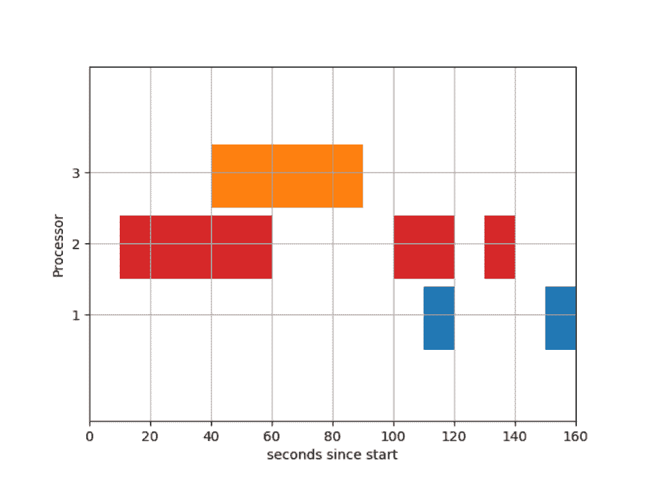

# Python |使用 Matplotlib 的基本甘特图

> 原文:[https://www . geesforgeks . org/python-basic-甘特图-使用-matplotlib/](https://www.geeksforgeeks.org/python-basic-gantt-chart-using-matplotlib/)

**先决条件:** [Matplotlib 简介](https://www.geeksforgeeks.org/python-introduction-matplotlib/)
在本文中，我们将讨论如何使用 Matplotlib 在 Python 中绘制**甘特图**。
甘特图是项目进度或任务进度(在操作系统中)的图形描述。它是一种条形图，显示项目中包括资源或截止日期在内的几个元素的开始和完成日期。第一张甘特图是 19 世纪 90 年代中期由波兰工程师凯罗尔·阿达米耶茨基设计的，他在波兰南部经营一家钢铁厂，对管理思想和技术产生了兴趣。在阿达米耶茨基之后大约 15 年，美国工程师、项目管理顾问亨利·甘特设计了他自己版本的图表，并以“甘特图”闻名。
**甘特图的一些用途:**

*   项目进度。
*   处理器上的任务调度

任务调度的甘特图示例如下所示:



我们将使用 matplotlib 中可用的 break _ barh 类型的图表来绘制甘特图。
以下是生成上述 ganntt 图表的代码:

## 蟒蛇 3

```py
# Importing the matplotlib.pyplot
import matplotlib.pyplot as plt

# Declaring a figure "gnt"
fig, gnt = plt.subplots()

# Setting Y-axis limits
gnt.set_ylim(0, 50)

# Setting X-axis limits
gnt.set_xlim(0, 160)

# Setting labels for x-axis and y-axis
gnt.set_xlabel('seconds since start')
gnt.set_ylabel('Processor')

# Setting ticks on y-axis
gnt.set_yticks([15, 25, 35])
# Labelling tickes of y-axis
gnt.set_yticklabels(['1', '2', '3'])

# Setting graph attribute
gnt.grid(True)

# Declaring a bar in schedule
gnt.broken_barh([(40, 50)], (30, 9), facecolors =('tab:orange'))

# Declaring multiple bars in at same level and same width
gnt.broken_barh([(110, 10), (150, 10)], (10, 9),
                         facecolors ='tab:blue')

gnt.broken_barh([(10, 50), (100, 20), (130, 10)], (20, 9),
                                  facecolors =('tab:red'))

plt.savefig("gantt1.png")
```

让我们逐一了解不同的代码:

```py
fig, gnt = plt.subplots()
```

*   这里，我们声明了一个用于绘制图表的数字“gnt”。

```py
gnt.set_ylim(0, 50)
gnt.set_xlim(0, 160)
```

*   在这里，我们声明了图表的 X 轴和 Y 轴的极限。默认情况下，X 轴和 Y 轴的下限是 0，两个轴的上限是最高 X 轴值和 Y 轴值的 5 倍。

```py
gnt.set_xlabel('seconds since start')
gnt.set_ylabel('Processor')
```

*   在这里，我们为轴添加了标签。默认情况下，没有标签。

```py
gnt.set_yticks([15, 25, 35])
gnt.set_yticklabels(['1', '2', '3'])
```

*   这里，我们在 Y 轴上添加了刻度。我们也可以给它们贴上标签。默认情况下，轴在界限内均匀划分。

```py
gnt.grid(True)
```

*   这里，我们将 grid()设置为 True 以显示网格。默认情况下，它是 False。

```py
gnt.broken_barh([(40, 50)], (30, 9), facecolors=('tab:orange'))
```

*   这里，我们在图表中添加了一个条形图。在本例中，该条表示运行时间为 40 到(40+50)= 90 秒。
    **基本论点:**

```py
gnt.broken_barh([(start_time, duration)],
                 (lower_yaxis, height),
                 facecolors=('tab:colours'))
```

*   默认情况下，颜色设置为蓝色。
    我们可以同时申报多个酒吧:

```py
gnt.broken_barh([(10, 50), (100, 20), (130, 10)], (20, 9),
                                  facecolors=('tab:red'))
```

*   我们还可以通过将“edge color”属性设置为任何颜色来添加边缘颜色。

```py
plt.savefig("gantt1.png")
```

*   我们将图形保存在 png 文件中。

**参考:** [断巴示例 Matplotlib 文档](https://matplotlib.org/gallery/lines_bars_and_markers/broken_barh.html#sphx-glr-gallery-lines-bars-and-markers-broken-barh-py)