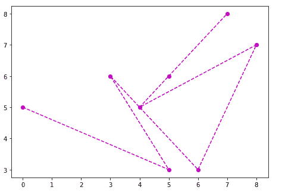

# Python | Matplotlib 使用面向对象的 API 进行图形绘制

> 原文:[https://www . geesforgeks . org/python-matplotlib-graph-绘图-使用-面向对象-api/](https://www.geeksforgeeks.org/python-matplotlib-graph-plotting-using-object-oriented-api/)

在面向对象的应用编程接口中，首先，我们创建一个画布，我们必须在其上绘制图形，然后我们绘制图形。许多人更喜欢面向对象的应用编程接口，因为它比函数式应用编程接口更容易使用。

让我们试着用一些例子来理解这一点。

**Example #1:**

```
# importing matplotlib library
import matplotlib.pyplot as plt

# x axis values
x =[0, 5, 3, 6, 8, 4, 5, 7]

# y axis values
y =[5, 3, 6, 3, 7, 5, 6, 8]

# creating the canvas
fig = plt.figure()

# setting the size of canvas
axes = fig.add_axes([0, 0, 1, 1])

# plotting the graph
axes.plot(x, y, 'mo--')

# displaying the graph
plt.show()
```

**输出:**


在第一个例子中，一切都非常清楚，但是有一件事需要关注，“设置画布的大小”，这基本上意味着设置您想要在其上绘制图形的图形的大小，语法如下。

```
add_axes([left, bottom, width, height])
```

左侧、底部、高度和宽度的值介于 0 到 1 之间。另一个例子会让你更清楚这个概念。

**例 2:**

```
# importing matplotlib library
import matplotlib.pyplot as plt

# x-axis values
x =[0, 1, 2, 3, 4, 5, 6]

# y-axis values
y =[0, 1, 3, 6, 9, 12, 17]

# creating the canvas
fig = plt.figure()

# setting size of first canvas
axes1 = fig.add_axes([0, 0, 0.7, 1])

# plotting graph of first canvas
axes1.plot(x, y, 'mo--')

# setting size of second canvas
axes2 = fig.add_axes([0.1, 0.5, 0.3, 0.3])

# plotting graph of second canvas
axes2.plot(x, y, 'go--')

# displaying both graphs
plt.show()
```