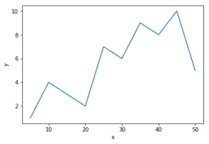
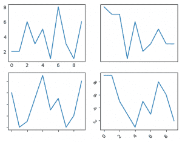
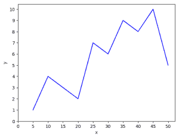

# python | matplot lib . pyplot ticks

> 哎哎哎:# t0]https://www . geeksforgeeks . org/python-matplot lib-pyplot-ticks/

[Matplotlib](https://www.geeksforgeeks.org/graph-plotting-in-python-set-1/) 是 Python 中一个惊人的可视化库，用于数组的 2D 图。Matplotlib 是一个多平台数据可视化库，构建在 NumPy 数组上，旨在与更广泛的 SciPy 堆栈一起工作。它是由约翰·亨特在 2003 年推出的。
可视化的最大好处之一是，它允许我们以易于理解的视觉方式可视化访问大量数据。Matplotlib 由几个图组成，如直线、条形图、散点图、直方图等。
**刻度**是用于显示坐标轴上特定点的值。它可以是数字或字符串。每当我们绘制图表时，坐标轴都会调整并采用默认刻度。Matplotlib 的默认刻度通常在常见情况下就足够了，但绝不是每个图的最佳刻度。在这里，我们将看到如何根据我们的需要定制这些刻度。
**参数**:

<figure class="table">

| 参数 | 价值 | 使用 |
| --- | --- | --- |
| 轴 | x，y，两者 | 告诉操作哪个轴 |
| 重置 | 真，假 | 如果为真，则将所有参数设置为默认值 |
| 方向 | 输入，输出，输入 | 将刻度放在内部或外部或两者都放 |
| 长度 | 浮动 | 设置刻度的长度 |
| 宽度 | 浮动 | 设置刻度的宽度 |
| 旋转 | 浮动 | 绕轴旋转刻度 |
| 颜色；色彩；色调 | 颜色 | 更改刻度颜色 |
| 衬垫 | 浮动 | 刻度和标签之间的点距离 |

</figure>

**示例#1:** 默认图

## 蟒蛇 3

```
# importing required modules
import matplotlib.pyplot as plt

# values of x and y axes
x = [5, 10, 15, 20, 25, 30, 35, 40, 45, 50]
y = [1, 4, 3, 2, 7, 6, 9, 8, 10, 5]

plt.plot(x, y)
plt.xlabel('x')
plt.ylabel('y')

plt.show()
```

**输出:**



**示例#2:** 玩弄刻度
假设我们不想显示刻度的值，或者希望我们的刻度倾斜，或者希望进行任何其他自定义。我们可以这样做。

## 计算机编程语言

```
# importing libraries
import random
import matplotlib.pyplot as plt

fig = plt.figure()

# function to get random values for graph
def get_graphs():
    xs =[]
    ys =[]
    for i in range(10):
        xs.append(i)
        ys.append(random.randrange(10))
    return xs, ys

# defining subplots
ax1 = fig.add_subplot(221)
ax2 = fig.add_subplot(222)
ax3 = fig.add_subplot(223)
ax4 = fig.add_subplot(224)

# hiding the marker on axis
x, y = get_graphs()
ax1.plot(x, y)
ax1.tick_params(axis ='both', which ='both', length = 0)

# One can also change marker length
# by setting (length = any float value)

# hiding the ticks and markers
x, y = get_graphs()
ax2.plot(x, y)
ax2.axes.get_xaxis().set_visible(False)
ax2.axes.get_yaxis().set_visible(False)

# hiding the values and displaying the marker
x, y = get_graphs()
ax3.plot(x, y)
ax3.yaxis.set_major_formatter(plt.NullFormatter())
ax3.xaxis.set_major_formatter(plt.NullFormatter())

# tilting the ticks (usually needed when
# the ticks are densely populated)
x, y = get_graphs()
ax4.plot(x, y)
ax4.tick_params(axis ='x', rotation = 45)
ax4.tick_params(axis ='y', rotation =-45)

plt.show()
```

**输出:**



**示例#3:** 更改刻度值。
在第一个例子中，x 轴和 y 轴分别除以值 10 和 2。让我们把它变成 5 和 1。

## 蟒蛇 3

```
# importing libraries
import matplotlib.pyplot as plt
import numpy as np

# values of x and y axes
x = [5, 10, 15, 20, 25, 30, 35, 40, 45, 50]
y = [1, 4, 3, 2, 7, 6, 9, 8, 10, 5]

plt.plot(x, y, 'b')
plt.xlabel('x')
plt.ylabel('y')

# 0 is the initial value, 51 is the final value
# (last value is not taken) and 5 is the difference
# of values between two consecutive ticks
plt.xticks(np.arange(0, 51, 5))
plt.yticks(np.arange(0, 11, 1))
plt.show()
```

**输出:**



与第一个示例的主要区别是:
PLT . xtpicks(np.arange(0，51，5))
plt.yticks(np.arange(0，11，1))
更改 NP . arange 中的值将会更改 ticks 的范围。

**参考:** [Matplotlib 滴答](https://matplotlib.org/api/axis_api.html)。