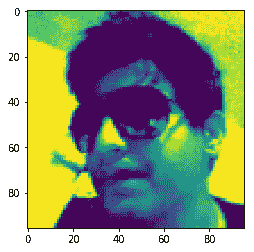
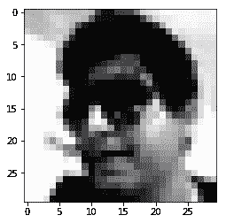
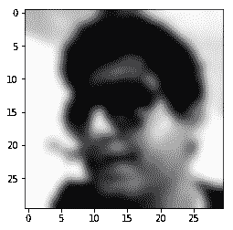
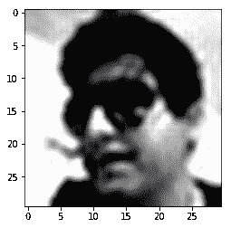

# Python |使用 Matplotlib 处理 PNG 图像

> 原文:[https://www . geesforgeks . org/python-work-with-png-images-use-matplotlib/](https://www.geeksforgeeks.org/python-working-with-png-images-using-matplotlib/)

Matplotlib 是一个神奇的 Python 可视化库，用于数组的 2D 图。Matplotlib 绘图库是一个基于 NumPy 阵列的多平台数据可视化库，旨在与更广泛的 SciPy 堆栈协同工作。它是由约翰·亨特在 2002 年推出的。
可视化的最大好处之一是，它允许我们以易于消化的视觉方式可视化访问海量数据。Matplotlib 由几个图组成，如直线、条形图、散点图、直方图等。

在本文中，我们将看到如何使用 Matplotlib 处理 PNG 图像。

**代码#1:** 使用 Matplotlib 读取 PNG 图像

```py
# importing pyplot and image from matplotlib
import matplotlib.pyplot as plt
import matplotlib.image as img

# reading png image file
im = img.imread('imR.png')

# show image
plt.imshow(im)
```

**输出:**


**代码#2:** 对图像应用伪彩色

伪彩色有助于增强图像的对比度。

```py
# importing pyplot and image from matplotlib
import matplotlib.pyplot as plt
import matplotlib.image as img

# reading png image
im = img.imread('imR.png')

# applying pseudocolor 
# default value of colormap is used.
lum = im[:, :, 0]

# show image
plt.imshow(lum)
```

**输出:**


**代码#3:** 我们可以用 colorbar 为 colormap 提供另一个值。

```py
# importing pyplot and image from matplotlib
import matplotlib.pyplot as plt
import matplotlib.image as img

# reading png image
im = img.imread('imR.png')
lum = im[:, :, 0]

# setting colormap as hot
plt.imshow(lum, cmap ='hot')
plt.colorbar()
```

**输出:**


**插值方案:**
插值计算像素“应该”的颜色或值，当我们调整图像大小但想要相同的信息时，这是需要的。调整图像大小时会缺少空间，因为像素是离散的，插值是填充空间的方式。

**代码# 4:** 插值

```py
# importing PIL and matplotlib
from PIL import Image 
import matplotlib.pyplot as plt

# reading png image  file
img = Image.open('imR.png')

# resizing the image
img.thumbnail((50, 50), Image.ANTIALIAS)
imgplot = plt.imshow(img)
```

**输出:**


**代码#6:** 这里使用‘双三次’值进行插值。

```py
# importing pyplot from matplotlib
import matplotlib.pyplot as plt

# importing image from PIL
from PIL import Image 

# reading image
img = Image.open('imR.png')

img.thumbnail((30, 30), Image.ANTIALIAS) 

# bicubic used for interpolation
imgplot = plt.imshow(img, interpolation ='bicubic')
```

**输出:**


**代码# 7:**“sinc”值用于插值。

```py
# importing PIL and matplotlib
from PIL import Image 
import matplotlib.pyplot as plt

# reading image
img = Image.open('imR.png')

img.thumbnail((30, 30), Image.ANTIALIAS)

# sinc used for interpolation
imgplot = plt.imshow(img, interpolation ='sinc')
```

**输出:**


参考:[https://matplotlib . org/gallery/images _ contours _ and _ fields/interpolation _ methods . html](https://matplotlib.org/gallery/images_contours_and_fields/interpolation_methods.html)