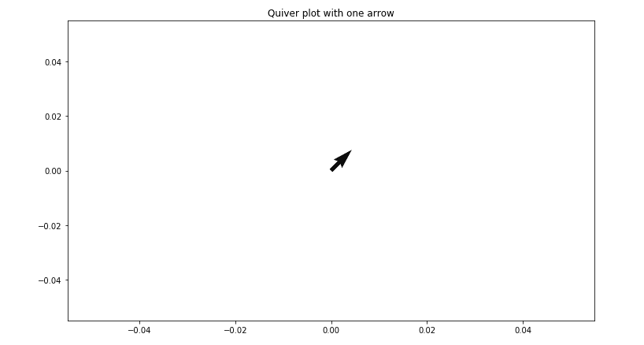
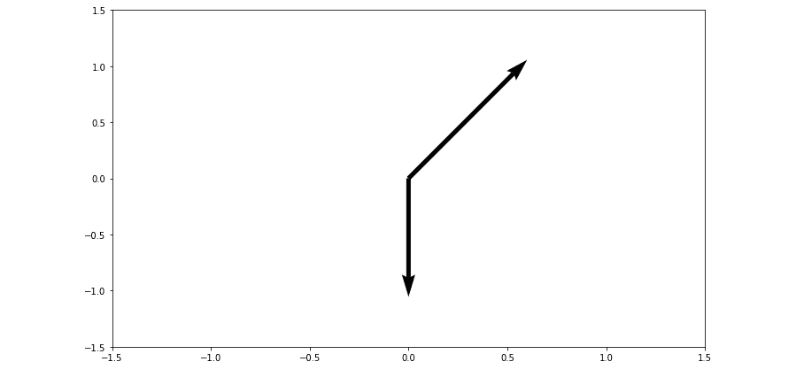
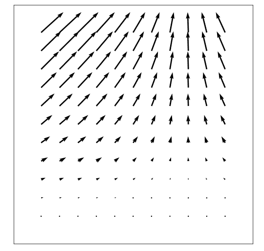
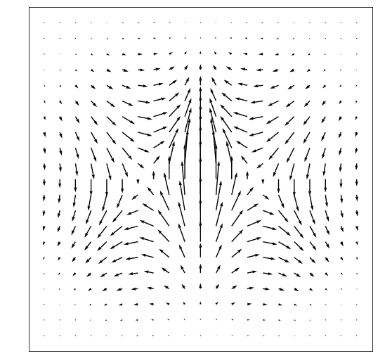

# 马特普洛特利布中的箭袋情节

> 原文:[https://www.geeksforgeeks.org/quiver-plot-in-matplotlib/](https://www.geeksforgeeks.org/quiver-plot-in-matplotlib/)

**颤图**基本上是 2D 图的一种，将向量线显示为箭头。这种类型的图有助于电气工程师在机械工程中可视化电势和显示应力梯度。

## 创建颤图

让我们开始创建一个包含一个箭头的简单颤图，它将解释 Matplotlib 的 ax .颤()函数是如何工作的。ax .箭袋()函数接受四个参数:

**语法:**

```
ax.quiver(x_pos, y_pos, x_dir, y_dir, color) 
```

这里 x_pos 和 y_pos 是箭头的起始位置，而 x_dir 和 y_dir 是箭头的方向。
下图包含一个箭袋箭头，从 x_pos = 0 和 y_pos = 0 开始。箭头的方向指向 x_dir = 1 和 y_dir = 1 处的上方和右侧。

**示例:**

## 蟒蛇 3

```
# Import libraries
import numpy as np
import matplotlib.pyplot as plt

# Creating arrow
x_pos = 0
y_pos = 0
x_direct = 1
y_direct = 1

# Creating plot
fig, ax = plt.subplots(figsize = (12, 7))
ax.quiver(x_pos, y_pos, x_direct, y_direct)
ax.set_title('Quiver plot with one arrow')

# Show plot
plt.show()
```

**输出:**



## 带两个箭头的箭袋图

让我们在穿过两个起点和两个方向的图中添加另一个箭头。通过保持原始箭头从原点(0，0)开始并指向上方和右侧方向(1，1)，并创建从(0，0)开始指向下方方向(0，-1)的第二个箭头。为了清楚地看到起点和终点，我们将使用方法 ax.axis()将轴限制设置为[-1.5，1.5]，并以[x_min，x_max，y_max，y_min]的形式传递参数。通过向 ax .箭袋()方法添加一个额外的参数 scale=value，我们可以管理箭头的长度，使其看起来更长，在图上显示得更好。

**示例:**

## 蟒蛇 3

```
# Import libraries
import numpy as np
import matplotlib.pyplot as plt

# Creating arrow
x_pos = [0, 0]
y_pos = [0, 0]
x_direct = [1, 0]
y_direct = [1, -1]

# Creating plot
fig, ax = plt.subplots(figsize = (12, 7))
ax.quiver(x_pos, y_pos, x_direct, y_direct,
         scale = 5)

ax.axis([-1.5, 1.5, -1.5, 1.5])

# show plot
plt.show()
```

**输出:**



## 使用网格的颤动图

包含两个箭头的箭袋图是一个好的开始，但是将箭头一个一个地添加到箭袋图中太慢太长。因此，为了创建箭头的完全 2D 表面，我们将使用 Numpy 的网格()方法。首先，创建一组名为 X 和 Y 的数组，分别代表箭囊图上每个箭头的 X 和 Y 的起始位置。x、y 箭头的起始位置也可用于定义每个箭头方向的 x 和 y 分量。在下面的图中，u 和 v 表示箭囊箭头的方向阵列，我们将使用下面的等式基于箭头起点定义箭头方向:

```
x_{direction} = cos(x_{starting \ point})
y_{direction} = sin(y_{starting \ point})
```

**示例:**

## 蟒蛇 3

```
# Import libraries
import numpy as np
import matplotlib.pyplot as plt

# Creating arrow
x = np.arange(0, 2.2, 0.2)
y = np.arange(0, 2.2, 0.2)

X, Y = np.meshgrid(x, y)
u = np.cos(X)*Y
v = np.sin(Y)*Y

# creating plot
fig, ax = plt.subplots(figsize =(14, 8))
ax.quiver(X, Y, u, v)

ax.xaxis.set_ticks([])
ax.yaxis.set_ticks([])
ax.axis([-0.3, 2.3, -0.3, 2.3])
ax.set_aspect('equal')

# show plot
plt.show()
```

**输出:**



## 使用渐变的颤动图

让我们创建一个显示梯度函数的颤图。Numpy 的 np，gradient()方法可用于将渐变函数应用于每个箭头的 x，y 起始位置。该等式用于创建以下图表:

```
z = xe^{-x^2-y^2}
```

**示例:**

## 蟒蛇 3

```
# Import libraries
import numpy as np
import matplotlib.pyplot as plt

# Creating arrows
x = np.arange(-2, 2.2, 0.2)
y = np.arange(-2, 2.2, 0.2)

# Creating gradient
X, Y = np.meshgrid(x, y)
z = X * np.exp(-X**2-Y**2)
dx, dy = np.gradient(z)

# Creating plot
fig, ax = plt.subplots(figsize =(9, 9))
ax.quiver(X, Y, dx, dy)

ax.xaxis.set_ticks([])
ax.yaxis.set_ticks([])
ax.set_aspect('equal')

# show plot
plt.show()
```

**输出:**



## 着色颤图

python matplotlib 库的 ax .箭袋()方法提供了一个可选的属性颜色，用于指定箭头的颜色。箭袋颜色属性要求尺寸与位置和方向数组相同。

下面是修改我们之前制作的颤图的代码:

**例 1:**

## 蟒蛇 3

```
# Import libraries
import numpy as np
import matplotlib.pyplot as plt

# Defining subplots
fig, (ax1, ax2) = plt.subplots(1, 2, figsize =(14, 8))

# first subplot
# Creating arrows
x = np.arange(0, 2.2, 0.2)
y = np.arange(0, 2.2, 0.2)
X, Y = np.meshgrid(x, y)
u = np.cos(X)*Y
v = np.sin(y)*Y
n = -2

# Defining color
color = np.sqrt(((v-n)/2)*2 + ((u-n)/2)*2)

# Creating plot
ax1.quiver(X, Y, u, v, color, alpha = 0.8)
ax1.xaxis.set_ticks([])
ax1.yaxis.set_ticks([])
ax1.axis([-0.2, 2.3, -0.2, 2.3])
ax1.set_aspect('equal')
ax1.set_title('meshgrid function')

# second subplot
# Creating arrows
x = np.arange(-2, 2.2, 0.2)
y = np.arange(-2, 2.2, 0.2)
X, Y = np.meshgrid(x, y)
z = X * np.exp(-X**2 -Y**2)
dx, dy = np.gradient(z)
n = -2

# Defining color
color = np.sqrt(((dx-n)/2)*2 + ((dy-n)/2)*2)

# Creating plot
ax2.quiver(X, Y, dx, dy, color)
ax2.xaxis.set_ticks([])
ax2.yaxis.set_ticks([])
ax2.set_aspect('equal')
ax2.set_title('gradient')

# show figure
plt.tight_layout()
plt.show()
```