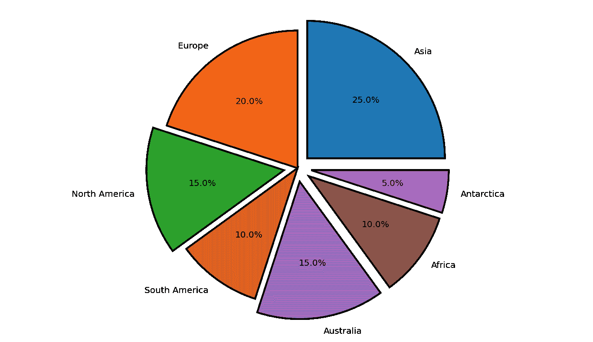
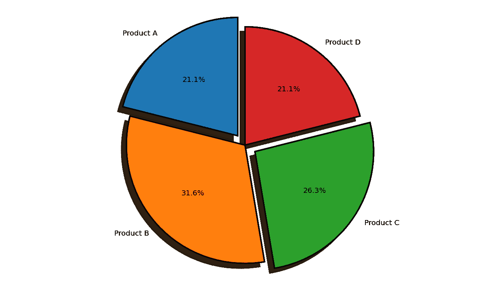

# 在 Matplotlib 中径向移动饼图楔形区

> 原文:[https://www . geesforgeks . org/radial-displace-pie-chart-wedge-in-matplotlib/](https://www.geeksforgeeks.org/radially-displace-pie-chart-wedge-in-matplotlib/)

饼图是划分为多个部分的统计图，代表不同的数据值，总和为 100%。Python 是最常用的数据可视化编程语言之一。Python 有多个数据可视化库，Matplotlib 就是其中之一。Matplotlib 因其简单和易于实现而被广泛使用。matplotlib 库支持创建饼图。分解功能允许分离饼图的切片。用户可以明确指定他们希望分解的部分。分解元组中指定的值决定了切片分解的距离。值越大，切片与饼图中心的距离越大。

**例 1:**

在本例中，导入了 matplotlib.pyplot 模块。大陆和区域数组被初始化。定义了分解元组。必须分割的切片的索引被赋予大于 0 的值。切片从圆心移动元组中指定的距离。为指定的数据绘制饼图。autopct 属性用于指定切片中文本到圆心的距离。startangle 用于指定图表的方向。起始角度的默认值为 0，这意味着绘图从正 X 轴开始。边缘颜色设置为黑色，线宽设置为 2。抗锯齿属性设置为 true，以防止图像出现锯齿效果。

**下面是实现:**

## 蟒蛇 3

```py
import matplotlib.pyplot as plt

# the slices are ordered and 
# plotted counter-clockwise:
continents = ['Asia', 'Europe', 'North America',
              'South America','Australia',
              'Africa','Antarctica']

area = [25, 20, 15, 10,15,10,5]
explode = (0.1, 0, 0.1, 0,0.1,0.1,0.1) 

plt.pie(area, explode = explode, labels = continents,
        autopct = '%1.1f%%',startangle = 0,
        wedgeprops = {"edgecolor" : "black",
                    'linewidth' : 2,
                    'antialiased': True})

# Equal aspect ratio ensures 
# that pie is drawn as a circle.
plt.axis('equal') 

plt.show()
```

**输出:**



**例 2:**

在本例中，导入了 matplotlib.pyplot 模块。销售和利润数组被初始化。定义了分解元组。必须分割的切片的索引被赋予大于 0 的值。切片从圆心移动元组中指定的距离。为指定的数据绘制饼图。autopct 属性用于指定切片中文本到圆心的距离。startangle 用于指定图表的方向。startangle 的默认值为 0，这意味着绘图从正 X 轴开始。边缘颜色设置为黑色，线宽设置为 2。抗锯齿属性设置为 true，以防止图像出现锯齿效果。

**下面是实现:**

## 蟒蛇 3

```py
import matplotlib.pyplot as plt

# the slices are ordered and plotted counter-clockwise:
sales = ['Product A', 'Product B', 
         'Product C', 'Product D']

profit = [20, 30, 25, 20]
explode = (0.1, 0, 0.1, 0) 

plt.pie(profit, explode = explode, labels = sales,
        autopct = '%1.1f%%',shadow = True,
        startangle = 90,
        wedgeprops = {"edgecolor":"black",
                    'linewidth': 2,
                    'antialiased': True})

# Equal aspect ratio ensures
# that pie is drawn as a circle.
plt.axis('equal')  

plt.show()
```

**输出:**

