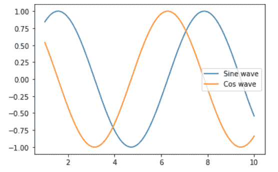
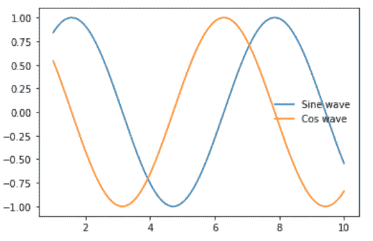

# 移除 Matplotlib 中的图例边框

> 原文:[https://www . geesforgeks . org/remove-the-legend-border-in-matplotlib/](https://www.geeksforgeeks.org/remove-the-legend-border-in-matplotlib/)

在本文中，我们将学习如何在 [Matplotlib](https://www.geeksforgeeks.org/python-introduction-matplotlib/) 中移除图例边框。让我们讨论一些概念:

*   图例是描述图形元素的区域。在 matplotlib 库中，有一个名为 legend()的函数，用于在轴上放置图例。

**进场:**

1.  汇入资源库(Matplotlib)
2.  导入/创建数据。
3.  绘制图表。
4.  添加图例。
5.  移除图例边框。

**例:**这里是一个有传说的例子。

## 蟒蛇 3

```py
# importing packages
import numpy as np
import matplotlib.pyplot as plt

# create data
x = np.linspace(1, 10, 1000)
y1 = np.sin(x)
y2 = np.cos(x)

# plot graph
plt.plot(x, y1)
plt.plot(x, y2)

# add legend
plt.legend(['Sine wave', 'Cos wave'])
plt.show()
```

**输出:**



**方法 1:(使用 frameon = False)**

## 蟒蛇 3

```py
# importing packages
import numpy as np
import matplotlib.pyplot as plt

# create data
x = np.linspace(1, 10, 1000)
y1 = np.sin(x)
y2 = np.cos(x)

# plot graph
plt.plot(x, y1)
plt.plot(x, y2)

# add legend and remove frame
plt.legend(['Sine wave', 'Cos wave'], frameon=False)
plt.show()
```

**输出:**



**方法二:(使用 legend.get_frame()。set_alpha(0))**

## 蟒蛇 3

```py
# importing packages
import numpy as np
import matplotlib.pyplot as plt

# create data
x = np.linspace(1, 10, 1000)
y1 = np.sin(x)
y2 = np.cos(x)

# plot graph
plt.plot(x, y1)
plt.plot(x, y2)

# add legend
leg = plt.legend(['Sine wave', 'Cos wave'])

# set opacity equal to zero i.e; transparent
leg.get_frame().set_alpha(0)
plt.show()
```

**输出:**

