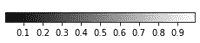
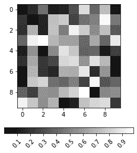
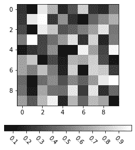
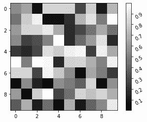
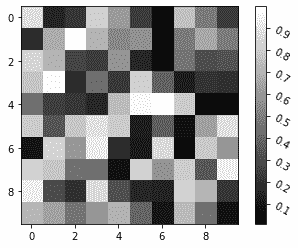
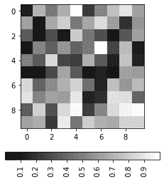
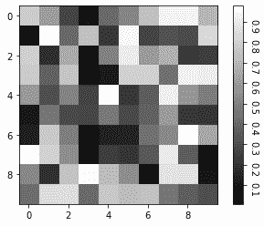

# Matplotlib 中颜色条刻度标签的旋转

> 原文:[https://www . geesforgeks . org/rotation-of-color bar-tick-labels-in-matplotlib/](https://www.geeksforgeeks.org/rotation-of-colorbar-tick-labels-in-matplotlib/)

**颜色条**是一个轴，表示数据值到绘图中使用的颜色的映射。matplotlib 的 pyplot 模块中的 colorbar()函数将一个 colorbar 添加到绘图中，以指示色标。



典型颜色条

有时，为了更好的可视化和理解，需要旋转标签。要更改 colorbar ticklabels 的旋转，所需的旋转角度在中提供:

*   *cbar.ax.set_xticklabels* ，如果彩条方向为水平
*   *cbar.ax.set_yticklabels* ，如果彩条方向垂直

角度正值对应逆时针旋转，负值对应顺时针旋转。此外，我们可以使用“垂直”和“水平”值进行旋转，而不是角度的数值。这些分别相当于 0 和+90。

#### 旋转颜色条标签的步骤:

1.  绘制图表
2.  绘制相应的颜色条
3.  提供刻度和标签
4.  将 ticklabels 的旋转设置为所需的角度

**示例 1:** 以下程序演示了水平颜色条，颜色条标签旋转 45 度。

## 蟒蛇 3

```py
# Import libraries
import matplotlib.pyplot as plt
import numpy as np

# Plot image
a = np.random.random((10, 10))
plt.imshow(a, cmap='gray')

# Plot horizontal colorbar
cbar = plt.colorbar(
    orientation="horizontal", fraction=0.050)

# Set ticklabels
labels = [0, 0.1, 0.2, 0.3, 0.4, 0.5, 0.6,
          0.7, 0.8, 0.9, 1]
cbar.set_ticks(labels)

# Rotate colorbar ticklabels by 45 degrees
# anticlockwise
cbar.ax.set_xticklabels(labels, rotation=45)

plt.show()
```

**输出:**



**示例 2:** 以下程序演示了水平颜色条，颜色条标签旋转-45 度。

## 蟒蛇 3

```py
# Import libraries
import matplotlib.pyplot as plt
import numpy as np

# Plot image
a = np.random.random((10, 10))
plt.imshow(a, cmap='gray')

# Plot horizontal colorbar
cbar = plt.colorbar(
    orientation="horizontal", fraction=0.050)

# Set ticklabels
labels = [0, 0.1, 0.2, 0.3, 0.4, 0.5, 0.6,
          0.7, 0.8, 0.9, 1]
cbar.set_ticks(labels)

# Rotate colorbar ticklabels by 45 degrees clockwise
cbar.ax.set_xticklabels(labels, rotation=-45)

plt.show()
```

**输出:**



**示例 3:** 以下程序演示了颜色条标签旋转 30 度的垂直颜色条。

## 蟒蛇 3

```py
# Import libraries
import matplotlib.pyplot as plt
import numpy as np

# Plot image
a = np.random.random((10, 10))
plt.imshow(a, cmap='gray')

# Plot vertical colorbar
cbar = plt.colorbar(
    orientation="vertical", fraction=0.050)

# Set ticklabels
labels = [0, 0.1, 0.2, 0.3, 0.4, 0.5, 0.6,
          0.7, 0.8, 0.9, 1]
cbar.set_ticks(labels)

# Rotate colorbar ticklabels by 30 degrees
# anticlockwise
cbar.ax.set_yticklabels(labels, rotation=30)

plt.show()
```

**输出:**



**示例 4:** 以下程序演示了颜色条标签旋转-30 度的垂直颜色条。

## 蟒蛇 3

```py
# Import libraries
import matplotlib.pyplot as plt
import numpy as np

# Plot image
a = np.random.random((10, 10))
plt.imshow(a, cmap='gray')

# Plot vertical colorbar
cbar = plt.colorbar(
    orientation="vertical", fraction=0.050)

# Set ticklabels
labels = [0, 0.1, 0.2, 0.3, 0.4, 0.5, 0.6,
          0.7, 0.8, 0.9, 1]
cbar.set_ticks(labels)

# Rotate colorbar ticklabels by 30 degrees clockwise
cbar.ax.set_yticklabels(labels, rotation=-30)

plt.show()
```

**输出:**



**示例 5:** 以下程序演示了水平颜色条和颜色条标签的垂直旋转。

## 蟒蛇 3

```py
# Import libraries
import matplotlib.pyplot as plt
import numpy as np

# Plot image
a = np.random.random((10, 10))
plt.imshow(a, cmap='gray')

# Plot horizontal colorbar
cbar = plt.colorbar(
    orientation="horizontal", fraction=0.050)

# Set ticklabels
labels = [0, 0.1, 0.2, 0.3, 0.4, 0.5, 0.6,
          0.7, 0.8, 0.9, 1]
cbar.set_ticks(labels)

# Rotate colorbar ticklabels by 90 degrees
# anticlockwise using "vertical" value
cbar.ax.set_xticklabels(labels,
                        rotation="vertical")

plt.show()
```

**输出:**



**示例 6:** 以下程序演示了颜色条标签旋转 270 度的垂直颜色条。

## 蟒蛇 3

```py
# Import libraries
import matplotlib.pyplot as plt
import numpy as np

# Plot image
a = np.random.random((10, 10))
plt.imshow(a, cmap='gray')

# Plot vertical colorbar
cbar = plt.colorbar(
    orientation="vertical", fraction=0.050)

# Set ticklabels
labels = [0, 0.1, 0.2, 0.3, 0.4, 0.5, 0.6,
          0.7, 0.8, 0.9, 1]
cbar.set_ticks(labels)

# Rotate colorbar ticklabels by 270 degrees
# anticlockwise
cbar.ax.set_yticklabels(labels, rotation=270)
plt.show()
```

**输出:**

