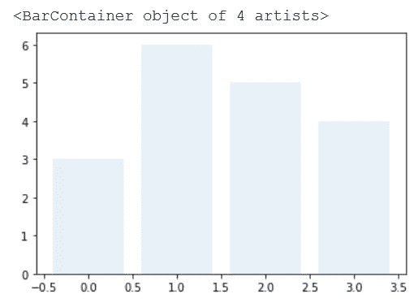
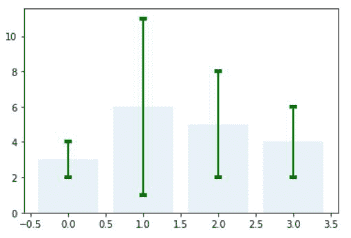
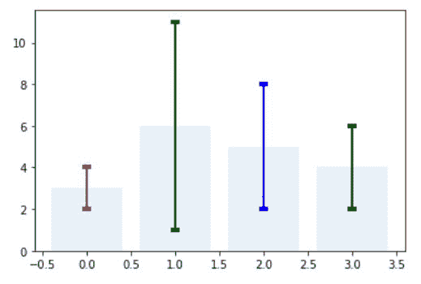
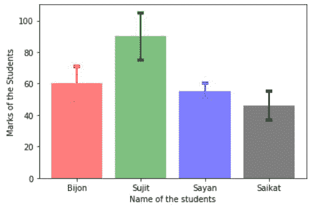
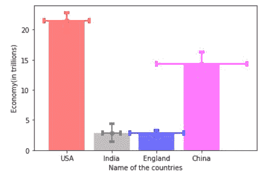

# 在 Matplotlib 中的条形图中设置不同的误差条颜色

> 原文:[https://www . geesforgeks . org/setting-different-error-bar-colors-in-bar-plot-in-matplotlib/](https://www.geeksforgeeks.org/setting-different-error-bar-colors-in-bar-plot-in-matplotlib/)

Python 为我们提供了各种各样的库，Matplotlib 就是其中之一。它用于数据可视化目的。在本文中，我们将在 Matplotlib 的条形图中设置不同的误差线颜色。

## **Matplotlib 中的误差线**

matplotlib 的各种图，如条形图、折线图都可以使用误差线。误差线用于显示测量或计算值的精度。没有误差线，使用 matplotlib 从一组值创建的图看起来具有高精度或高置信度。

> ***语法:**matplotlib . pyplot . error bar(x，y，yerr=None，xerr=None，fmt= "，ecolor=None，elinewidth =None，倾覆= None，barsabove=False，lolims=False，uplims=False，xlolims=False，xuplims=False，errorevery = 1，capthick=None，*，data=None，*\*kwargs)*
> 
> ***参数:**该方法接受以下描述的参数:*
> 
> *   ***x，y:这些参数**是数据点的水平和垂直坐标。*
> *   ***ecolor:** 此参数为可选参数。它是 errorbar 线条的颜色，默认值为 NONE。*
> *   ***埃莉诺:**此参数也是可选参数。它是 errorbar 行的线宽，默认值为 NONE。*
> *   ***翻船:**这个参数也是可选参数。它是误差线的长度，以磅为单位，默认值为 NONE。*
> *   ***barsabove:** 该参数也是可选参数。它包含布尔值“真”，用于在绘图符号上方绘制误差线。其默认值为“假”。*

## **如何在 Matplotlib** 中设置条形图中不同的误差条颜色

**例 1:**

**第一步:**首先创建一个条形图。

## 蟒蛇 3

```
# import matplotlib package
import matplotlib.pyplot as plt

# Store set of values in x 
# and height for plotting 
# the graph
x = range(4)
height = [ 3, 6, 5, 4]

# using tuple unpacking
# to grab fig and axes
fig, ax = plt.subplots()

# Creating the bar plot 
# with opacity=0.1
ax.bar(x, height, alpha = 0.1)
```

**输出:**



**步骤 2:** 将误差线添加到每个点:

## 蟒蛇 3

```
# import matplotlib package
import matplotlib.pyplot as plt

# Store set of values in x 
# and height for plotting 
# the graph
x= range(4)
height=[ 3, 6, 5, 4]

# using tuple unpacking
# to grab fig and axes
fig, ax = plt.subplots()

# Creating the bar plot 
# with opacity=0.1
ax.bar(x, height, alpha = 0.1)

# Zip function acts as an
# iterator for tuples so that
# we are iterating through 
# each set of values in a loop

for pos, y, err in zip(x, height, error):
    ax.errorbar(pos, y, err, lw = 2,
                capsize = 4, capthick = 4, 
                color = "green")

# Showing the plotted error bar
# plot with same color which is
# green
plt.show()
```

**输出:**



**步骤 3:** 在条形图中设置不同的误差线颜色(示例 1):

## 蟒蛇 3

```
# importing matplotlib
import matplotlib.pyplot as plt

# Storing set of values in
# x, height, error and colors for ploting the graph
x= range(4)
height=[ 3, 6, 5, 4]
error=[ 1, 5, 3, 2]
colors = ['red', 'green', 'blue', 'black']

# using tuple unpacking
# to grab fig and axes
fig, ax = plt.subplots()

# ploting the bar plot
ax.bar( x, height, alpha = 0.1)

# Zip function acts as an
# iterator for tuples so that
# we are iterating through 
# each set of values in a loop
for pos, y, err, colors in zip(x, height, 
                               error, colors):

    ax.errorbar(pos, y, err, lw = 2,
                capsize = 4, capthick = 4, 
                color = colors)

# Showing the plotted error bar
# plot with different color 
plt.show()
```

**输出:**



**示例 2:** 在条形图中设置不同的误差线颜色:

## 蟒蛇 3

```
# importing matplotlib package
import matplotlib.pyplot as plt

# importing the numpy package
import numpy as np

# Storing set of values in
# names, x, height, 
# error and colors for ploting the graph
names= ['Bijon', 'Sujit', 'Sayan', 'Saikat']
x=np.arange(4)
marks=[ 60, 90, 55, 46]
error=[ 11, 15, 5, 9]
colors = ['red', 'green', 'blue', 'black']

# using tuple unpacking
# to grab fig and axes
fig, ax = plt.subplots()

# ploting the bar plot
ax.bar(x, marks, alpha = 0.5,
       color = colors)

# Zip function acts as an
# iterator for tuples so that
# we are iterating through 
# each set of values in a loop
for pos, y, err, colors in zip(x, marks,
                               error, colors):

    ax.errorbar(pos, y, err, lw = 2,
                capsize = 4, capthick = 4,
                color = colors)

# Showing the plotted error bar
# plot with different color 
ax.set_ylabel('Marks of the Students')

# Using x_ticks and x_labels
# to set the name of the
# students at each point
ax.set_xticks(x)
ax.set_xticklabels(names)
ax.set_xlabel('Name of the students')

# Showing the plot
plt.show()
```

**输出:**



**示例 3:** 在条形图中设置不同的误差线颜色。

## 蟒蛇 3

```
# importing matplotlib
import matplotlib.pyplot as plt

# importing the numpy package
import numpy as np

# Storing set of values in
# names, x, height, error, 
# error1 and colors for ploting the graph
names= ['USA', 'India', 'England', 'China']
x=np.arange(4)
economy=[21.43, 2.87, 2.83, 14.34]
error=[1.4, 1.5, 0.5, 1.9]
error1=[0.5, 0.2, 0.6, 1]
colors = ['red', 'grey', 'blue', 'magenta']

# using tuple unpacking
# to grab fig and axes
fig, ax = plt.subplots()

# ploting the bar plot
ax.bar(x, economy, alpha = 0.5,
       color = colors)

# Zip function acts as an
# iterator for tuples so that
# we are iterating through 
# each set of values in a loop
for pos, y, err,err1, colors in zip(x, economy,
                                    error, error1, 
                                    colors):

    ax.errorbar(pos, y, err, err1, fmt = 'o',
                lw = 2, capsize = 4, capthick = 4,
                color = colors)

# Showing the plotted error bar
# plot with different color 
ax.set_ylabel('Economy(in trillions)')

# Using x_ticks and x_labels
# to set the name of the
# countries at each point
ax.set_xticks(x)
ax.set_xticklabels(names)
ax.set_xlabel('Name of the countries')

# Showing the plot
plt.show()
```

**输出:**

