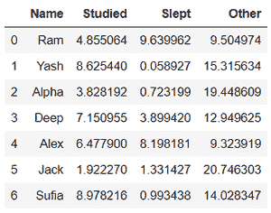
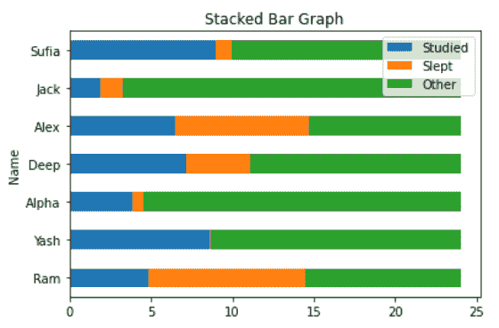
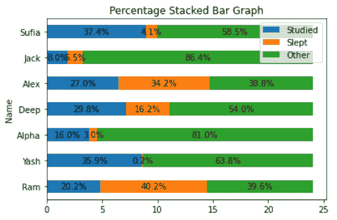
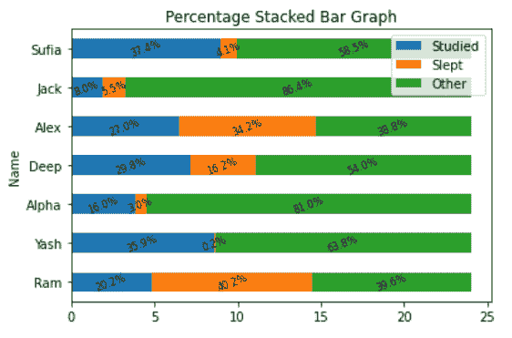

# MatPlotLib 中的堆叠百分比条形图

> 原文:[https://www . geesforgeks . org/stacked-percent-bar-plot-in-matplotlib/](https://www.geeksforgeeks.org/stacked-percentage-bar-plot-in-matplotlib/)

A **堆叠百分比条形图**是一个简单的堆叠形式的条形图，其中包含一个组中每个子组的百分比。堆叠条形图表示一个在另一个之上的不同组。条形的高度取决于组结果组合的结果高度。它从底部到值，而不是从零到值。百分比堆积条形图几乎与[堆积条形图](https://www.geeksforgeeks.org/bar-plot-in-matplotlib/)相同。子组一个接一个地显示，但是数据被规范化，使得每个子组的总和与每个子组的总和相同。

以下示例中使用的数据集如下所示:



数据集可以从[这里](https://drive.google.com/file/d/1V5NITSVYMkI9F-vUI-vxRNGKLUk_GqS5/view?usp=sharing)下载。

**程序:**绘制堆叠百分比条形图的程序是以下步骤，下面通过示例进行描述:

**1。使用数据(数据集、字典等)绘制堆叠条形图。).**

## 蟒蛇 3

```py
# importing packages
import pandas as pd
import matplotlib.pyplot as plt

# load dataset
df = pd.read_excel("Hours.xlsx")

# view dataset
print(df)

# plot a Stacked Bar Chart using matplotlib
df.plot(
    x = 'Name',
    kind = 'barh',
    stacked = True,
    title = 'Stacked Bar Graph',
    mark_right = True)
```

**输出:**

```py
    Name   Studied     Slept      Other
0    Ram  4.855064  9.639962   9.504974
1   Yash  8.625440  0.058927  15.315634
2  Alpha  3.828192  0.723199  19.448609
3   Deep  7.150955  3.899420  12.949625
4   Alex  6.477900  8.198181   9.323919
5   Jack  1.922270  1.331427  20.746303
6  Sufia  8.978216  0.993438  14.028347

```



**2。将百分比添加到每个组的子组中。**

## 蟒蛇 3

```py
# importing packages
import pandas as pd
import numpy as np
import matplotlib.pyplot as plt

# load dataset
df = pd.read_excel("Hours.xlsx")

# view dataset
print(df)

# plot a Stacked Bar Chart using matplotlib
df.plot(
  x = 'Name', 
  kind = 'barh', 
  stacked = True, 
  title = 'Percentage Stacked Bar Graph', 
  mark_right = True)

df_total = df["Studied"] + df["Slept"] + df["Other"]
df_rel = df[df.columns[1:]].div(df_total, 0)*100

for n in df_rel:
    for i, (cs, ab, pc) in enumerate(zip(df.iloc[:, 1:].cumsum(1)[n], 
                                         df[n], df_rel[n])):
        plt.text(cs - ab / 2, i, str(np.round(pc, 1)) + '%', 
                 va = 'center', ha = 'center')
```

**输出:**

```py
     Name   Studied     Slept      Other
0    Ram  4.855064  9.639962   9.504974
1   Yash  8.625440  0.058927  15.315634
2  Alpha  3.828192  0.723199  19.448609
3   Deep  7.150955  3.899420  12.949625
4   Alex  6.477900  8.198181   9.323919
5   Jack  1.922270  1.331427  20.746303
6  Sufia  8.978216  0.993438  14.028347

```



#### 3.使用一些功能编辑图表(可选)。

## 蟒蛇 3

```py
# importing packages
import pandas as pd
import numpy as np
import matplotlib.pyplot as plt

# load dataset
df = pd.read_xlsx("Hours.xlsx")

# view dataset
print(df)

# plot a Stacked Bar Chart using matplotlib
df.plot(
  x = 'Name', 
  kind = 'barh', 
  stacked = True, 
  title = 'Percentage Stacked Bar Graph', 
  mark_right = True)

df_total = df["Studied"] + df["Slept"] + df["Other"]
df_rel = df[df.columns[1:]].div(df_total, 0) * 100

for n in df_rel:
    for i, (cs, ab, pc) in enumerate(zip(df.iloc[:, 1:].cumsum(1)[n], 
                                         df[n], df_rel[n])):
        plt.text(cs - ab / 2, i, str(np.round(pc, 1)) + '%', 
                 va = 'center', ha = 'center', rotation = 20, fontsize = 8)
```

**输出:**

```py
    Name   Studied     Slept      Other
0    Ram  4.855064  9.639962   9.504974
1   Yash  8.625440  0.058927  15.315634
2  Alpha  3.828192  0.723199  19.448609
3   Deep  7.150955  3.899420  12.949625
4   Alex  6.477900  8.198181   9.323919
5   Jack  1.922270  1.331427  20.746303
6  Sufia  8.978216  0.993438  14.028347

```

