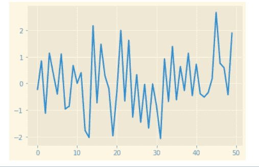
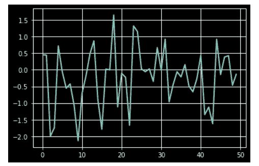

# 使用 Matplotlib 绘制风格图

> 原文:[https://www.geeksforgeeks.org/style-plots-using-matplotlib/](https://www.geeksforgeeks.org/style-plots-using-matplotlib/)

[Matplotlib](https://www.geeksforgeeks.org/python-introduction-matplotlib/) 是 Python 中最流行的用于数据可视化的包或库。通过使用这个库，我们可以生成图和图形，并可以轻松地创建光栅和矢量文件，而无需使用任何其他图形用户界面。使用 matplotlib，我们可以像使用 CSS 样式来设计 HTML 网页一样来设计情节。我们只需要导入 matplotlib 库的样式包。

样式包中有各种内置样式，我们还可以编写定制的样式文件，然后，要使用这些样式，您需要导入它们并应用于图形和绘图。这样，我们不需要一次又一次地为每个图单独编写不同的代码行，也就是说，只要需要，代码就可以重用。

首先，我们将导入模块:

```py
from matplotlib import style
```

要列出所有可用的样式:

## 蟒蛇 3

```py
from matplotlib import style

print(plt.style.available)
```

**输出:**

> ['Solarize_Light2 '，' _classic_test_patch '，' bmh '，' classic '，' dark_background '，' fast '，' fivethirtyeight '，' ggplot '，'灰度'，' seaborn '，' seaborn-bright '，' seaborn-colorblind '，' seaborn-color blind '，' seaborn-dark '，' seaborn-darkgrid '，' seaborn-deep '，' seaborn-muted '，' seaborn-noteboon '，' seaborn-paper '，' seaborn-talk '，' seaborn-ticks

以上是软件包中可用的样式列表。

> **语法:** plt.style.use('style_name ')

其中 style_name 是我们要使用的样式的名称。

**进场:**

*   导入模块。
*   为绘图创建数据。
*   在绘图中使用想要添加的样式。
*   创造一个情节。
*   展示剧情。

**例 1:**

## 蟒蛇 3

```py
# importing all the necessary packages
import numpy as np
import matplotlib.pyplot as plt

# importing the style package
from matplotlib import style

# creating an array of data for plot
data = np.random.randn(50)

# using the style for the plot
plt.style.use('Solarize_Light2')

# creating a plot
plt.plot(data)

# show plot
plt.show()
```

**输出:**



**例 2:**

## 蟒蛇 3

```py
# importing all the necessary packages
import numpy as np
import matplotlib.pyplot as plt

# importing the style package
from matplotlib import style

# creating an array of data for plot
data = np.random.randn(50)

# using the style for the plot
plt.style.use('dark_background')

# creating a plot
plt.plot(data)

# show plot
plt.show()
```

**输出:**



**例 3:**

## 蟒蛇 3

```py
# importing all the necessary packages
import numpy as np
import matplotlib.pyplot as plt

# importing the style package
from matplotlib import style

# creating an array of data for plot
data = np.random.randn(50)

# using the style for the plot
plt.style.use('ggplot')

# creating plot
plt.plot(data, linestyle=":", linewidth=2)

# show plot
plt.show()
```