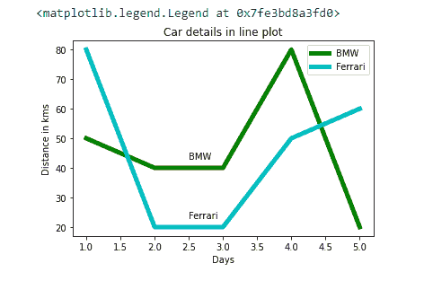
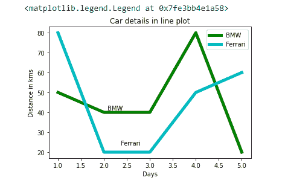
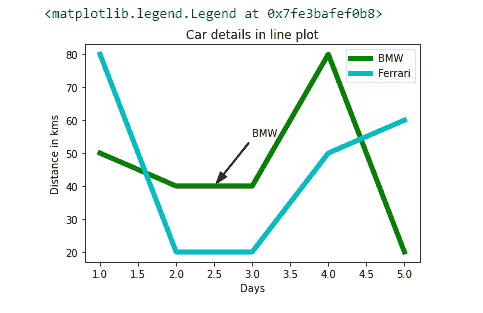
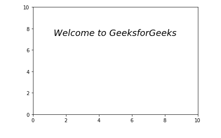
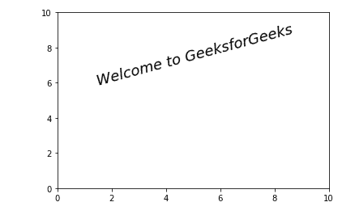

# Matplotlib 中换行的文本框

> 原文:[https://www . geesforgeks . org/带换行的文本框-in-matplotlib/](https://www.geeksforgeeks.org/text-box-with-line-wrapping-in-matplotlib/)

[Matplotlib](https://www.geeksforgeeks.org/python-introduction-matplotlib/) 是一个主要用于可视化的 python 综合库(静态、动画、创意&交互)。它提供了多种通过文本注释和描述情节的方法。此外，它可以自动换行。

文本在情节中有各种各样的用途。除了描述情节，文本的另一个用途是提供一般的注释和读者的注意力。Matplotlib 提供了向绘图添加文本的方法。

### 方法

*   导入模块
*   创建数据
*   绘图数据
*   添加文本
*   显示图
*   **text() :** 该方法为图形提供通用文本。它将文本添加到任意位置。

**语法:**

> *matplotlib.pyplot.text(x，y，string，fontdict，withdash，**kwargs)*

**示例:**

## 蟒蛇 3

```py
import matplotlib.pyplot as plt

x = [1, 2, 3, 4, 5]
y = [50, 40, 40, 80, 20]
y2 = [80, 20, 20, 50, 60]

plt.plot(x, y, 'g', label='BMW', linewidth=5)
plt.plot(x, y2, 'c', label='Ferrari', linewidth=5)

plt.title('Car details in line plot')
plt.ylabel('Distance in kms')
plt.xlabel('Days')

# Text on Ferrari line plot
plt.text(2.5, 23, "Ferrari")

# Text on BMW line plot
plt.text(2.5, 43, "BMW")
plt.legend()
```

**输出:**



*   **figtext() : figtext()** 可以作为 **text()** 方法的替代。**图形文本()**有助于将文本放置在图形上的任何位置。我们也可以将文本放在图的坐标轴之外。

**语法:**

> ***【matplot lib . pyplot . figtext(x，y，string，fontdict=None，**kwargs)】***

****示例:****

## **蟒蛇 3**

```py
import matplotlib.pyplot as plt
x = [1, 2, 3, 4, 5]
y = [50, 40, 40, 80, 20]
y2 = [80, 20, 20, 50, 60]

plt.plot(x, y, 'g', label='BMW', linewidth=5)
plt.plot(x, y2, 'c', label='Ferrari', linewidth=5)

plt.title('Car details in line plot')
plt.ylabel('Distance in kms')
plt.xlabel('Days')
plt.figtext(0.4, 0.2, "Ferrari")  
plt.figtext(0.35, 0.4, "BMW")  
plt.legend()
```

****输出:****

****

*   ****注释():**借助这些方法，我们可以通过添加箭头来注释地块上的一个点。**

****语法:****

> ***matplotlib.pyplot.annotate（ string， xy， xytext， arrowprops， **kwargs）***

****例 1:****

## **蟒蛇 3**

```py
import matplotlib.pyplot as plt
x = [1, 2, 3, 4, 5]
y = [50, 40, 40, 80, 20]
y2 = [80, 20, 20, 50, 60]

plt.plot(x, y, 'g', label='BMW', linewidth=5)
plt.plot(x, y2, 'c', label='Ferrari', linewidth=5)

plt.title('Car details in line plot')
plt.ylabel('Distance in kms')
plt.xlabel('Days')

# Text on Ferrari line plot
plt.annotate('BMW', xy=(2.5, 40), xytext=(3, 55), arrowprops=dict(
               width=1, headwidth=8, facecolor='black', shrink=0.05))  

plt.legend()
```

****输出:****

****

****示例 2:** 使用 pyplot.text()换行的文本框:**

## **蟒蛇 3**

```py
import matplotlib.pyplot as plt

fig = plt.figure()
plt.axis([0, 10, 0, 10])
t = ("Welcome to GeeksforGeeks")
plt.text(5, 8, t, fontsize=18, style='oblique', ha='center',
         va='top', wrap=True)

plt.show()
```

****输出:****

****

**我们可以使用**旋转**参数来旋转文本。**

****例 3:****

## **蟒蛇 3**

```py
import matplotlib.pyplot as plt

fig = plt.figure()
plt.axis([0, 10, 0, 10])
t = ("Welcome to GeeksforGeeks")

plt.text(5, 8, t, fontsize=18, rotation=15, style='oblique', ha='center',
         va='top', wrap=True)  # rotate the text 15 degree.

plt.show()
```

****输出:****

****