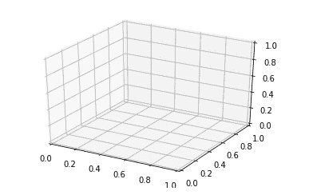
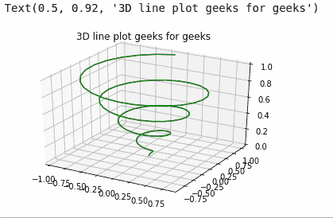
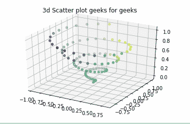
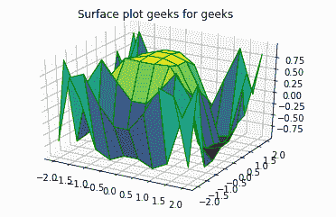
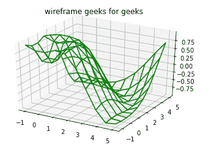
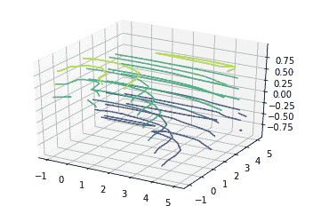
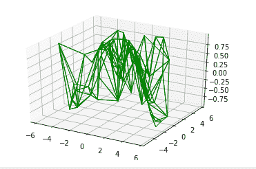
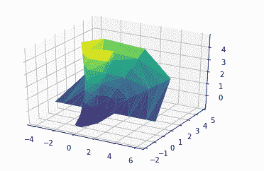

# 使用 Matplotlib 在 Python 中进行三维绘图

> 原文:[https://www . geesforgeks . org/三维-python 绘图-使用-matplotlib/](https://www.geeksforgeeks.org/three-dimensional-plotting-in-python-using-matplotlib/)

[**Matplotlib**](https://www.geeksforgeeks.org/python-introduction-matplotlib/) 的推出牢记在心，只有二维标绘。但是在 1.0 发布的时候，3d 实用程序是在 2d 的基础上开发的，因此，我们今天有了 3d 的数据实现！通过导入 mplot3d 工具包来启用 3d 绘图。在本文中，我们将使用 matplotlib 处理 3d 图。
**例:**

## 蟒蛇 3

```
import numpy as np
import matplotlib.pyplot as plt

fig = plt.figure()
ax = plt.axes(projection ='3d')
```

**输出:**



使用上述语法，三维轴被启用，数据可以以三维方式绘制。三维图形提供了一种动态的方法，使数据更具交互性。像二维图一样，我们可以用不同的方式来表示三维图。我们可以做散点图、等高线图、表面图等。让我们看看不同的三维图。

## 绘制三维线和点

**有线有点的图形**是最简单的三维图形。 **ax.plot3d 和 ax .散点图**分别是绘制线图和点图的功能。
**例 1:** **三维线图**

## 蟒蛇 3

```
# importing mplot3d toolkits, numpy and matplotlib
from mpl_toolkits import mplot3d
import numpy as np
import matplotlib.pyplot as plt

fig = plt.figure()

# syntax for 3-D projection
ax = plt.axes(projection ='3d')

# defining all 3 axes
z = np.linspace(0, 1, 100)
x = z * np.sin(25 * z)
y = z * np.cos(25 * z)

# plotting
ax.plot3D(x, y, z, 'green')
ax.set_title('3D line plot geeks for geeks')
plt.show()
```

**输出:**



**例 2:** **三维散点图**

## 蟒蛇 3

```
# importing mplot3d toolkits
from mpl_toolkits import mplot3d
import numpy as np
import matplotlib.pyplot as plt

fig = plt.figure()

# syntax for 3-D projection
ax = plt.axes(projection ='3d')

# defining axes
z = np.linspace(0, 1, 100)
x = z * np.sin(25 * z)
y = z * np.cos(25 * z)
c = x + y
ax.scatter(x, y, z, c = c)

# syntax for plotting
ax.set_title('3d Scatter plot geeks for geeks')
plt.show()
```

**输出:**



## 绘制表面图形和线框

**曲面图和线框**图处理网格数据。他们获取网格值并将其绘制在三维表面上。
**例 1:** **曲面图**

## 蟒蛇 3

```
# importing libraries
from mpl_toolkits import mplot3d
import numpy as np
import matplotlib.pyplot as plt

# defining surface and axes
x = np.outer(np.linspace(-2, 2, 10), np.ones(10))
y = x.copy().T
z = np.cos(x ** 2 + y ** 3)

fig = plt.figure()

# syntax for 3-D plotting
ax = plt.axes(projection ='3d')

# syntax for plotting
ax.plot_surface(x, y, z, cmap ='viridis', edgecolor ='green')
ax.set_title('Surface plot geeks for geeks')
plt.show()
```

**输出:**



**示例 2:** **线框**

## 蟒蛇 3

```
from mpl_toolkits import mplot3d
import numpy as np
import matplotlib.pyplot as plt

# function for z axea
def f(x, y):
    return np.sin(np.sqrt(x ** 2 + y ** 2))

# x and y axis
x = np.linspace(-1, 5, 10)
y = np.linspace(-1, 5, 10)

X, Y = np.meshgrid(x, y)
Z = f(X, Y)

fig = plt.figure()
ax = plt.axes(projection ='3d')
ax.plot_wireframe(X, Y, Z, color ='green')
ax.set_title('wireframe geeks for geeks');
```

**输出:**



## 绘制等高线图

**等高线图**取二维规则网格中的所有输入数据，对 Z 数据进行每一点的求值。我们使用 **ax.contour3D** 功能绘制等高线图。
**例:**

## 蟒蛇 3

```
from mpl_toolkits import mplot3d
import numpy as np
import matplotlib.pyplot as plt

# function for z axis
def f(x, y):
    return np.sin(np.sqrt(x ** 2 + y ** 3))

# x and y axis
x = np.linspace(-1, 5, 10)
y = np.linspace(-1, 5, 10)
X, Y = np.meshgrid(x, y)
Z = f(X, Y)

fig = plt.figure()
ax = plt.axes(projection ='3d')

# ax.contour3D is used plot a contour graph
ax.contour3D(X, Y, Z)
```

**输出:**



## 绘制曲面三角形

上图有时限制过多，不方便。所以通过这种方法，我们使用一组随机抽取。使用函数 **ax.plot_trisurf** 绘制此图。不是那么清楚，但更灵活。
**例:**

## 蟒蛇 3

```
from mpl_toolkits import mplot3d
import numpy as np
import matplotlib.pyplot as plt

# angle and radius
theta = 2 * np.pi * np.random.random(100)
r = 6 * np.random.random(100)

# all three axes
x = np.ravel(r * np.sin(theta))
y = np.ravel(r * np.cos(theta))
z = f(x, y)

ax = plt.axes(projection ='3d')
ax.scatter(x, y, z, c = z, cmap ='viridis', linewidth = 0.25);

ax = plt.axes(projection ='3d')
ax.plot_trisurf(x, y, z, cmap ='viridis', edgecolor ='green');
```

**输出:**



## 绘制莫比乌斯带

**莫比乌斯带**也叫扭曲圆柱，是一个没有边界的单面曲面。要创建莫比乌斯带，请考虑它的参数化，它是一个二维带，我们需要两个内在维度。它的角度范围从 0 到 2，宽度范围从-1 到 1。
**例:**

## 蟒蛇 3

```
from mpl_toolkits import mplot3d
import numpy as np
import matplotlib.pyplot as plt
from matplotlib.tri import Triangulation

theta = np.linspace(0, 2 * np.pi, 10)
w = np.linspace(-1, 5, 8)
w, theta = np.meshgrid(w, theta)
phi = 0.5 * theta

# radius in x-y plane
r = 1 + w * np.cos(phi)

# all three axes
x = np.ravel(r * np.cos(theta))
y = np.ravel(r * np.sin(theta))
z = np.ravel(w * np.sin(phi))

# triangulate in the underlying
# parameterization
tri = Triangulation(np.ravel(w), np.ravel(theta))

ax = plt.axes(projection ='3d')
ax.plot_trisurf(x, y, z, triangles = tri.triangles,
                cmap ='viridis', linewidths = 0.2);
```

**输出:**

