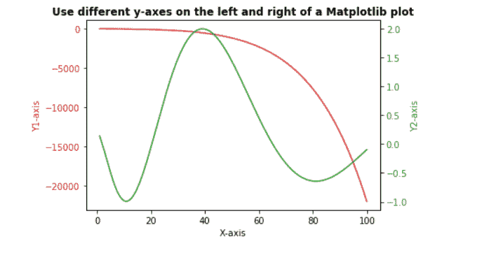
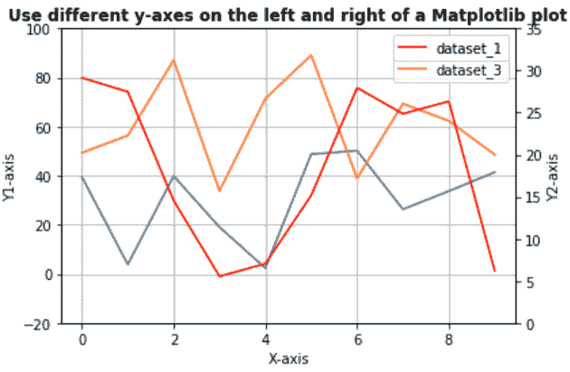

# 在 Matplotlib 图的左侧和右侧使用不同的 y 轴

> 原文:[https://www . geeksforgeeks . org/use-异 y 轴-在 matplotlib-plot 的左侧和右侧/](https://www.geeksforgeeks.org/use-different-y-axes-on-the-left-and-right-of-a-matplotlib-plot/)

在本文中，我们将讨论如何创建 Matplotlib 图两侧的 y 轴。

有时为了快速进行数据分析，需要创建一个包含两个不同比例的数据变量的图表。为此目的**使用双轴**方法，即双 X 轴或双 Y 轴。 *matplotlib* 库中的*matplotlib . Axes . Axes . twinx()*功能用于创建共享 X 轴的双轴。

**语法:**

```py
matplotlib.axes.Axes.twinx(self)
```

此方法不接受任何参数，如果提供了参数，将引发错误。它返回 *ax_twin* 对象，表示创建了一个新的 Axes 实例。以下示例说明了 *matplotlib.axes* 中的*matplotlib . axes . Twinx()*功能:

**例 1:**

## 蟒蛇 3

```py
# import libraries 
import numpy as np 
import matplotlib.pyplot as plt 

# Creating dataset 
x = np.arange(1.0, 100.0, 0.191) 
dataset_1 = np.exp(x**0.25) - np.exp(x**0.5) 
dataset_2 = np.sin(0.4 * np.pi * x**0.5) + np.cos(0.8 * np.pi * x**0.25) 

# Creating plot with dataset_1
fig, ax1 = plt.subplots() 

color = 'tab:red'
ax1.set_xlabel('X-axis') 
ax1.set_ylabel('Y1-axis', color = color) 
ax1.plot(x, dataset_1, color = color) 
ax1.tick_params(axis ='y', labelcolor = color) 

# Adding Twin Axes to plot using dataset_2
ax2 = ax1.twinx() 

color = 'tab:green'
ax2.set_ylabel('Y2-axis', color = color) 
ax2.plot(x, dataset_2, color = color) 
ax2.tick_params(axis ='y', labelcolor = color) 

# Adding title
plt.title('Use different y-axes on the left and right of a Matplotlib plot', fontweight ="bold") 

# Show plot
plt.show()
```

**输出:**



**例 2:**

## 蟒蛇 3

```py
# import libraries
import numpy as np
import matplotlib.pyplot as plt
from matplotlib import rc
rc('mathtext', default='regular')

# Creating dataset
x = np.arange(10)
dataset_1 = np.random.random(10)*30
dataset_2 = np.random.random(10)*60
dataset_3 = np.random.random(10)*100

# Creating figure
fig = plt.figure()

# Plotting dataset_2
ax = fig.add_subplot(111)
ax.plot(x, dataset_2, '-', label='dataset_2')
ax.plot(x, dataset_3, '-', label='dataset_3')

# Creating Twin axes for dataset_1
ax2 = ax.twinx()
ax2.plot(x, dataset_1, '-r', label='dataset_1')

# Adding title
plt.title('Use different y-axes on the left and right of a Matplotlib plot',
          fontweight="bold")

# Adding legend
ax.legend(loc=0)
ax2.legend(loc=0)

# Sdding grid
ax.grid()

# Adding labels
ax.set_xlabel("X-axis")
ax.set_ylabel(r"Y1-axis")
ax2.set_ylabel(r"Y2-axis")

# Setting Y limits
ax2.set_ylim(0, 35)
ax.set_ylim(-20, 100)

# Show plot
plt.show()
```

**输出:**

