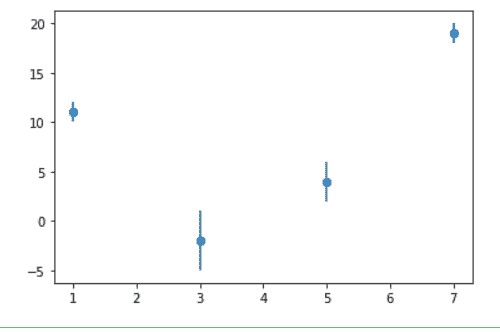
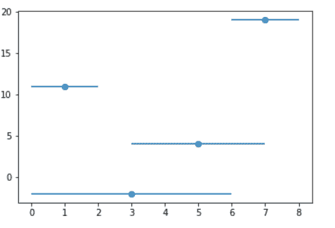
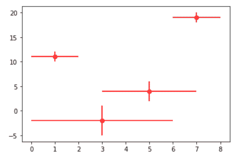
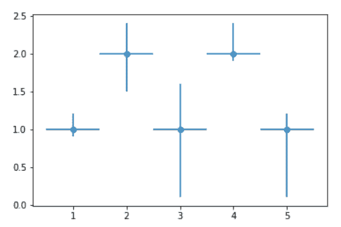

# 在 Matplotlib 散点图中使用误差线

> 原文:[https://www . geesforgeks . org/use-error-bar-in-a-matplotlib-散点图/](https://www.geeksforgeeks.org/use-error-bars-in-a-matplotlib-scatter-plot/)

**先决条件:**T2【马特洛特利

在本文中，我们将使用 Matplotlib 创建一个带有误差线的散点图。误差条形图是表示数据可变性的好方法。它可以应用于图表，为所呈现的数据提供额外的详细信息层。

### **接近**

*   导入所需的 python 库。
*   创建数据。
*   将所需值传递给 [errorbar()](https://www.geeksforgeeks.org/matplotlib-pyplot-errorbar-in-python/) 功能
*   绘制图表。

> ***语法:**matplotlib . pyplot . error bar(x，y，yerr=None，xerr=None，fmt= "，ecolor=None，elinewidth =None，倾覆= None，barsabove=False，lolims=False，uplims=False，xlolims=False，xuplims=False，errorevery = 1，capthick=None，*，data=None，*\*kwargs)*
> 
> ***参数:**该方法接受以下描述的参数:*
> 
> *   ***x，y:** 这些参数是数据点的水平和垂直坐标。*
> *   ***fmt:** 该参数为可选参数，包含字符串值。*
> *   ***翻船:**这个参数也是可选参数。它是误差线的长度，以磅为单位，默认值为 NONE。*

下面给出了上述概念的实现:

**示例 1:** 在“y”值中添加一些错误。

## 蟒蛇 3

```py
import matplotlib.pyplot as plt

a = [1, 3, 5, 7]
b = [11, -2, 4, 19]
plt.scatter(a, b)

c = [1, 3, 2, 1]

plt.errorbar(a, b, yerr=c, fmt="o")
plt.show()
```

**输出:**



**示例 2:** 在‘x’值中添加一些错误。

## 蟒蛇 3

```py
import matplotlib.pyplot as plt

a = [1, 3, 5, 7]
b = [11, -2, 4, 19]
plt.scatter(a, b)

c = [1, 3, 2, 1]

plt.errorbar(a, b, xerr=c, fmt="o")
plt.show()
```

**输出:**



**例 3:**x&y 相加错误

## 蟒蛇 3

```py
import matplotlib.pyplot as plt

a = [1, 3, 5, 7]
b = [11, -2, 4, 19]
plt.scatter(a, b)

c = [1, 3, 2, 1]
d = [1, 3, 2, 1]

# you can use color ="r" for red or skip to default as blue
plt.errorbar(a, b, xerr=c, yerr=d, fmt="o", color="r")

plt.show()
```

**输出:**



**例 4:** 在 x 和 y 方向添加变量误差

## 蟒蛇 3

```py
# importing matplotlib
import matplotlib.pyplot as plt

# making a simple plot
x = [1, 2, 3, 4, 5]
y = [1, 2, 1, 2, 1]

# creating error
y_errormin = [0.1, 0.5, 0.9,
              0.1, 0.9]
y_errormax = [0.2, 0.4, 0.6,
              0.4, 0.2]

x_error = 0.5
y_error = [y_errormin, y_errormax]

# ploting graph
# plt.plot(x, y)
plt.errorbar(x, y,
             yerr=y_error,
             xerr=x_error,
             fmt='o')  
plt.show()
```

**输出:**

