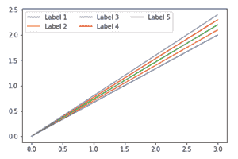

# 在 Matplotlib 图例中使用多列

> 原文:[https://www . geesforgeks . org/use-multi-columns-in-a-matplotlib-legend/](https://www.geeksforgeeks.org/use-multiple-columns-in-a-matplotlib-legend/)

在本文中，任务是在 Python 中的 Matplotlib 图例中使用多个列。在开始讨论“在 matplotlib 图例中使用多列”之前，我们首先要简单了解 Matplotlib、pyplot 和图例。

*   [**Matplotlib:**](https://www.geeksforgeeks.org/python-introduction-matplotlib/) 这个“Matplotlib”库基本上用来创建这么多图形化的东西，比如像高质量的图形、图表、图形等等很多东西。这个图书馆很大，能把非常小的细节变成一个人物的最小细节。这个图书馆是约翰·亨特和他的团队在 2002 年引进的。
*   [**Pyplot:**](https://www.geeksforgeeks.org/pyplot-in-matplotlib/)[](https://www.geeksforgeeks.org/pyplot-in-matplotlib/)**在 Python 中，“py plot”是一个用于二维图形的绘图库。它用于 python 脚本、shell、web 应用服务器和其他 GUI 工具包。**
*   **[**图例:**](https://www.geeksforgeeks.org/html-legend-tag/) 图例是描述图形元素的区域。在 matplotlib 中，有一个名为 legend()的函数，用于将图例放置在上述轴上。**

****注意:**在声明 matplotlib 和 pyplot 之前，最好也声明 numpy 库。**

**基本上，我们可以用 matplotlib 导入 pyplot，就像我们通常用 python 导入其他库一样，比如**

```py
import matplotlib.pyplot as plt
```

**或者**

```py
from matplotlib import pyplot as plt
```

## ****在 Matolotlib 图例中使用多列****

**在许多情况下，我们可能会遇到的主要问题是，随着图例数量的增加，它可能会消耗大量的垂直空间，这可能会给图形的可视化带来问题。因此，在这种情况下，我们需要将图例标签组织成多个列。为此，很容易无中断地放置所有图例。**

**以下面定义的方式使用 plt.legend()中的 ncol 参数来指定图例应该具有的列数。**

```py
plt.legend(ncol=k)
```

**这里，k 是图例在图表中应有的列数。**

****示例:****

## **蟒蛇 3**

```py
# code
import matplotlib.pyplot as plt

plt.plot([0, 3], [0, 2.0], label='Label 1')
plt.plot([0, 3], [0, 2.1], label='Label 2')
plt.plot([0, 3], [0, 2.2], label='Label 3')
plt.plot([0, 3], [0, 2.3], label='Label 4')
plt.plot([0, 3], [0, 2.4], label='Label 5')

# Change the number of columns here
plt.legend(ncol=3)

plt.show()
```

****输出:****

**

输出**