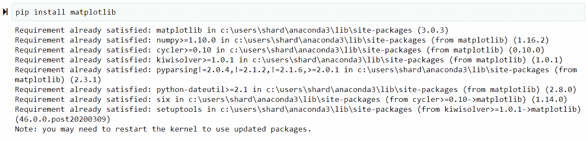
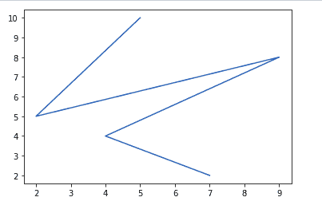
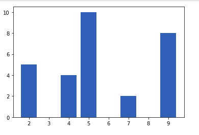
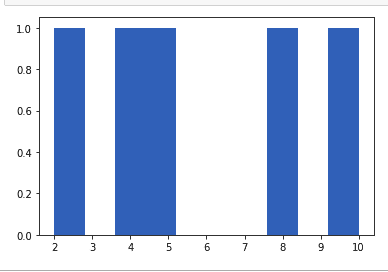
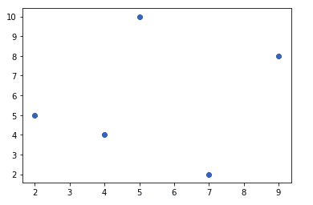
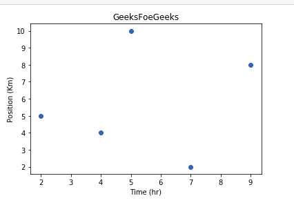
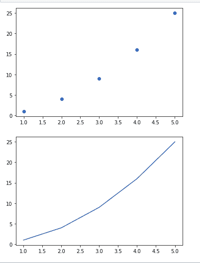

# 使用 Matplotlib 搭配 Jupyter 笔记本

> 原文:[https://www . geeksforgeeks . org/using-matplotlib-with-jupyter-notebook/](https://www.geeksforgeeks.org/using-matplotlib-with-jupyter-notebook/)

**Jupyter Notebook**是一个开源的网络应用程序，允许你创建和共享包含实时代码、公式、可视化和叙事文本的文档。用途包括:数据清理和转换、数值模拟、统计建模、数据可视化、机器学习等等。

**注:**更多信息请参考[如何使用 Jupyter 笔记本-终极指南](http://geeksforgeeks.org/how-to-use-jupyter-notebook-an-ultimate-guide/)

**Matplotlib** 是最流行的用于数据可视化的 Python 包之一。这是一个跨平台的库，用于从数组中的数据制作 2D 图。开始你只需要进行必要的导入，准备一些数据，就可以借助**绘图()**功能开始绘图了。完成后，记得使用 **show()** 功能显示你的剧情。

Matplotlib 用 Python 编写，利用了 Python 的数值数学扩展 **NumPy** 。它由几个情节组成，如:–

*   线条
*   酒吧
*   分散
*   组织结构图
*   还有更多

#### 装置

*   用 **pip** 安装 Matplotlib
    Matplotlib 也可以用 Python 包管理器 pip 安装。要使用 pip 安装 Matplotlib，请打开一个终端窗口并键入:

    ```
    pip install matplotlib

    ```

*   Install Matplotlib with the **Anaconda Prompt**
    Matplotlib can be installed using with the Anaconda Prompt. If the Anaconda Prompt is available on your machine, it can usually be seen in the Windows Start Menu. To install Matplotlib, open the Anaconda Prompt and type:

    ```
    conda install matplotlib

    ```

    
    

## 使用 matplotlib 和 jupiter 笔记本

安装完成后。让我们开始在 Jupyter 笔记本上使用 Matplotlib。我们将使用 Matplotlib 在 Jupyter 笔记本中绘制各种图表。

#### 线图

```
# importing matplotlib module 
from matplotlib import pyplot as plt 

# x-axis values 
x = [5, 2, 9, 4, 7] 

# Y-axis values 
y = [10, 5, 8, 4, 2] 

# Function to plot 
plt.plot(x, y) 

# function to show the plot 
plt.show()
```

**输出:**



#### 条形图

```
# importing matplotlib module 
from matplotlib import pyplot as plt 

# x-axis values 
x = [5, 2, 9, 4, 7] 

# Y-axis values 
y = [10, 5, 8, 4, 2] 

# Function to plot 
plt.bar(x, y) 

# function to show the plot 
plt.show()
```

**输出:**



#### 柱状图

```
# importing matplotlib module 
from matplotlib import pyplot as plt 

# Y-axis values 
y = [10, 5, 8, 4, 2] 

# Function to plot histogram 
plt.hist(y) 

# Function to show the plot 
plt.show() 
```

**输出:**



#### 散点图

```
# importing matplotlib module 
from matplotlib import pyplot as plt 

# x-axis values 
x = [5, 2, 9, 4, 7] 

# Y-axis values 
y = [10, 5, 8, 4, 2] 

# Function to plot scatter 
plt.scatter(x, y) 

# function to show the plot 
plt.show() 
```

**输出:**



#### 在图形中添加标题和标注轴

我们可以使用以下命令为图表添加标题

```
matplotlib.pyplot.title("My title")
```

我们可以使用以下函数来标记 x 轴和 y 轴

```
matplotlib.pyplot.xlabel("Time (Hr)")

matplotlib.pyplot.ylabel("Position (Km)")
```

**示例:**

```
# importing matplotlib module 
from matplotlib import pyplot as plt 

# x-axis values 
x = [5, 2, 9, 4, 7] 

# Y-axis values 
y = [10, 5, 8, 4, 2] 

# Function to plot 
plt.scatter(x, y) 

# Adding Title
plt.title("GeeksFoeGeeks")

# Labeling the axes
plt.xlabel("Time (hr)")
plt.ylabel("Position (Km)")

# function to show the plot 
plt.show()
```

**输出:**



我们也可以在同一个单元格中编写一个程序，一起打印**多个图形**。
我们可以通过在程序中重复 show()函数，将这些图形上下垂直打印，或者我们也可以使用名为**子图()**的函数，将它们水平打印。

```
from matplotlib import pyplot as plt 

x = [1, 2, 3, 4, 5] 
y = [1, 4, 9, 16, 25] 
plt.scatter(x, y) 

# function to show the plot 
plt.show()

plt.plot(x, y)

# function to show the plot 
plt.show()
```

**输出**

