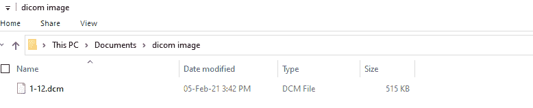

# 使用 pydicom 和 matplotlib 查看 DICOM 图像

> 原文:[https://www . geeksforgeeks . org/view-DICOM-images-using-pydicom-and-matplotlib-2/](https://www.geeksforgeeks.org/view-dicom-images-using-pydicom-and-matplotlib-2/)

**先决条件:**T2【马特洛特利

DICOM 代表医学中的数字成像和通信。引入 DICOM 文件是为了保持不同类型医学图像模式的一致性。它是查看、存储、共享和检索医学图像的标准格式。

Python 提供了一个强大的模块 **pydicom** 来处理医学图像、报告和放射治疗对象等 dicom 文件。 **pydicom** 读取、修改和写入 dicom 文件中的数据。

### 装置

在命令提示符下运行以下命令:

> pip 安装 dicom

> pip install matplotlib

pydicom 使我们能够处理 dicom 文件，在本文中我们将讨论使用 pydicom 和 matplotlib 查看 DICOM 文件的机制。为了读取 DICOM 文件，我们使用 pydicom 包，为了查看结果，我们使用 matplotlib。

#### 给定输入

存储 dicom 文件的路径作为参数传递给 **data_manager.get_files** 方法。

> #### 将 pydicom 与 matplotlib 一起使用
> 
> 解释:
> 
> *   导入模块
> *   使用**py DICOM . data . data _ manager . get _ files()**方法读取 DICOM 文件
> 
> > **语法:**
> > 
> > py DICOM . data . data _ manager . get _ files(base，pass_dicom)[0]
> > 
> > **参数:**
> > 
> > *   **Base :** 是以字符串形式递归搜索的基目录。
> > *   **模式:**默认为“*”。这是一个字符串模式，用于过滤文件。
> 
> *   提供两个参数:基础和模式
> *   将数据显示为图像，即在 2D 常规栅格上。
> *   显示图像
> 
> **注意:**在变量名库中输入除文件名以外的 dcm 文件的位置，在 pass_dicom 变量中输入文件名。在这种情况下，文件存储在一个名为 dicom_image 的目录中，如图所示:
> 
> 从[这里](https://drive.google.com/drive/u/0/folders/17oIs4uYwjs-kAkVdXFt_mWzorVEnr4K2)下载 dcm 文件，重命名为:1-12.dcm
> 
> 
> 
> 将地址栏中显示的路径与变量 base 和 pass_dicom 中存储的值进行比较
> 
> **程序:**
> 
> ## 蟒蛇 3
> 
> ```
> import matplotlib.pyplot as plt
> import pydicom
> import pydicom.data
>   
> # Full path of the DICOM file is passed in base
> base = r"C:\Users\Ajit Gupta\Documents\dicom image"
> pass_dicom = "1-12.dcm"  # file name is 1-12.dcm
>   
> # enter DICOM image name for pattern
> # result is a list of 1 element
> filename = pydicom.data.data_manager.get_files(base, pass_dicom)[0]
>   
> ds = pydicom.dcmread(filename)
>   
> plt.imshow(ds.pixel_array, cmap=plt.cm.bone)  # set the color map to bone
> plt.show()
> ```
> 
> **输出:**
> 
> 