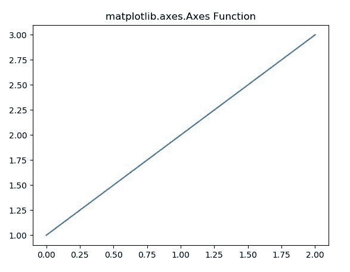
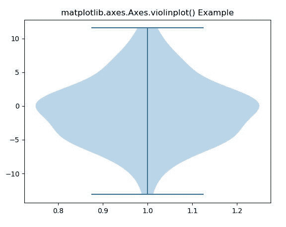
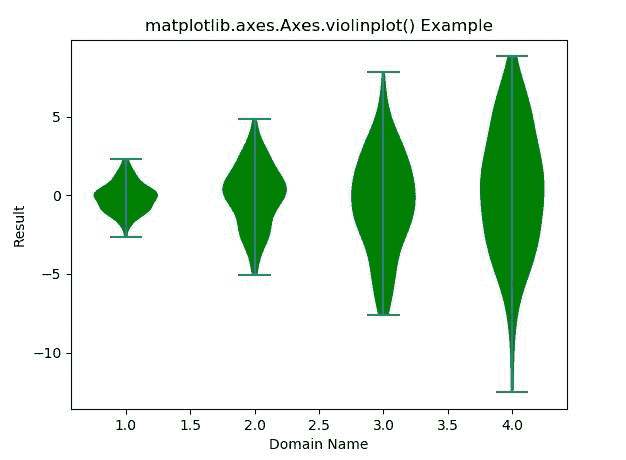

# 使用 Matplotlib

的轴类在 Python 中绘制紫色

> 原文:[https://www . geeksforgeeks . org/violinplot-in-python-use-axes-of-matplotlib/](https://www.geeksforgeeks.org/violinplot-in-python-using-axes-class-of-matplotlib/)

**[Matplotlib](https://www.geeksforgeeks.org/python-introduction-matplotlib/)** 是 Python 中的一个库，是 NumPy 库的数值-数学扩展。

**轴类**包含大部分图形元素:轴、刻度、线 2D、文本、多边形等。，并设置坐标系。Axes 的实例通过回调属性支持回调。
**#样本代码**

```py
# Implementation of matplotlib function

import matplotlib.pyplot as plt
import numpy as np

# make an agg figure
fig, ax = plt.subplots()
ax.plot([1, 2, 3])
ax.set_title('matplotlib.axes.Axes function')
fig.canvas.draw()
plt.show()
```

**输出:**


## 使用轴类的小提琴曲

matplotlib 库的 Axes 模块中的 **Axes.violinplot()函数**用于对数据集的每一列或序列数据集中的每一个向量进行小提琴作图。

**语法:**

> Axes.violinplot(self，dataset，positions=None，vert=True，widths = 0.5，showmeans=False，showextrema=True，showmedians=False，points=100，bw_method=None，* data = None)

**参数:**该方法接受以下描述的参数:

*   **数据集:**这个参数是一个数据序列。
*   **位置:**该参数用于设置小提琴的位置。
*   **垂直:**该参数为可选参数，包含布尔值。它使垂直小提琴情节如果是真的。否则水平。
*   **宽度:**此参数用于用标量或序列设置每把小提琴的宽度。
*   **显示方式:**该参数包含布尔值。它用于切换手段的呈现。
*   **显示极值:**该参数包含布尔值。它用于切换极值的渲染。
*   **显示中间值:**该参数包含布尔值。它用于切换媒体的呈现。
*   **点:**该参数用于定义评估每个高斯核密度估计的点数。

**返回:**这将返回以下内容:

*   **结果:**这将返回将 violinplot 的每个组件映射到 matplotlib.collections 实例列表的字典。

下面的例子说明了 matplotlib.axes . axes . violinplot()函数在 matplotlib . axes 中的作用:

**示例-1:**

```py
# Implementation of matplotlib function
import matplotlib.pyplot as plt
import numpy as np

# create test data
np.random.seed(10**7)
data = np.random.normal(0, 5, 100)

fig, ax1 = plt.subplots()
val = ax1.violinplot(data)

ax1.set_title('matplotlib.axes.Axes.violinplot() Example')
plt.show()
```

**输出:**


**示例-2:**

```py
# Implementation of matplotlib function
import matplotlib.pyplot as plt
import numpy as np

# create test data
np.random.seed(10**7)
data = [sorted(np.random.normal(0, std, 100)) for std in range(1, 5)]

fig, ax1 = plt.subplots()
val = ax1.violinplot(data)
ax1.set_ylabel('Result')
ax1.set_xlabel('Domain Name')
for i in val['bodies']:
    i.set_facecolor('green')
    i.set_alpha(1)

ax1.set_title('matplotlib.axes.Axes.violinplot() Example')
plt.show()
```

**输出:**
