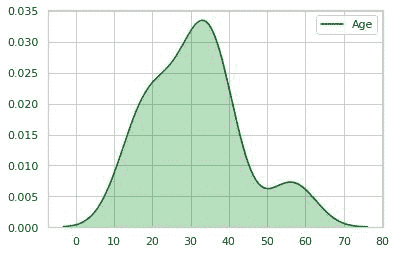
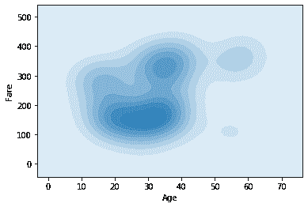
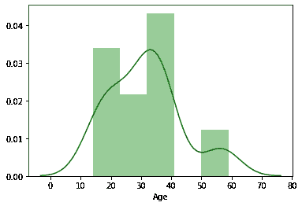
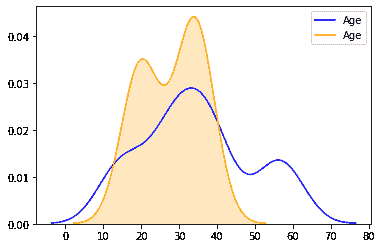
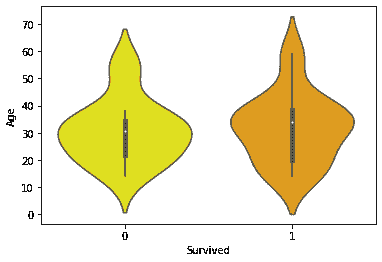
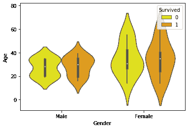
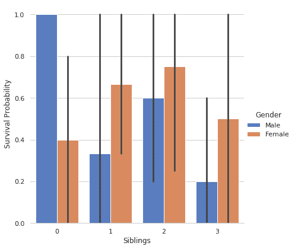
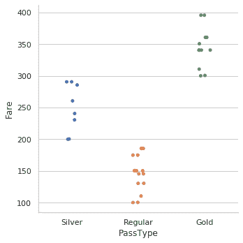
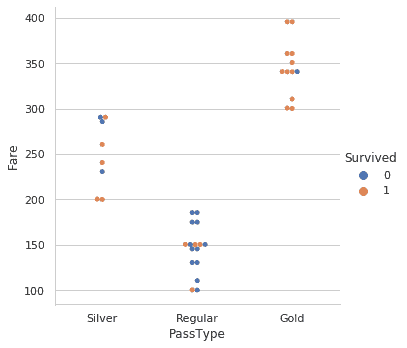

# 通过海底地块和 Matplotlib 可视化最大似然数据集

> 原文:[https://www . geesforgeks . org/visualizing-ml-dataset-through-seaborn-plots-and-matplotlib/](https://www.geeksforgeeks.org/visualising-ml-dataset-through-seaborn-plots-and-matplotlib/)

处理数据有时会有点无聊。将原始数据转换成可理解的格式是整个过程中最重要的部分之一，那么为什么只停留在数字上呢，因为我们可以将数据可视化为令人惊叹的图形，这些图形可以在 python 中获取。这篇文章将重点探讨那些能让你的预处理之旅变得有趣的情节。

**Seaborn** 和 **Matplotlib** 为我们提供了无数诱人的图表，通过这些图表，人们可以轻松地分析弱点，以更深的理解探索数据，并最终通过不同的算法对数据进行训练后，获得对数据的深刻洞察和最高的准确性。

**让我们浏览一下我们的数据集**:数据集(36 行)包含 6 个要素和 2 个类(存活的= 1，未存活的= 0)，我们将基于此绘制特定的图表。数据集链接–[点击此处获取完整数据集](https://github.com/Abduttayyeb/Visual-Data-Analysis/blob/master/Graph_Data.csv)

**1。KDE 情节:**好的，在浏览了数据集之后，我们可以有一个问题。哪个年龄组的人数最多？为了回答这个问题，我们需要视觉效果，我们的 KDE 图进入画面，它只是一个密度图。因此，让我们从导入所需的库开始，并使用它的函数来绘制图表。

## 蟒蛇 3

```py
# importing the modules and dataset
import pandas as pd
import matplotlib.pyplot as plt
import seaborn as sns
dataset = pd.read_csv("Survival.csv")

# KDE plot
sns.kdeplot(dataset["Age"], color = "green",
            shade = True)
plt.show()
plt.figure()
```

输出:



**2。**所以现在我们已经清楚地了解了人数与年龄组的分布情况，这里我们可以看到 20-40 岁年龄组的人数最多，所以让我们来检查一下。

## 蟒蛇 3

```py
# importing the modules and dataset
import pandas as pd
import matplotlib.pyplot as plt
import seaborn as sns
dataset = pd.read_csv("Survival.csv")

# Checking the count of Age Group 20-40
dataset.Age[(dataset["Age"] >= 20) & (dataset["Age"] <= 40)].count()
```

输出:

```py
26
```

**3。**深入挖掘视觉效果，了解公平与年龄的变化，它们之间的关系，让我们简单地使用不同类型的 kdeplot 来看看，现在将有二元密度，我们将只添加 Y 变量(公平)。

## 蟒蛇 3

```py
# importing the modules and dataset
import pandas as pd
import matplotlib.pyplot as plt
import seaborn as sns
dataset = pd.read_csv("Survival.csv")

sns.kdeplot(dataset["Age"], dataset["Fare"], shade = True)
plt.show()
plt.figure()
```

输出:



**4。**稍微研究一下这个图，我们看到 20-30 岁年龄段的颜色强度最大，准确的说是 100-200 之间，让我们来检查一下

## 蟒蛇 3

```py
# importing the modules and dataset
import pandas as pd
import matplotlib.pyplot as plt
import seaborn as sns
dataset = pd.read_csv("Survival.csv")

# Checking The Variation Between Fare And Age
dataset.Age[((dataset["Fare"] >= 100) &
             (dataset["Fare"]<=200)) &
            ((dataset["Age"]>=20) &
             dataset["Age"]<=40)].count()
```

输出:

```py
16
```

**5。**我们也可以通过使用 seaborn 的 distplot()模块来为 kdeplot 添加一个直方图:

## 蟒蛇 3

```py
# importing the modules and dataset
import pandas as pd
import matplotlib.pyplot as plt
import seaborn as sns
dataset = pd.read_csv("Survival.csv")

# Histogram+Density Plot
sns.distplot(dataset["Age"], color = "green")
plt.show()
plt.figure()
```

输出:



**6。**嗯。如果你想知道男性对女性的比例，我们可以在 KDE 本身画出同样的图:

## 蟒蛇 3

```py
# importing the modules and dataset
import pandas as pd
import matplotlib.pyplot as plt
import seaborn as sns
dataset = pd.read_csv("Survival.csv")

# Adding Two Plots In One
sns.kdeplot(dataset[dataset.Gender == 'Female']['Age'],
            color = "blue")
sns.kdeplot(dataset[dataset.Gender == 'Male']['Age'],
            color = "orange", shade = True)
plt.show()
plt.figure()
```

输出:



**7。**从图中我们可以看到，从 12 岁到 40 岁，计数有所增加，让我们检查一下

## 蟒蛇 3

```py
# importing the modules and dataset
import pandas as pd
import matplotlib.pyplot as plt
import seaborn as sns
dataset = pd.read_csv("Survival.csv")

# showing that there are more Male's Between Age Of 12-40
dataset.Gender[((dataset["Age"] >= 12) &
                (dataset["Age"] <= 40)) &
               (dataset["Gender"] == "Male")].count()
dataset.Gender[((dataset["Age"] >= 12) &
                (dataset["Age"] <= 40)) &
               (dataset["Gender"] == "Female")].count()
```

输出:

```py
17
15
```

**8。VIOLIN PLOT :** 我们已经谈了很多特性，现在我们来谈谈存活率对特性的依赖。为此，我们将使用一个经典的小提琴情节，顾名思义，它描绘了与小提琴的音乐波相同的视觉效果。基本上，小提琴图用于可视化数据的分布及其概率密度。

存活率和年龄有什么关系？让我们直观地分析一下:

## 蟒蛇 3

```py
# importing the modules and dataset
import pandas as pd
import matplotlib.pyplot as plt
import seaborn as sns
dataset = pd.read_csv("Survival.csv")

sns.violinplot(x = 'Survived', y = 'Age', data = dataset,
               palette = {0 : "yellow", 1 : "orange"});
plt.show()
plt.figure()
```

输出:



**说明:**我们在图中看到的白点为中值，中间粗黑条代表四分位数
区间。从中延伸出来的细黑线代表数据中的上(最大)和下(最小)相邻值。
快速浏览一下，我们发现在[10-20 岁]之间，存活率稍高(存活==1)。

**9。**让我们再画一张存活率与性别和年龄的关系图

## 蟒蛇 3

```py
# importing the modules and dataset
import pandas as pd
import matplotlib.pyplot as plt
import seaborn as sns
dataset = pd.read_csv("Survival.csv")

sns.violinplot(x = "Gender", y = "Age", hue = "Survived",
               data = dataset,
               palette = {0 : "yellow", 1 : "orange"})
plt.show()
plt.figure()
```

这里还有一个属性是色调，它指的是存活的二进制值。

输出:



**10。CATPLOT :** 简单来说，CATPLOT 显示一个、两个或三个分类变量类别的频率(或可选的分数或百分比)。

## 蟒蛇 3

```py
# importing the modules and dataset
import pandas as pd
import matplotlib.pyplot as plt
import seaborn as sns
dataset = pd.read_csv("Survival.csv")

# Plot a nested barplot to show survival for Siblings and Gender
g = sns.catplot(x = "Siblings", y = "Survived", hue = "Gender", data = dataset,
                height = 6, kind = "bar", palette = "muted")
g.despine(lef t= True)
g.set_ylabels("Survival Probability")
plt.show()
```

这里 sns.despine 是用来去掉剧情的顶部和右侧刺的，我们来看看。

输出:



在这里，我们可以清楚地看到兄弟姐妹的性别生存概率。

**11** 。现在，在我们看到的数据集中，票有三个类别，这是基于票价的，让我们找到它(参考这个图，我为票添加了一个类别列)

## 蟒蛇 3

```py
# importing the modules and dataset
import pandas as pd
import matplotlib.pyplot as plt
import seaborn as sns
dataset = pd.read_csv("Survival.csv")

# Based On Fare There Are 3 Types Of Tickets
sns.catplot(x = "PassType", y = "Fare", data = dataset)
plt.show()
plt.figure()
```

输出:



利用这一点，我们得出结论，应该为门票定义类别

**12 时。**与存活率的关系:

## 蟒蛇 3

```py
# importing the modules and dataset
import pandas as pd
import matplotlib.pyplot as plt
import seaborn as sns
dataset = pd.read_csv("Survival.csv")

sns.catplot(x="PassType", y="Fare", hue="Survived",kind="swarm",data=dataset)
plt.show()
plt.figure()
```

输出:



由此，我们对门票的存活率与票价的关系有了清晰的认识。