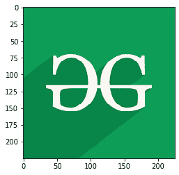
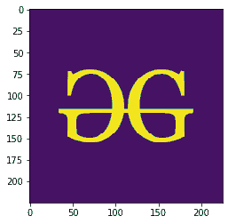
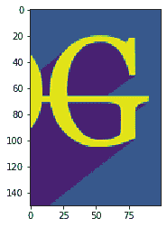

# 使用 Matplotlib 处理 Python 中的图像

> 原文:[https://www . geesforgeks . org/使用-matplotlib/](https://www.geeksforgeeks.org/working-with-images-in-python-using-matplotlib/) 处理 python 中的图像

**[Matplotlib](https://www.geeksforgeeks.org/python-matplotlib-an-overview/)** 是 Python 中一个惊人的可视化库，用于数组的 2D 图。Matplotlib 是一个多平台数据可视化库，构建在 NumPy 数组上，旨在与更广泛的 SciPy 堆栈一起工作。

## 使用 Matplotlib 在 Python 中处理图像

`matplotlib`库中的`image`模块用于处理 Python 中的图像。`image`模块还包括两种有用的方法，分别是用于读取图像的`imread`和用于显示图像的`imshow`。

以下是一些使用`matplotlib`库对图像进行各种操作的示例:

**示例 1:** 在本示例中，程序使用`matplotlib.image.imread()`读取图像，并使用`matplotlib.image.imread()`显示该图像。

```py
# importing required libraries
import matplotlib.pyplot as plt
import matplotlib.image as img

# reading the image
testImage = img.imread('g4g.png')

# displaying the image
plt.imshow(testImage)
```

**输出:**


**示例 2:** 下面的程序读取一个图像，然后以数组的形式表示该图像。

```py
# importing required libraries
import matplotlib.pyplot as plt
import matplotlib.image as img

# reading the image
testImage = img.imread('g4g.png')

# displaying the image as an array
print(testImage)
```

**输出:**

```py
[[[0.05490196 0.6156863  0.34117648]
  [0.05490196 0.6156863  0.34117648]
  [0.05490196 0.6156863  0.34117648]
  ...
  [0.05490196 0.6156863  0.34117648]
  [0.05490196 0.6156863  0.34117648]
  [0.05490196 0.6156863  0.34117648]]

 [[0.05490196 0.6156863  0.34117648]
  [0.05490196 0.6156863  0.34117648]
  [0.05490196 0.6156863  0.34117648]
  ...
  [0.05490196 0.6156863  0.34117648]
  [0.05490196 0.6156863  0.34117648]
  [0.05490196 0.6156863  0.34117648]]

 [[0.05490196 0.6156863  0.34117648]
  [0.05490196 0.6156863  0.34117648]
  [0.05490196 0.6156863  0.34117648]
  ...
  [0.05490196 0.6156863  0.34117648]
  [0.05490196 0.6156863  0.34117648]
  [0.05490196 0.6156863  0.34117648]]

 ...

 [[0.03529412 0.52156866 0.28235295]
  [0.03529412 0.52156866 0.28235295]
  [0.03529412 0.52156866 0.28235295]
  ...
  [0.05490196 0.6156863  0.34117648]
  [0.05490196 0.6156863  0.34117648]
  [0.05490196 0.6156863  0.34117648]]

 [[0.03529412 0.52156866 0.28235295]
  [0.03529412 0.52156866 0.28235295]
  [0.03529412 0.52156866 0.28235295]
  ...
  [0.05490196 0.6156863  0.34117648]
  [0.05490196 0.6156863  0.34117648]
  [0.05490196 0.6156863  0.34117648]]

 [[0.03529412 0.52156866 0.28235295]
  [0.03529412 0.52156866 0.28235295]
  [0.03529412 0.52156866 0.28235295]
  ...
  [0.05490196 0.6156863  0.34117648]
  [0.05490196 0.6156863  0.34117648]
  [0.05490196 0.6156863  0.34117648]]]

```

**例 3:** 这里，图像的形状为`(225, 225, 3)`，表示图像的(高度、宽度、模式)，对于彩色图像模式值为 0 到 2，对于黑白图像模式值仅为 0 和 1。在输出图像中，仅修改图像的模式。

```py
# importing required libraries
import matplotlib.pyplot as plt
import matplotlib.image as img

# reading the image
testImage = img.imread('g4g.png')

# displaying the shape of the image
print(testImage.shape)

# modifying the shape of the image
modifiedImage = testImage[:, :, 0]

# displaying the modified image
plt.imshow(modifiedImage)
```

**输出:**

```py
(225, 225, 3)
```



**例 4:** 在下面的程序中，修改了图像形状的所有参数。这里，图像的高度是 150 像素(从第 50 个像素开始显示)，宽度是 100 像素(从第 100 个像素开始显示)，模式值是 1。

```py
# importing required libraries
import matplotlib.pyplot as plt
import matplotlib.image as img

# reading the image
testImage = img.imread('g4g.png')

# displaying the shape of the image
print(testImage.shape)

# modifying the shape of the image
modifiedImage = testImage[50:200, 100:200, 1]

# displaying the modified image
plt.imshow(modifiedImage)
```

**输出:**

```py
(225, 225, 3)
```



**例 5:** 这里没有修改任何参数。于是，原始图像被显示出来。

```py
# importing required libraries
import matplotlib.pyplot as plt
import matplotlib.image as img

# reading the image
testImage = img.imread('g4g.png')

# displaying the shape of the image
print(testImage.shape)

# modifying the shape of the image
modifiedImage = testImage[:, :, :]

# displaying the modified image
plt.imshow(modifiedImage)
```

**输出:**

```py
(225, 225, 3)
```

