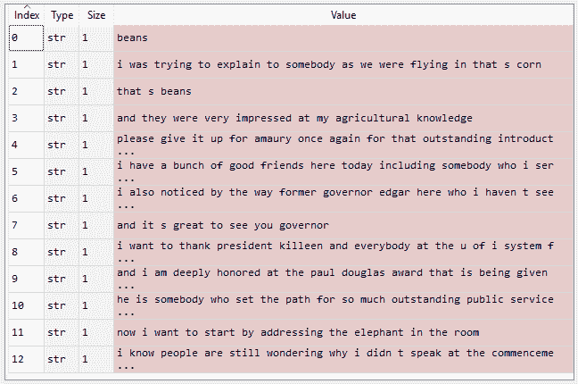
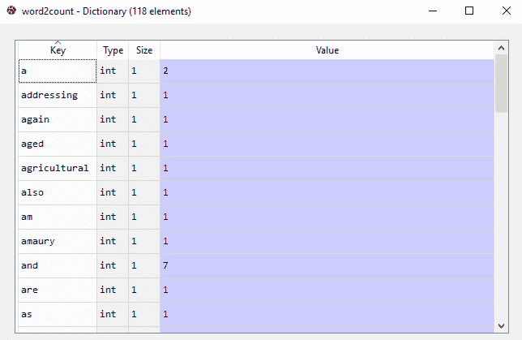
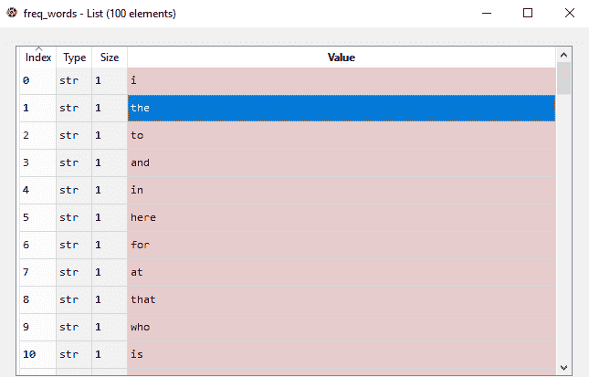
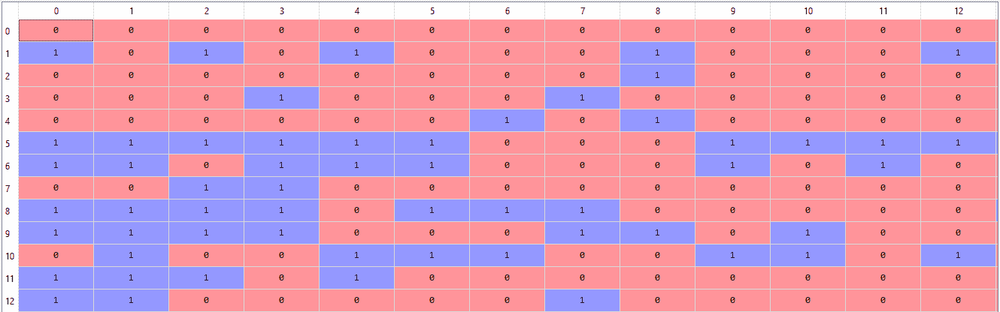

# NLP 中的单词包(BoW)模型

> 原文:[https://www . geesforgeks . org/单词包-蝴蝶结-模型-in-nlp/](https://www.geeksforgeeks.org/bag-of-words-bow-model-in-nlp/)

在本文中，我们将讨论一种称为**单词包**模型的文本建模自然语言处理技术。每当我们在自然语言处理中应用任何算法时，它都适用于数字。我们不能直接将文本输入到该算法中。因此，单词包模型用于预处理文本，将文本转换为一个单词包*，该单词包记录最常用单词的总出现次数。*

*这个模型可以使用一个表来可视化，该表包含与单词本身相对应的单词数。*

***应用单词包模型:***

*让我们用这个样本段落来完成我们的任务:*

> **豆子。当我们飞进来的时候，我试图向某人解释，那是玉米。那是豆子。他们对我的农业知识印象深刻。请为那个出色的介绍再一次为阿毛里放弃它。我今天在这里有一群好朋友，包括和我一起服役的人，他是这个国家最好的参议员之一，我们很幸运有他，你的参议员迪克·德宾在这里。顺便说一下，我还注意到这里的前州长埃德加，我很久没见他了，不知何故，他没有变老，我也变老了。很高兴见到你，州长。我要感谢基林总统和麻省理工学院的每一个人，是他们让我今天能够来到这里。我对被授予的保罗·道格拉斯奖深感荣幸。他为伊利诺伊州如此杰出的公共服务开辟了道路。现在，我想从向房间里的大象讲话开始。我知道人们还在奇怪我为什么没有在毕业典礼上发言。**

***步骤#1 :** 我们将首先对数据进行预处理，以便:*

*   *将文本转换为小写。*
*   *删除所有非单词字符。*
*   *删除所有标点符号。*

```py
*# Python3 code for preprocessing text
import nltk
import re
import numpy as np

# execute the text here as :
# text = """ # place text here  """
dataset = nltk.sent_tokenize(text)
for i in range(len(dataset)):
    dataset[i] = dataset[i].lower()
    dataset[i] = re.sub(r'\W', ' ', dataset[i])
    dataset[i] = re.sub(r'\s+', ' ', dataset[i])*
```

***输出:*** 

*

预处理文本*  *You can further preprocess the text to suit you needs.

**第二步:**获取我们文本中出现频率最高的单词。

我们将应用以下步骤来生成我们的模型。

*   我们声明用字典来装我们的单词包。*   接下来，我们将每个句子标记为单词。*   现在对于句子中的每个单词，我们检查这个单词是否存在于我们的词典中。*   If it does, then we increment its count by 1\. If it doesn’t, we add it to our dictionary and set its count as 1.

    ```py
    # Creating the Bag of Words model
    word2count = {}
    for data in dataset:
        words = nltk.word_tokenize(data)
        for word in words:
            if word not in word2count.keys():
                word2count[word] = 1
            else:
                word2count[word] += 1
    ```

    **输出:**

    

    单词包词典

    在我们的模型中，我们总共有 118 个单词。然而，当处理大型文本时，字数可能达到数百万。我们不需要使用所有这些词。因此，我们选择了一些最常用的词。为了实现这一点，我们使用:

    ```py
    import heapq
    freq_words = heapq.nlargest(100, word2count, key=word2count.get)
    ```

    其中 100 表示我们想要的字数。如果我们的文本很大，我们就会输入更多的文本。

    

    100 个最常见的单词

    **第三步:**构建单词包模型
    在这一步中，我们构建一个向量，它将告诉我们每个句子中的一个单词是否是一个常用单词。如果一个句子中的一个词是常用词，我们将其设置为 1，否则我们将其设置为 0。
    这可以通过以下代码来实现:

    ```py
    X = []
    for data in dataset:
        vector = []
        for word in freq_words:
            if word in nltk.word_tokenize(data):
                vector.append(1)
            else:
                vector.append(0)
        X.append(vector)
    X = np.asarray(X)
    ```

    **输出:**

    

    BoW 模型*