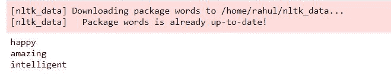
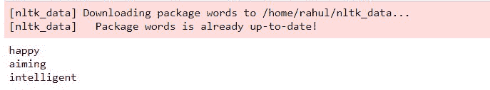

# 使用 Python 中的 NLTK 纠正单词

> 原文:[https://www . geesforgeks . org/correcting-words-use-nltk-in-python/](https://www.geeksforgeeks.org/correcting-words-using-nltk-in-python/)

**nltk** 代表自然语言工具包，是一个由库和程序组成的强大套件，可用于统计自然语言处理。这些库可以实现标记化、分类、解析、词干、标记、语义推理等。这个工具包可以让机器理解人类语言。

我们将使用两种方法进行拼写纠正。每种方法都列出拼错的单词，并为每个不正确的单词给出正确单词的建议。它试图在正确拼写列表中找到一个距离最短、首字母与拼写错误的单词相同的单词。然后它返回符合给定标准的单词。这些方法可以根据它们用来找到最近单词的距离度量来区分。nltk 的单词包被用作正确单词的字典。

### 方法 1:使用雅克卡距离法

Jaccard 距离，与 Jaccard 系数相反，用于测量两个样本集之间的差异。我们通过从 1 中减去雅克卡系数得到雅克卡距离。我们也可以通过将并集和两个集合的交集的大小之差除以并集的大小来得到。我们使用 qg-gram(这些相当于 N-gram)，它们被称为字符而不是标记。雅克卡距离由以下公式给出。


### 逐步实施

**步骤 1:** 首先，我们安装并导入之前讨论过的 nltk 套件和 Jaccard 距离度量。ngrams '用于在给定窗口中获取一组共现词，并从 nltk.utils 包中导入。

## 蟒蛇 3

```
# importing the nltk suite 
import nltk

# importing jaccard distance
# and ngrams from nltk.util
from nltk.metrics.distance import jaccard_distance
from nltk.util import ngrams
```

**第二步:**现在，我们从 nltk 下载器下载‘单词’资源(其中包含单词的正确拼写列表)并通过 nltk .语料库导入，并将其分配给 correct_words。

## 蟒蛇 3

```
# Downloading and importing
# package 'words' from nltk corpus
nltk.download('words')
from nltk.corpus import words

correct_words = words.words()
```

**第三步:**我们定义需要正确拼写的不正确单词列表。然后，我们对不正确单词列表中的每个单词运行一个循环，其中我们计算不正确单词的 Jaccard 距离，每个正确拼写的单词具有相同的首字母，形式为[字符二元模型](https://www.geeksforgeeks.org/python-bigram-formation-from-given-list/)。然后，我们按照升序对它们进行排序，这样最短的距离就在顶部，提取与之对应的单词并打印出来。

## 蟒蛇 3

```
# list of incorrect spellings
# that need to be corrected 
incorrect_words=['happpy', 'azmaing', 'intelliengt']

# loop for finding correct spellings
# based on jaccard distance
# and printing the correct word
for word in incorrect_words:
    temp = [(jaccard_distance(set(ngrams(word, 2)),
                              set(ngrams(w, 2))),w)
            for w in correct_words if w[0]==word[0]]
    print(sorted(temp, key = lambda val:val[0])[0][1])
```

**输出:**



实现 Jaccard Distance 查找正确拼写单词后输出截图

### 方法 2:使用编辑距离方法

编辑距离通过找到将一个字符串转换为另一个字符串所需的最小操作数来衡量两个字符串之间的差异。可以执行的转换有:

*   插入新字符:

```
bat -> bats (insertion of 's')
```

*   删除现有字符。

```
care -> car (deletion of 'e')
```

*   替换现有字符。

```
bin -> bit (substitution of n with t)
```

*   两个现有连续字符的换位。

```
sing -> sign (transposition of ng to gn)
```

### 逐步实施

**第一步:**首先，我们安装并导入 nltk 套件。

## 蟒蛇 3

```
# importing the nltk suite 
import nltk

# importing edit distance  
from nltk.metrics.distance  import edit_distance
```

**第二步:**现在，我们从 nltk 下载器下载‘单词’资源(包含单词的正确拼写)并通过 nltk .语料库导入，并将其分配给 correct_words。

## 蟒蛇 3

```
# Downloading and importing package 'words'
nltk.download('words')
from nltk.corpus import words
correct_words = words.words()
```

**第三步:**我们定义需要正确拼写的不正确单词列表。然后，我们对错误单词列表中的每个单词运行一个循环，其中我们计算错误单词的编辑距离，每个正确拼写的单词具有相同的首字母。然后，我们按照升序对它们进行排序，这样最短的距离就在顶部，提取与之对应的单词并打印出来。

## 蟒蛇 3

```
# list of incorrect spellings
# that need to be corrected 
incorrect_words=['happpy', 'azmaing', 'intelliengt']

# loop for finding correct spellings
# based on edit distance and
# printing the correct words
for word in incorrect_words:
    temp = [(edit_distance(word, w),w) for w in correct_words if w[0]==word[0]]
    print(sorted(temp, key = lambda val:val[0])[0][1])
```

**输出:**



实现编辑距离以找到正确拼写的单词后输出截图