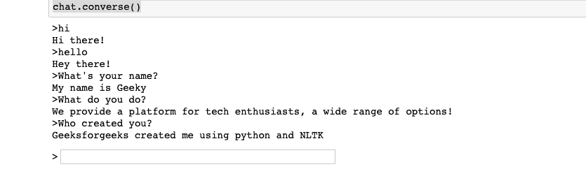

# 使用 Python-NLTK 创建一个基本的硬编码聊天机器人

> 原文:[https://www . geesforgeks . org/creating-a-basic-hard coded-chatbot-use-python-nltk/](https://www.geeksforgeeks.org/creating-a-basic-hardcoded-chatbot-using-python-nltk/)

在 Jupyter 笔记本中使用 Python 创建一个基本聊天机器人。这个聊天机器人使用输入到 Python 代码中的硬编码输入和输出与用户交互。

**需求:**
你需要安装 NLTK(自然语言工具包)，它为用 Python 编程语言编写的英语提供符号和统计自然语言处理的库和程序。要安装此模块，请在终端中键入以下命令。

```py
pip install nltk
```

下面是实现

```py
from nltk.chat.util import Chat, reflections

pairs =[
    ['my name is (.*)', ['Hello ! % 1']],
    ['(hi|hello|hey|holla|hola)', ['Hey there !', 'Hi there !', 'Hey !']],
    ['(.*) your name ?', ['My name is Geeky']],
    ['(.*) do you do ?', ['We provide a platform for tech enthusiasts, a wide range of options !']],
    ['(.*) created you ?', ['Geeksforgeeks created me using python and NLTK']]
]

chat = Chat(pairs, reflections)
chat.converse()
```

**输出:**


**上面代码的解释:**
在第一行代码中，我们已经从自然语言工具包的 chatbot 实用程序中导入了 Chat 类和 Reflections 字典。聊天类，将处理用户和你的聊天机器人之间的对话。Reflections 是一个字典，当正则表达式组中的值与字典中的键匹配时，它将在响应中输出该值。所以对于列表对的第一项，如果我们输入我的名字是 geek，其中 geek 对应于 regex”(。*)”它会输出“你好！Geeky”，也就是说，它取代了 regex 来响应被称为”()的“%1”。*)”换成“Geeky”。现在我们使用对和反射字典初始化聊天机器人。然后在初始化之后，我们调用聊天类的逆向方法来自动化聊天机器人。