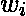
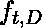
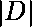
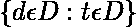

# 特征提取技术–自然语言处理

> 原文:[https://www . geesforgeks . org/feature-extraction-technologies-NLP/](https://www.geeksforgeeks.org/feature-extraction-techniques-nlp/)

本文主要研究自然语言处理中的基本特征提取技术，分析文本之间的相似性。自然语言处理是计算机科学和机器学习的一个分支，处理训练计算机处理大量人类(自然)语言数据。简而言之，自然语言处理是计算机理解人类语言的能力。

**需要特征提取技术**
机器学习算法从训练数据的一组预定义特征中学习，以产生测试数据的输出。但是使用语言处理的主要问题是机器学习算法不能直接在原始文本上工作。因此，我们需要一些特征提取技术来将文本转换成特征矩阵(或向量)。
一些最流行的特征提取方法有:

*   单词包
*   TF-以色列国防军

**单词包:**
单词包是将令牌转换为一组特征的最基本方法之一。BoW 模型用于文档分类，其中每个单词都被用作训练分类器的特征。
例如，在基于评论的情感分析任务中，出现像*‘难以置信’‘优秀’*这样的词表示正面评论，而像*‘讨厌’‘差’*这样的词表示负面评论。
创建 BoW 模型有 3 个步骤:

1.  第一步是**文本预处理**，包括:
    1.  将整个文本转换为小写字符。
    2.  删除所有标点符号和不必要的符号。
2.  The second step is to **create a vocabulary** of all unique words from the corpus. Let’s suppose, we have a hotel review text.
    Let’s consider 3 of these reviews, which are as follows :

    > 1.  Good movie
    > 2.  Not a good movie.
    > 3.  Sure enough, it doesn't look like

    现在，我们考虑来自上述评论集的所有独特单词来创建一个词汇表，如下所示:

    > {好，电影，不是，a，做了，喜欢}

3.  在第三步中，我们通过为每个单词分配一个单独的列来创建一个特征矩阵，而每行对应一个评论。这个过程被称为**文本矢量化**。矩阵中的每个条目表示该单词在评论中的存在(或不存在)。如果单词出现在评论中，我们放 **1** ，如果单词不出现，我们放 **0** 。

对于上面的例子，特征矩阵如下:

| 好的 | 电影 | 不 | a | 做 | 喜欢 |
| --- | --- | --- | --- | --- | --- |
| **1** | **1** | Zero | Zero | Zero | Zero |
| **1** | **1** | **1** | **1** | Zero | Zero |
| Zero | Zero | **1** | Zero | **1** | **1** |

使用这个模型的一个主要缺点是单词出现的顺序丢失了，因为我们以随机的顺序创建了一个标记向量。但是，我们可以通过考虑 **N-grams** (大部分是二元图)来解决这个问题，而不是考虑单个单词(即单个图)。这可以保持单词的本地排序。如果我们从给定的评论中考虑所有可能的二元模型，上表将如下所示:

| 好电影 | 电影 | 不 | a | … |
| --- | --- | --- | --- | --- |
| **1** | **1** | Zero | Zero | … |
| **1** | **1** | Zero | **1** | … |
| Zero | Zero | **1** | Zero | … |

然而，这个表会非常大，因为通过考虑所有可能的连续单词对，可能会有很多可能的二元模型。还有，使用 N-gram 会产生一个巨大的**稀疏的**(有很多 0)矩阵，如果词汇量大的话，使得计算真的很复杂！！
因此，我们必须根据它们的频率去除一些氮克。就像，我们总是可以去掉**高频 N 克**，因为它们几乎出现在所有的文档中。这些高频 N 克一般是冠词、限定词等。最常被称为 **StopWords** 。
同样，我们也可以去掉低频 N 克，因为这些真的很少见(即一般出现在 1、2 篇评论中)！！这些类型的 N-gram 一般都是错别字(或打字错误)。
一般认为中频 N 克最理想。
然而，有一些 N-gram 在我们的语料库中确实很少见，但可以突出某个特定的问题。
假设有一篇评论说–*“Wi-Fi 经常断”。*

在这里，N-gram *的 Wi-Fi 中断*不能太频繁，但它凸显了一个需要关注的主要问题。
我们的 BoW 模型无法捕获这样的 N 克，因为它的频率非常低。为了解决这类问题，我们需要另一个模型，即 **TF-IDF 矢量器**，我们接下来将研究它。
 **代码:创建 BoW 模型的 Python 代码是:**

```
# Creating the Bag of Words model 
word2count = {} 
for data in dataset: 
    words = nltk.word_tokenize(data) 
    for word in words: 
        if word not in word2count.keys(): 
            word2count[word] = 1
        else: 
            word2count[word] += 1
```

**TF-IDF 矢量器:**
TF-IDF 代表*术语频率-逆文档频率*。它强调了一个特定的问题，这个问题在我们的语料库中可能不太常见，但非常重要。TF–IFD 值随着单词在文档中出现的次数成比例增加，随着语料库中包含该单词的文档数量减少。它由两个子部分组成，分别是:

1.  术语频率
2.  反向文档频率

**术语频率(TF) :**
术语频率指定术语在整个文档中出现的频率。它可以被认为是在文档中找到一个单词的概率。它计算单词在评论中出现的次数，相对于评论中的单词总数。其表述如下:

![\[tf(w_i, r_j)=\frac{No.\, of \, times \, w_i \, occurs \, in \, r_j}{Total \, no. \, of \, words \, in \, r_j}\]](img/ad5f3cc2759f8dba9616c3b11021fa74.png "Rendered by QuickLaTeX.com")

计算 tf 的不同方案是*对数归一化*。它被表述为:

![\[tf(t, d)=1 + \log{\(f_{t, d}\)}\]](img/4ea289cd27c1612653a7a35374accea3.png "Rendered by QuickLaTeX.com")

其中，
是文档 d 中术语 t 的出现频率。

**反向文档频率(IDF) :**
反向文档频率是对一个术语在整个语料库的文档中是稀有还是频繁的度量。它突出了那些出现在语料库中非常少的文档中的单词，或者用简单的语言来说，那些罕见的单词具有很高的 IDF 分数。IDF 是一个对数归一化值，它是通过将语料库中的文档总数除以包含术语的文档数，并取整个术语的对数而获得的。

![\[idf(d, D)=\log{\frac{|D|}{\{d \epsilon D:t \epsilon D\}}}\]](img/197546df8fcc250b7933b1e7f668244b.png "Rendered by QuickLaTeX.com")

其中，
是单词 t 在文档 d 中出现的频率。
是语料库中的文档总数。
是语料库中文档的计数，其中包含术语 t。

由于 IDF 的对数函数中的比值必须始终大于或等于 1，因此 IDF(以及 TF–IDF)的值大于或等于 0。当一个术语出现在大量文档中时，对数内的比值接近 1，IDF 更接近 0。

**术语频率-逆文档频率(TF-IDF)**
TF-IDF 是 TF 和 IDF 的乘积。其表述如下:

![\[tfidf(t, d, D) = tf(t, d)*idf(d, D)\]](img/19593907453a130919c5d4e063a7404a.png "Rendered by QuickLaTeX.com")

高 TF-IDF 分数是通过在文档中具有高频率而在语料库中具有低文档频率的术语获得的。对于出现在几乎所有文档中的一个词，IDF 值接近 0，使得 tf-idf 也更接近 0。当 IDF 和 TF 值都很高时，TF-IDF 值很高，即该词在整个文档中很少见，但在文档中却很常见。

让我们举同一个例子来更好地理解这一点:

> 1.  Good movie
> 2.  Not a good movie.
> 3.  Sure enough, it doesn't look like

在这个例子中，每个句子都是一个单独的文档。

考虑到二元模型，我们计算每个二元模型的 TF-IDF 值:

|  | 好电影 | 电影 | 不 |
| --- | --- | --- | --- |
| **好电影** | 1*log(3/2) = 0.17 | 1*log(3/2) = 0.17 | 0*log(3/1) = 0 |
| **不是好电影** | 1*log(3/2) = 0.17 | 1*log(3/2) = 0.17 | 0*log(3/1) = 0 |
| **不喜欢** | 0*log(3/2) = 0 | 0*log(3/2) = 0 | 1*log(3/1) = 0.47 |

在这里，我们观察到，与其他标记相比，bigram *没有*是罕见的(即仅出现在一个文档中)，因此具有更高的 tf-idf 分数。

**代码:使用 python 内置函数 *TfidfVectorizer* 计算任意语料库的 tf-idf 评分**

```
# calculating tf-idf values
from sklearn.feature_extraction.text import TfidfVectorizer
import pandas as pd

texts = {
"good movie", "not a good movie", "did not like"
}

tfidf = TfidfVectorizer(min_df = 2, max_df = 0.5, ngram_range = (1, 2))
features = tfidf.fit_transform(texts)

pd.Dataframe{
     features.todense(),
     columns = tfidf.get_feature_names()
}
```

最后，我们可以说，尽管词袋是特征提取和文本矢量化中最基本的方法之一，但它无法捕捉文本中的某些问题。然而，这个问题是由 TF-IDF Vectorizer 解决的，这也是一种特征提取方法，它捕获了一些在整个语料库中不太频繁出现的主要问题。