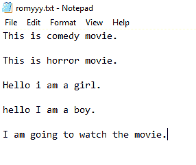
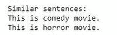

# 查找文件中与输入句子最相似的句子| NLP

> 原文:[https://www . geesforgeks . org/find-最相似-文件中的句子-输入句子-nlp/](https://www.geeksforgeeks.org/find-most-similar-sentence-in-the-file-to-the-input-sentence-nlp/)

在本文中，我们将在文件中找到与输入句子最相似的句子。

**示例:**

```py
File content:
"This is movie."
"This is romantic movie"
"This is a girl."

Input: "This is a boy"

Similar sentence to input: 
"This is a girl", "This is movie".
```

**进场:**

1.  创建一个列表来存储文件中所有唯一的单词。
2.  在清理(移除 stopword、词干等)后，通过将每个单词与列表内容进行比较，将文件的所有句子转换为二进制格式。)
3.  将输入句子转换为二进制格式。
4.  找到输入句子中与每个句子相似的词的数量，并将该值存储在名为相似性索引的列表中。
5.  求相似度指数的最大值，返回相似词最多的句子。

**文件内容:**



**代码得到类似的句子:**

## 蟒蛇 3

```py
from nltk.stem import PorterStemmer
from nltk.tokenize import word_tokenize, sent_tokenize
import nltk
from nltk.corpus import stopwords

nltk.download('stopwords')
ps = PorterStemmer()
f = open('romyyy.txt')
a = sent_tokenize(f.read())

# removal of stopwords
stop_words = list(stopwords.words('english'))

# removal of punctuation signs
punc = '''!()-[]{};:'"\, <>./?@#$%^&*_~'''
s = [(word_tokenize(a[i])) for i in range(len(a))]
outer_1 = []

for i in range(len(s)):
    inner_1 = []

    for j in range(len(s[i])):

        if s[i][j] not in (punc or stop_words):
            s[i][j] = ps.stem(s[i][j])

            if s[i][j] not in stop_words:
                inner_1.append(s[i][j].lower())

    outer_1.append(set(inner_1))
rvector = outer_1[0]

for i in range(1, len(s)):
    rvector = rvector.union(outer_1[i])
outer = []

for i in range(len(outer_1)):
    inner = []

    for w in rvector:

        if w in outer_1[i]:
            inner.append(1)

        else:
            inner.append(0)
    outer.append(inner)
comparison = input("Input: ")

check = (word_tokenize(comparison))
check = [ps.stem(check[i]).lower() for i in range(len(check))]

check1 = []
for w in rvector:
    if w in check:
        check1.append(1)  # create a vector
    else:
        check1.append(0)

ds = []

for j in range(len(outer)):
    similarity_index = 0
    c = 0

    if check1 == outer[j]:
        ds.append(0)
    else:
        for i in range(len(rvector)):

            c += check1[i]*outer[j][i]

        similarity_index += c
        ds.append(similarity_index)

ds
maximum = max(ds)
print()
print()
print("Similar sentences: ")
for i in range(len(ds)):

    if ds[i] == maximum:
        print(a[i])
```

**输出:**

 