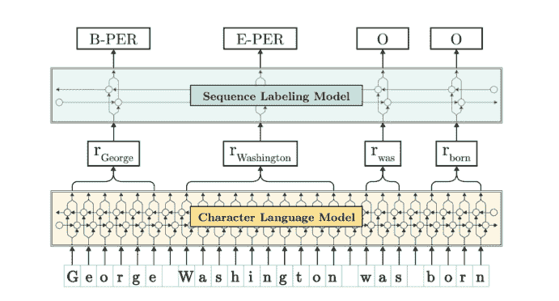
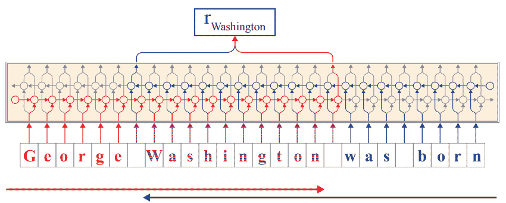
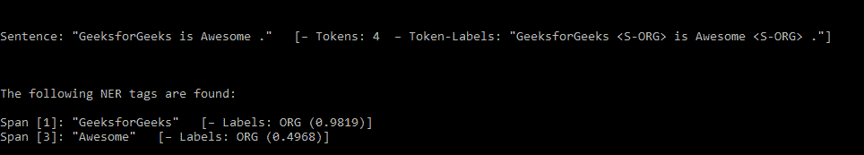
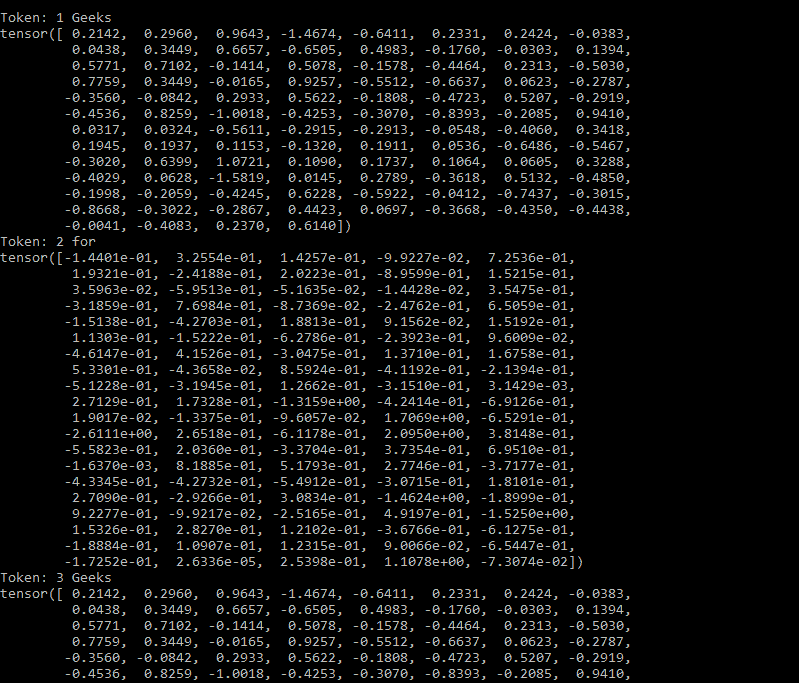
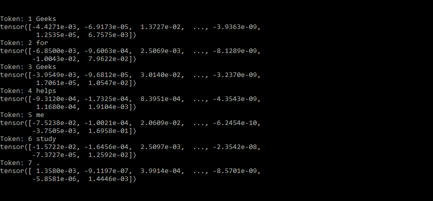
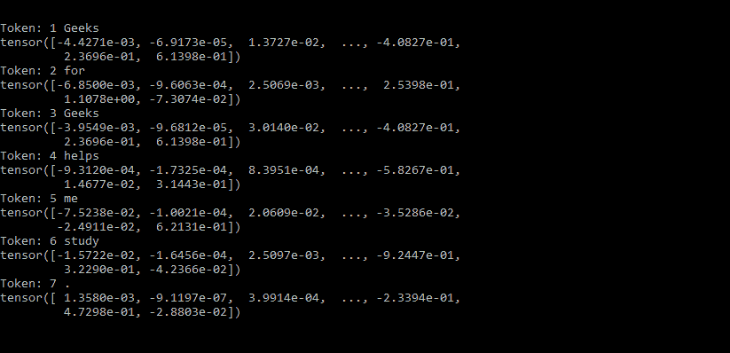
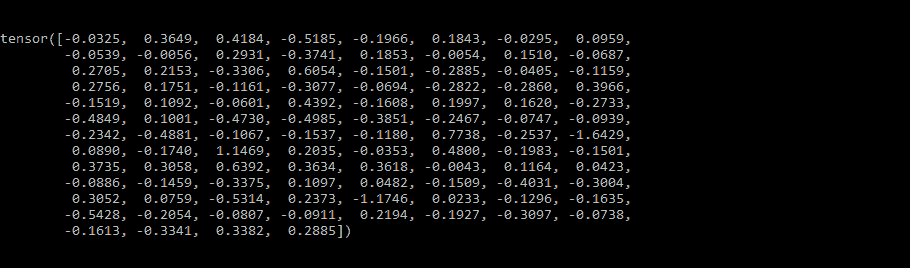

# FLAIR–自然语言处理的框架

> 原文:[https://www.geeksforgeeks.org/flair-a-framework-for-nlp/](https://www.geeksforgeeks.org/flair-a-framework-for-nlp/)

**什么是 FLAIR？**

这是最先进的自然语言处理的简单框架。这是一个非常强大的库，由 Zalando Research 开发。Flair 框架建立在 **PyTorch 之上。**

**Flair 有哪些功能？**

1.  Flair 支持许多用于执行自然语言处理任务的单词嵌入，如快速文本、ELMo、手套、BERT 及其变体、XLM 和字节对嵌入，包括 Flair 嵌入。
2.  Flair 嵌入基于**上下文字符串嵌入**的概念，用于**序列标签。**
3.  使用 Flair，您还可以将不同的单词嵌入组合在一起，以获得更好的结果。
4.  Flair 支持多种语言。

**上下文字符串嵌入:**

在该单词嵌入中，单词中的每个字母被发送到**字符语言模型**，然后从向前和向后的列表中取出输入表示。



单词“Washington”的输入表示是基于单词“Washington”之前的上下文来考虑的。获取每个单词的第一个和最后一个字符状态，以便生成单词嵌入。



你可以看到，对于单词“Washington”，红色标记是向前的 LSTM 输出，蓝色标记是向后的 LSTM 输出。前向和后向上下文被连接以获得单词“Washington”的输入表示。

在获得输入表示后，它被馈送到向前和向后的 LSTM，以获得您正在处理的特定任务。在提到的图表中，我们试图得到 NER。

**安装 Flair:**

你应该已经安装了 **PyTorch > =1.1** 和 **Python > =3.6** 。要在蟒蛇上安装 PyTorch，请运行以下命令-

```
conda install -c pytorch pytorch

```

要安装 flair，请运行–

```
pip install flair

```

**天赋的工作**

**1) Flair 数据类型:**

Flair 提供两种类型的对象。它们是:

1.  句子
2.  代币

要获取一个句子中的标记数:

## 蟒蛇 3

```
import flair
from flair.data import Sentence

# take a sentence
s= Sentence('GeeksforGeeks is Awesome.')
print(s)
```

**输出:**


**2) NER 标记:**

为了预测给定句子的标签，我们将使用如下所示的预训练模型:

## 蟒蛇 3

```
import flair
from flair.data import Sentence
from flair.models import SequenceTagger

# input a sentence
s = Sentence('GeeksforGeeks is Awesome.')

# loading NER tagger
tagger_NER= SequenceTagger.load('ner')

# run NER over sentence
tagger_NER.predict(s)
print(s)
print('The following NER tags are found:\n')

# iterate and print
for entity in s.get_spans('ner'):
    print(entity)
```

**输出:**



**3)单词嵌入:**

单词嵌入为文本的每个单词提供嵌入。如前所述，Flair 支持许多单词嵌入，包括它自己的 Flair 嵌入。这里我们将看到如何实现其中的一些。

**A)经典单词嵌入–**这类单词嵌入是静态的。在这种情况下，每个不同的单词只被赋予一个预先计算的嵌入。大多数常见的单词嵌入都属于这一类，包括 GloVe 嵌入。

## 蟒蛇 3

```
import flair
from flair.data import Sentence
from flair.embeddings import WordEmbeddings

# using glove embedding
GloVe_embedding = WordEmbeddings('glove')

# input a  sentence
s = Sentence('Geeks for Geeks helps me study.')

# embed the sentence
GloVe_embedding.embed(s)

# print the embedded tokens
for token in s:
    print(token)
    print(token.embedding)
```

**输出:**



**注意:**你可以在这里看到两次出现的单词“*极客*的嵌入是相同的。

**B)Flair Embedding–**这是基于上下文字符串嵌入的概念。它捕捉潜在的句法语义信息。单词嵌入是由它们周围的单词语境化的。因此，它会根据周围的文本对同一个单词进行不同的嵌入。

## 蟒蛇 3

```
import flair
from flair.data import Sentence
from flair.embeddings import FlairEmbeddings

# using forward flair embeddingembedding
forward_flair_embedding= FlairEmbeddings('news-forward-fast')

# input the sentence
s = Sentence('Geeks for Geeks helps me study.')

# embed words in the input sentence
forward_flair_embedding.embed(s)

# print the embedded tokens
for token in s:
    print(token)
    print(token.embedding)
```

**输出:**



**注意:**在这里，我们看到“极客”一词的嵌入在两次出现时是不同的，这取决于它们周围的上下文信息。

**C)堆叠嵌入–**使用这些嵌入，您可以将不同的嵌入组合在一起。让我们来看看如何将 GloVe、前向和后向 Flair 嵌入结合起来:

## 蟒蛇 3

```
import flair
from flair.data import Sentence
from flair.embeddings import FlairEmbeddings, WordEmbeddings
from flair.embeddings import StackedEmbeddings
# flair embeddings
forward_flair_embedding= FlairEmbeddings('news-forward-fast')
backward_flair_embedding= FlairEmbeddings('news-backward-fast')

# glove embedding
GloVe_embedding = WordEmbeddings('glove')

# create a object which combines the two embeddings
stacked_embeddings = StackedEmbeddings([forward_flair_embedding,
                                        backward_flair_embedding,
                                        GloVe_embedding,])

# input the sentence
s = Sentence('Geeks for Geeks helps me study.')

# embed the input sentence with the stacked embedding
stacked_embeddings.embed(s)

# print the embedded tokens
for token in s:
    print(token)
    print(token.embedding)
```

**输出:**



**4)文件嵌入:**

与单词嵌入不同，文档嵌入为整个文本提供了单一嵌入。Flair 提供的文档嵌入包括:

*   **A)** 变压器文件嵌入
*   **B)** 句子转换文档嵌入
*   **C)** 记录 RNN 嵌入
*   **D)** 文档池嵌入

让我们来看看文档池嵌入是如何工作的

**文档池嵌入—** 这是一个非常简单的文档嵌入，它汇集了所有的单词嵌入，并返回所有单词嵌入的平均值。

## 蟒蛇 3

```
import flair
from flair.data import Sentence
from flair.embeddings import WordEmbeddings, DocumentPoolEmbeddings

# init the glove word embedding
GloVe_embedding = WordEmbeddings('glove')

# init the document embedding
doc_embeddings = DocumentPoolEmbeddings([GloVe_embedding])

# input the sentence
s = Sentence('Geeks for Geeks helps me study.')

#embed the input sentence with the document embedding
doc_embeddings.embed(s)

# print the embedded tokens
print(s.embedding)
```

**输出:**



同样，您也可以使用其他文档嵌入。

**5)使用 Flair 训练文本分类模型:**

我们将使用 Flair 中提供的*‘TREC _ 6’数据集*。您也可以使用自己的数据集。为了训练我们的模型，我们将使用*文档 RNN 嵌入*，它在一个句子中的所有单词嵌入上训练一个 RNN。我们将使用的单词嵌入是*手套和向前天赋嵌入。*

## 蟒蛇 3

```
from flair.data import Corpus
from flair.datasets import TREC_6
from flair.embeddings import WordEmbeddings, FlairEmbeddings, DocumentRNNEmbeddings
from flair.models import TextClassifier
from flair.trainers import ModelTrainer

# load the corpus
corpus = TREC_6()

# create a label dictionary
label_Dictionary = corpus.make_label_dictionary()

# list of word embeddings to be used
word_embeddings = [WordEmbeddings('glove'),FlairEmbeddings('news-forward-fast')]

# init document embeddings and pass the word embeddings list
doc_embeddings = DocumentRNNEmbeddings(word_embeddings,hidden_size = 250)

# creating the text classifier
text_classifier = TextClassifier(doc_embeddings,label_dictionary = label_Dictionary)

# init the text classifier trainer
model_trainer = ModelTrainer(text_classifier,corpus)

# train your model
model_trainer.train('resources/taggers/trec',learning_rate=0.1,mini_batch_size=40,anneal_factor=0.5,patience=5,max_epochs=200)
```