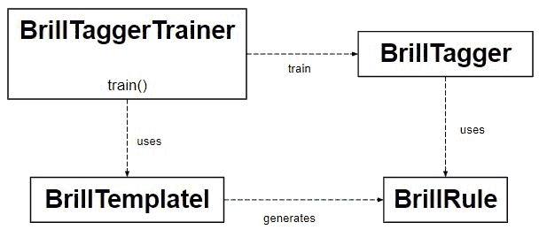

# NLP | Brill Tagger

> 原文:[https://www.geeksforgeeks.org/nlp-brill-tagger/](https://www.geeksforgeeks.org/nlp-brill-tagger/)

*   **brillitagger 类**是一个**基于转化的 tagger** 。它不是 SequentialBackoffTagger 的子类。
*   此外，它使用一系列规则来纠正初始标记器的结果。
*   它遵循的这些规则是基于分数的。这个分数等于他们改正的错误数减去他们产生的新错误数。



**代码#1:训练一个高明的班级**

```py
# Loading Libraries
from nltk.tag import brill, brill_trainer

def train_brill_tagger(initial_tagger, train_sents, **kwargs):
    templates = [
            brill.Template(brill.Pos([-1])),
            brill.Template(brill.Pos([1])),
            brill.Template(brill.Pos([-2])),
            brill.Template(brill.Pos([2])),
            brill.Template(brill.Pos([-2, -1])),
            brill.Template(brill.Pos([1, 2])),
            brill.Template(brill.Pos([-3, -2, -1])),
            brill.Template(brill.Pos([1, 2, 3])),
            brill.Template(brill.Pos([-1]), brill.Pos([1])),
            brill.Template(brill.Word([-1])),
            brill.Template(brill.Word([1])),
            brill.Template(brill.Word([-2])),
            brill.Template(brill.Word([2])),
            brill.Template(brill.Word([-2, -1])),
            brill.Template(brill.Word([1, 2])),
            brill.Template(brill.Word([-3, -2, -1])),
            brill.Template(brill.Word([1, 2, 3])),
            brill.Template(brill.Word([-1]), brill.Word([1])),
            ]

    # Using BrillTaggerTrainer to train 
    trainer = brill_trainer.BrillTaggerTrainer(
            initial_tagger, templates, deterministic = True)

    return trainer.train(train_sents, **kwargs)
```

**代码#2:让我们使用训练有素的布里尔塔格**

```py
from nltk.tag import brill, brill_trainer
from nltk.tag import DefaultTagger
from nltk.corpus import treebank
from tag_util import train_brill_tagger

# Initializing
default_tag = DefaultTagger('NN')

# initializing training and testing set    
train_data = treebank.tagged_sents()[:3000]
test_data = treebank.tagged_sents()[3000:]

initial_tag = backoff_tagger(
        train_data, [UnigramTagger, BigramTagger, 
                    TrigramTagger], backoff = default_tagger)

a = initial_tag.evaluate(test_data)
print ("Accuracy of Initial Tag : ", a)
```

**输出:**

```py
Accuracy of Initial Tag : 0.8806820634578028

```

**代码#3 :**

```py
brill_tag = train_brill_tagger(initial_tag, train_data)
b = brill_tag.evaluate(test_data)

print ("Accuracy of brill_tag : ", b)
```

**输出:**

```py
Accuracy of brill_tag : 0.8827541549751781

```