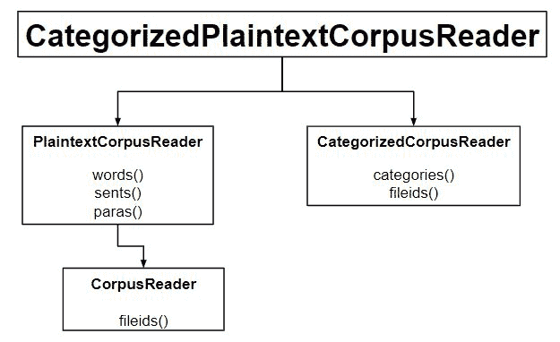

# NLP |分类文本语料库

> 原文:[https://www.geeksforgeeks.org/nlp-categorized-text-corpus/](https://www.geeksforgeeks.org/nlp-categorized-text-corpus/)

如果我们有大量的文本数据，那么我们可以将其分类到不同的部分。



**代码#1:分类**

## 蟒蛇 3

```py
# Loading brown corpus
from nltk.corpus import brown

brown.categories()
```

**输出:**

```py
['adventure', 'belles_lettres', 'editorial', 'fiction', 'government',
'hobbies', 'humor', 'learned', 'lore', 'mystery', 'news', 'religion',
'reviews', 'romance', 'science_fiction']
```

**如何对语料库进行分类？**
最简单的方法是每个类别有一个文件。以下是电影评论语料库的两个摘录:

*   电影 _pos.txt
*   电影 _neg.txt

使用这两个文件，我们将有两个类别 pos 和 neg。

**代码#2:我们来分类**

## 蟒蛇 3

```py
from nltk.corpus.reader import CategorizedPlaintextCorpusReader

reader = CategorizedPlaintextCorpusReader(
        '.', r'movie_.*\.txt', cat_pattern = r'movie_(\w+)\.txt')

print ("Categorize : ", reader.categories())

print ("\nNegative field : ", reader.fileids(categories =['neg']))

print ("\nPositive field : ", reader.fileids(categories =['pos']))
```

**输出:**

```py
Categorize : ['neg', 'pos']

Negative field : ['movie_neg.txt']

Positive field : ['movie_pos.txt']
```

**代码#3:代替 cat_pattern，在 cat_map 中使用**

## 蟒蛇 3

```py
from nltk.corpus.reader import CategorizedPlaintextCorpusReader

reader = CategorizedPlaintextCorpusReader(
        '.', r'movie_.*\.txt', cat_map ={'movie_pos.txt': ['pos'],
                                        'movie_neg.txt': ['neg']})

print ("Categorize : ", reader.categories())
```

**输出:**

```py
Categorize : ['neg', 'pos']
```