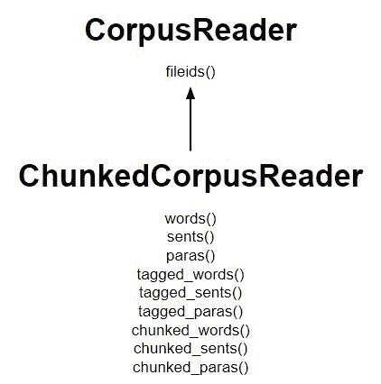

# NLP |使用语料库阅读器进行组块

> 原文:[https://www . geesforgeks . org/NLP-chunking-use-corpus-reader/](https://www.geeksforgeeks.org/nlp-chunking-using-corpus-reader/)

**什么是组块？**
这些是由单词组成的，单词的种类是使用词性标签定义的。一个人甚至可以定义一个模式或单词，它不能成为 chuck 的一部分，这样的单词被称为 chinks。ChunkRule 类指定在一个块中包含和排除哪些单词或模式。

**工作原理:**

*   **ChunkedCorpusReader** 类的工作方式与 TaggedCorpusReader 类似，用于获取标记令牌，此外它还提供了三种获取组块的新方法。
*   **的一个实例代表每个块。**
*   名词短语树看起来像树(' NP '，[…])，而句子级树看起来像树(' S '，[…])。
*   在 n 个 chunked_sents()中获得句子树的列表，每个名词短语作为句子的子树
*   在 chunked_words()中获得不在组块中的单词的标记标记旁边的名词短语树的列表。

列出主要方法的图表:


**代码#1:为单词创建一个 ChunkedCorpusReader】**

```py
# Using ChunkedCorpusReader
from nltk.corpus.reader import ChunkedCorpusReader

# intitializing
x = ChunkedCorpusReader('.', r'.*\.chunk')

words = x.chunked_words()
print ("Words : \n", words)
```

**输出:**

```py
Words : 
[Tree('NP', [('Earlier', 'JJR'), ('staff-reduction', 'NN'), 
('moves', 'NNS')]), ('have', 'VBP'), ...]

```

**代码#2:用于句子**

```py
Chunked Sentence = x.chunked_sents()
print ("Chunked Sentence : \n", tagged_sent)
```

**输出:**

```py
Chunked Sentence : 
[Tree('S', [Tree('NP', [('Earlier', 'JJR'), ('staff-reduction', 'NN'), 
('moves', 'NNS')]), ('have', 'VBP'), ('trimmed', 'VBN'), ('about', 'IN'), 
Tree('NP', [('300', 'CD'), ('jobs', 'NNS')]), (', ', ', '),
Tree('NP', [('the', 'DT'), ('spokesman', 'NN')]), ('said', 'VBD'), ('.', '.')])]

```

**代码#3:针对段落**

```py
para = x.chunked_paras()()
print ("para : \n", para)
```

**输出:**

```py
[[Tree('S', [Tree('NP', [('Earlier', 'JJR'), ('staff-reduction',
'NN'), ('moves', 'NNS')]), ('have', 'VBP'), ('trimmed', 'VBN'),
('about', 'IN'), 
Tree('NP', [('300', 'CD'), ('jobs', 'NNS')]), (', ', ', '), 
Tree('NP', [('the', 'DT'), ('spokesman', 'NN')]), ('said', 'VBD'), ('.', '.')])]] 
```