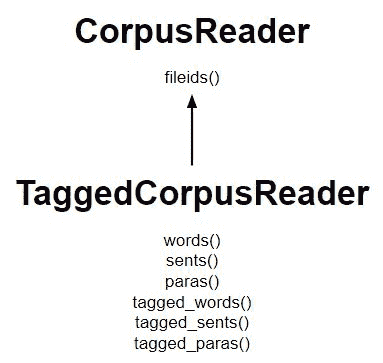

# NLP |使用标记语料库阅读器进行定制

> 原文:[https://www . geesforgeks . org/NLP-定制-使用-标记-语料库-阅读器/](https://www.geeksforgeeks.org/nlp-customization-using-tagged-corpus-reader/)

**我们如何使用标记语料库阅读器？**

*   自定义单词标记器
*   自定义句子标记器
*   自定义段落块阅读器
*   自定义标签分隔符
*   将标签转换为通用标签集



**代码#1:定制单词标记器**

## 蟒蛇 3

```
# Loading the libraries
from nltk.tokenize import SpaceTokenizer
from nltk.corpus.reader import TaggedCorpusReader

x = TaggedCorpusReader('.', r'.*\.pos',
                       word_tokenizer = SpaceTokenizer())

x.words()
```

**输出:**

```
['The', 'expense', 'and', 'time', 'involved', 'are', ...]
```

**代码#2:用于句子**

## 蟒蛇 3

```
# Loading the libraries
from nltk.tokenize import LineTokenizer
from nltk.corpus.reader import TaggedCorpusReader

x = TaggedCorpusReader('.', r'.*\.pos',
                       sent_tokenizer = LineTokenizer())

x.sents()
```

**输出:**

```
[['The', 'expense', 'and', 'time', 'involved', 'are', 'astronomical', '.']]
```

**定制段落**

*   假设段落被空行分割
*   使用 para_block_reader 功能完成，即**nltk . corps . reader . util . read _ blank line _ block**
*   许多其他块读取器存在于**中，其目的是从流中读取文本块。**

**定制标签分隔符**

*   如果“/”没有用作单词/标签分隔符，可以向 TaggedCorpusReader 传递一个替代字符串，用于 sep。
*   **默认为 sep='/'** ，但如果要用“|”拆分单词和标签，如“单词|标签”，则传入 sep='| '。

**将标签转换为通用标签集**
**标签集:**是一个或多个语料库使用的 POS 标签列表。
**通用标记集:**它是一个简化和精简的标记集，仅由 12 个词性标记组成
**代码#3:将语料库标记映射到通用标记集**

## 蟒蛇 3

```
from nltk.corpus.reader import TaggedCorpusReader

x = TaggedCorpusReader('.', r'.*\.pos', tagset ='en-brown')
x.tagged_words(tagset ='universal')
```

**输出:**

```
[('The', 'DET'), ('expense', 'NOUN'), ('and', 'CONJ'), ...] 
```

**代码#4:将语料库标签映射到通用标签集**

## 蟒蛇 3

```
from nltk.corpus.reader import TaggedCorpusReader
from nltk.corpus import treebank

treebank.tagged_words()

treebank.tagged_words(tagset ='universal')

treebank.tagged_words(tagset ='brown')
```

**输出:**

```
[('Pierre', 'NNP'), ('Vinken', 'NNP'), (', ', ', '), ...]

[('Pierre', 'NOUN'), ('Vinken', 'NOUN'), (', ', '.'), …]

[('Pierre', 'UNK'), ('Vinken', 'UNK'), (', ', 'UNK'), ...]
```