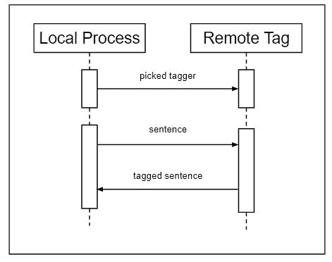

# NLP |使用 Execnet 进行分布式标记–第 1 部分

> 原文:[https://www . geesforgeks . org/NLP-distributed-taging-with-exec net-part-1/](https://www.geeksforgeeks.org/nlp-distributed-tagging-with-execnet-part-1/)

**什么是 Execnet？**

*   **Execnet** 是 Python 的分布式执行库。
*   它允许为远程代码执行创建网关和通道。
*   网关是从调用进程到远程环境的连接。
*   远程环境可以是本地子进程，也可以是到远程节点的 SSH 连接。
*   通道是从网关创建的，处理通道创建者和远程代码之间的通信。
*   这样，execnet 就是一种**消息传递接口(MPI)** ，网关创建连接，通道用来来回发送消息。

由于许多 NLTK 进程在计算过程中占用 100%的 CPU，因此 execnet 是分配该计算以获得最大资源利用率的理想方式。每个中央处理器核心可以创建一个网关，核心是在本地计算机中还是分布在远程机器中并不重要。在许多情况下，只需要在一台机器上拥有经过训练的对象和数据，并且可以根据需要将对象和数据发送到远程节点。
**安装 execnet :**
应该和 **sudo pip 安装 execnet** 或者 **sudo easy_install execnet** 一样简单。截至本文撰写之时，execnet 的当前版本是 1.2。execnet 主页包含 API 文档和示例，位于[http://codespeak.net/execnet/.](http://codespeak.net/execnet/.)

**它是如何工作的？**
需要导入 Pickle 才能序列化(传输)标记器。Execnet 本身并不知道如何处理复杂的对象，例如词性标记器，因此标记器将使用 **pickle.dumps()转储到字符串中。**
使用 **nltk.tag.pos_tag()** 函数使用的默认标记器，但是任何预先训练的词性标记器都可以使用，只要它实现了**标记器**接口。Execnet 可以通过在序列化标记器后用 execnet.makegateway()创建网关来启动。
默认网关创建 Python 子流程，可以调用 remote_tag 模块的 **remote_exec()** 函数创建通道。使用开放通道，可以发送序列化的标记符，然后是树库语料库的第一个标记化句子。
视觉上，交流过程看起来是这样的

现在，调用 **channel.receive()** ，会返回一个标记句，这个标记句相当于树库语料库中的第一个标记句，所以已知标记起作用了。最后，它通过退出网关而结束，网关关闭通道并终止子进程。

```
import execnet, remote_tag, nltk.tag, nltk.data
from nltk.corpus import treebank
import pickle

pickled_tagger = pickle.dumps(nltk.data.load(nltk.tag._POS_TAGGER))
gw = execnet.makegateway()

channel = gw.remote_exec(remote_tag)
channel.send(pickled_tagger)
channel.send(treebank.sents()[0])

tagged_sentence = channel.receive()

# will give output
tagged_sentence == treebank.tagged_sents()[0]

gw.exit()
```

**输出:**

```
True
```