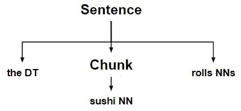
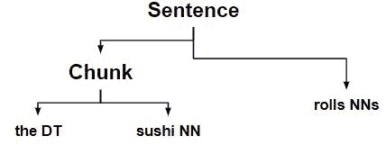
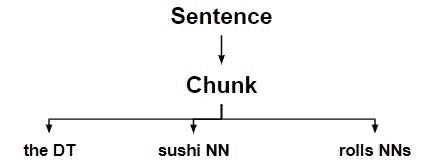
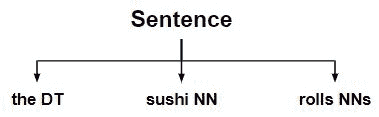

# NLP |用正则表达式扩展和移除组块

> 原文:[https://www . geeksforgeeks . org/NLP-expanding-and-remove-chunks-with-regex/](https://www.geeksforgeeks.org/nlp-expanding-and-removing-chunks-with-regex/)

**正则表达式或正则表达式不支持所有的`RegexpChunkRule classes`。所以，我们需要手动创建它们。**

本文主要讨论其中的三类:

**ExpandRightRule:** 它在一个组块的右边添加了一些不连贯的单词。
**ExpandLeftRule:** 它在一个大块的左边添加了不连贯的单词。
对于`ExpandLeftRule` 和`ExpandRightRule` 作为参数–分别是我们想要添加到块的开始和结束的左右缝隙模式。

**解开规则:**它解开任何匹配的块，它变成一个缝隙。

**代码#1:代码如何工作**

```
# Loading Libraries
from nltk.chunk.regexp import ChunkRule, ExpandLeftRule
from nltk.chunk.regexp import ExpandRightRule, UnChunkRule
from nltk.chunk import RegexpChunkParser

# Initialising ChunkRule
ur = ChunkRule('<NN>', 'single noun')

# Initialising ExpandLeftRule
el = ExpandLeftRule('<DT>', '<NN>', 'get left determiner')

# Initialising ExpandRightRule
er = ExpandRightRule('<NN>', '<NNS>', 'get right plural noun')

# Initialising UnChunkRule
un = UnChunkRule('<DT><NN.*>*', 'unchunk everything')

chunker = RegexpChunkParser([ur, el, er, un])

sent = [('the', 'DT'), ('sushi', 'NN'), ('rolls', 'NNS')]

chunker.parse(sent)
```

**输出:**

```
Tree('S', [('the', 'DT'), ('sushi', 'NN'), ('rolls', 'NNS')])
```

**注意:** Output 是一个扁平的句子，因为 ununknock rule 将前面的规则创建的组块取消。

**这东西是怎么工作的？**

*   用名词组成一个组块。
    
*   将左限定词扩展为以名词开头的词块。
    
*   将右复数名词扩展为以名词结尾的组块。
    
*   最后，它解开限定词+名词+复数名词的每一个组块，得到原句树。
    

**代码#2:解释图表的分步代码。**

```
# Loading Libraries
from nltk.chunk.regexp import ChunkRule, ExpandLeftRule
from nltk.chunk.regexp import ExpandRightRule, UnChunkRule
from nltk.chunk import RegexpChunkParser
from nltk.chunk.regexp import ChunkString
from nltk.tree import Tree

chunk_string = ChunkString(Tree('S', sent))
print ("Chunk String : ", chunk_string)

# Initialising ChunkRule
ur = ChunkRule('<NN>', 'single noun')
ur.apply(chunk_string)
print ("\nstep 1 : ", chunk_string)

# Initialising ExpandLeftRule
el = ExpandLeftRule('<DT>', '<NN>', 'get left determiner')
el.apply(chunk_string)
print ("step 2 : ", chunk_string)

# Initialising ExpandRightRule
er = ExpandRightRule('<NN>', '<NNS>', 'get right plural noun')
er.apply(chunk_string)
print ("step 3 : ", chunk_string)

# Initialising UnChunkRule
un = UnChunkRule('<DT><NN.*>*', 'unchunk everything')
un.apply(chunk_string)
print ("step 4 : ", chunk_string)
```

**输出:**

```
Chunk String :   <DT>  <NN>  <NNS> 

step 1 :   <DT> {<NN>} <NNS> 
step 2 :  {<DT>  <NN>} <NNS> 
step 3 :  {<DT>  <NN>  <NNS>}
step 4 :   <DT>  <NN>  <NNS>
```