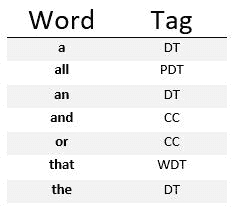

# NLP |过滤无关紧要的词

> 原文:[https://www . geesforgeks . org/NLP-过滤-无关紧要-字数/](https://www.geeksforgeeks.org/nlp-filtering-insignificant-words/)

这个短语中使用的许多词都不重要，没有任何意义。例如——英语是一门学科。在这里，“英语”和“主语”是最重要的词，“是”、“a”几乎没有用。英语主语和主语英语的意思是一样的，即使我们去掉了无关紧要的词–(‘是’，‘a’)。使用 nltk，我们可以通过查看它们的词性标签来删除无关紧要的单词。为此，我们必须决定哪些词性标签是重要的。



**代码# 1:filter _ notify()类过滤掉不重要的词**

```py
def filter_insignificant(chunk, 
                         tag_suffixes =['DT', 'CC']):    
    good = []

    for word, tag in chunk:
        ok = True

    for suffix in tag_suffixes:
        if tag.endswith(suffix):
            ok = False
            break

        if ok:
            good.append((word, tag))

    return good
```

`filter_insignificant()`通过迭代组块中的标记单词，检查该标记是否以 tag _ 后缀结束(对于每个标记)。如果标记以任何一个`tag_suffixes`结尾，则跳过标记的单词。否则，如果标记正常，标记的单词将被追加到返回的新的好的块中。

**代码#2:在短语**上使用`filter_insignificant()`

```py
from transforms import filter_insignificant

print ("Significant words : \n", 
       filter_insignificant([('the', 'DT'), 
                             ('terrible', 'JJ'), ('movie', 'NN')]))
```

**输出:**

```py
Significant words : 
[('terrible', 'JJ'), ('movie', 'NN')]

```

我们可以使用`filter_insignificant()`传递不同的标签后缀。在下面的代码中，我们说的是代词和所有格词，比如你的、你的、他们的和他们的都不好，但是 DT 和 CC 词还行。标签后缀将是 PRP 和 PRP$:

**代码#3:使用`filter_insignificant()`** 传入我们自己的标签后缀

```py
from transforms import filter_insignificant

# choosing tag_suffixes
print ("Significant words : \n", 
       filter_insignificant([('your', 'PRP{content}apos;), 
                             ('book', 'NN'), ('is', 'VBZ'), 
                             ('great', 'JJ')], 
        tag_suffixes = ['PRP', 'PRP{content}apos;]))
```

**输出:**

```py
Significant words : 
[('book', 'NN'), ('is', 'VBZ'), ('great', 'JJ')]

```