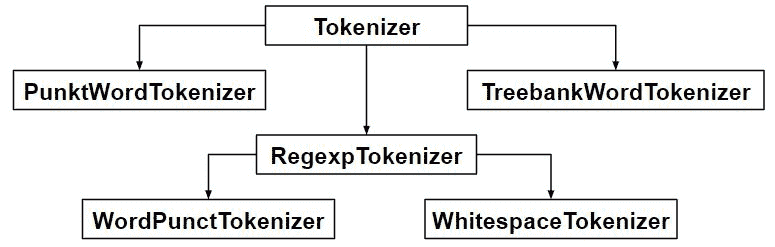

# NLP |标记文本、句子、单词是如何工作的

> 原文:[https://www . geesforgeks . org/NLP-how-token izing-text-句子-word-works/](https://www.geeksforgeeks.org/nlp-how-tokenizing-text-sentence-words-works/)

**自然语言处理(NLP)** 是计算机科学、人工智能、信息工程和人机交互的一个子领域。这个领域的重点是如何编程计算机来处理和分析大量的自然语言数据。这很难执行，因为阅读和理解语言的过程比乍看起来要复杂得多。

**标记化**是将字符串、文本标记化或拆分成标记列表的过程。人们可以把 token 看作像单词是句子中的 token，句子是段落中的 token 这样的部分。

**文章要点–**

*   文本到句子标记化
*   造句成词
*   使用正则表达式标记化的句子



**代码#1:句子标记化–**在段落中拆分句子

```py
from nltk.tokenize import sent_tokenize

text = "Hello everyone. Welcome to GeeksforGeeks. You are studying NLP article"
sent_tokenize(text)
```

**输出:**

```py
['Hello everyone.',
 'Welcome to GeeksforGeeks.',
 'You are studying NLP article']

```

**`sent_tokenize` 是如何工作的？**
`sent_tokenize` 函数使用了一个来自`nltk.tokenize.punkt module`的`PunktSentenceTokenizer`实例，该实例已经过训练，因此非常清楚在什么字符和标点上标记句子的结尾和开头。

**代码# 2:`PunktSentenceTokenizer` –**当我们拥有大量数据时，使用它们是高效的。

```py
import nltk.data

# Loading PunktSentenceTokenizer using English pickle file
tokenizer = nltk.data.load('tokenizers/punkt/PY3/english.pickle')

tokenizer.tokenize(text)
```

**输出:**

```py
['Hello everyone.',
 'Welcome to GeeksforGeeks.',
 'You are studying NLP article']

```

**代码#3:标记不同语言的句子–**除了英语之外，还可以使用不同的 pickle 文件标记不同语言的句子。

```py
import nltk.data

spanish_tokenizer = nltk.data.load('tokenizers/punkt/PY3/spanish.pickle')

text = 'Hola amigo. Estoy bien.'
spanish_tokenizer.tokenize(text)
```

**输出:**

```py
['Hola amigo.', 
 'Estoy bien.']

```

**代码#4:单词标记化–**在一个句子中拆分单词。

```py
from nltk.tokenize import word_tokenize

text = "Hello everyone. Welcome to GeeksforGeeks."
word_tokenize(text)
```

**输出:**

```py
['Hello', 'everyone', '.', 'Welcome', 'to', 'GeeksforGeeks', '.']

```

***word _ tokenize*是如何工作的？**
`word_tokenize()`函数是一个包装函数，在`TreebankWordTokenizer class`的实例上调用 tokenize()。

**代码#5:使用`TreebankWordTokenizer`**

```py
from nltk.tokenize import TreebankWordTokenizer

tokenizer = TreebankWordTokenizer()
tokenizer.tokenize(text)
```

**输出:**

```py
['Hello', 'everyone.', 'Welcome', 'to', 'GeeksforGeeks', '.']

```

这些标记器通过使用标点和空格分隔单词来工作。正如上面的代码输出中提到的，它不会丢弃标点符号，允许用户在预处理时决定如何处理标点符号。

**代码# 6:`PunktWordTokenizer`–**它没有把标点符号和单词分开。

```py
from nltk.tokenize import PunktWordTokenizer

tokenizer = PunktWordTokenizer()
tokenizer.tokenize("Let's see how it's working.")
```

**输出:**

```py
['Let', "'s", 'see', 'how', 'it', "'s", 'working', '.']

```

**代码# 6:`WordPunctTokenizer`–**它将标点符号与单词分开。

```py
from nltk.tokenize import WordPunctTokenizer

tokenizer = WordPunctTokenizer()
tokenizer.tokenize("Let's see how it's working.")
```

**输出:**

```py
['Let', "'", 's', 'see', 'how', 'it', "'", 's', 'working', '.']

```

**代码#7:使用正则表达式**

```py
from nltk.tokenize import RegexpTokenizer

tokenizer = RegexpTokenizer("[\w']+")
text = "Let's see how it's working."
tokenizer.tokenize(text)
```

**输出:**

```py
["Let's", 'see', 'how', "it's", 'working']

```

**代码#7:使用正则表达式**

```py
from nltk.tokenize import regexp_tokenize

text = "Let's see how it's working."
regexp_tokenize(text, "[\w']+")
```

**输出:**

```py
["Let's", 'see', 'how', "it's", 'working']

```