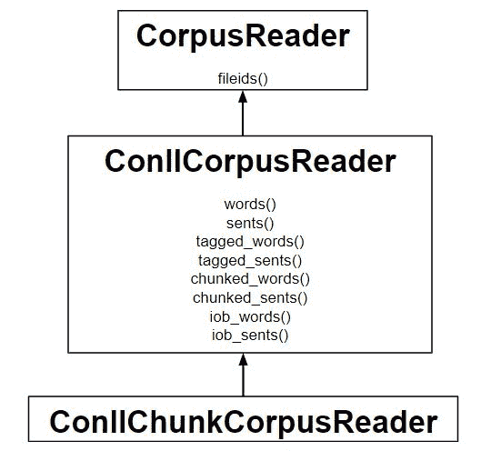

# NLP | IOB 标记

> 原文:[https://www.geeksforgeeks.org/nlp-iob-tags/](https://www.geeksforgeeks.org/nlp-iob-tags/)

**什么是组块？**
词块是由单词组成的，单词的种类是使用词性标签来定义的。一个人甚至可以定义一个模式或单词，它不能成为 chuck 的一部分，这样的单词被称为 chinks。



**什么是 IOB 标签？**
它是组块的一种格式。这些标记类似于词性标记，但可以表示一个组块的内部、外部和开始。这里不仅允许名词短语，还允许多种不同的组块短语类型。
**例:**节选自 **conll2000 文集**。每个单词都有一个词性标签，后面跟一个自己行上的 IOB 标签:

```
Mr. NNP B-NP
Meador NNP I-NP
had VBD B-VP
been VBN I-VP
executive JJ B-NP
vice NN I-NP
president NN I-NP
of IN B-PP
Balcor NNP B-NP
```

**什么意思？**
**B-NP :** 名词短语
**I-NP :** 的开头描述该词在当前名词短语的内部。
**O :** 句尾。
**B-VP 和 I-VP :** 动词短语的开头和内部。
**代码#1:工作原理——使用 IOB 标签对单词进行分块。**

## 蟒蛇 3

```
# Loading the libraries
from nltk.corpus.reader import ConllChunkCorpusReader

# Initializing
reader = ConllChunkCorpusReader(
        '.', r'.*\.iob', ('NP', 'VP', 'PP'))

reader.chunked_words()

reader.iob_words()
```

**输出:**

```
[Tree('NP', [('Mr.', 'NNP'), ('Meador', 'NNP')]), Tree('VP', [('had', 'VBD'), 
('been', 'VBN')]), ...]

[('Mr.', 'NNP', 'B-NP'), ('Meador', 'NNP', 'I-NP'), ...]
```

**代码#2:工作原理——使用 IOB 标签对句子进行分块。**

## 蟒蛇 3

```
# Loading the libraries
from nltk.corpus.reader import ConllChunkCorpusReader

# Initializing
reader = ConllChunkCorpusReader(
        '.', r'.*\.iob', ('NP', 'VP', 'PP'))

reader.chunked_sents()

reader.iob_sents()
```

**输出:**

```
[Tree('S', [Tree('NP', [('Mr.', 'NNP'), ('Meador', 'NNP')]),
Tree('VP', [('had', 'VBD'), ('been', 'VBN')]), 
Tree('NP', [('executive', 'JJ'), ('vice', 'NN'), ('president', 'NN')]),
Tree('PP', [('of', 'IN')]), Tree('NP', [('Balcor', 'NNP')]), ('.', '.')])]

[[('Mr.', 'NNP', 'B-NP'), ('Meador', 'NNP', 'I-NP'), ('had', 'VBD', 'B-VP'), 
('been', 'VBN', 'I-VP'), ('executive', 'JJ', 'B-NP'), ('vice', 'NN', 'I-NP'), 
('president', 'NN', 'I-NP'), ('of', 'IN', 'B-PP'), ('Balcor', 'NNP', 'B-NP'), 
('.', '.', 'O')]]
```

**我们来了解一下上面的代码:**

*   为了阅读 IOB 格式的语料库，使用了 ConllChunkCorpusReader 类。
*   没有段落分隔，每个句子都用一个空行分隔，因此 para_*方法不可用。
*   指定文件中区块类型的元组或列表(如(‘NP’，‘VP’，‘PP’)将作为第三个参数提供给 ConllChunkCorpusReader。
*   iob_words()和 iob_sents()方法返回(word、pos、iob)三元组的列表

**代码#3:树叶–即标记的代币**

## 蟒蛇 3

```
# Loading the libraries
from nltk.corpus.reader import ConllChunkCorpusReader

# Initializing
reader = ConllChunkCorpusReader(
        '.', r'.*\.iob', ('NP', 'VP', 'PP'))

reader.chunked_words()[0].leaves()

reader.chunked_sents()[0].leaves()

reader.chunked_paras()[0][0].leaves()
```

**输出:**

```
[('Earlier', 'JJR'), ('staff-reduction', 'NN'), ('moves', 'NNS')]

[('Earlier', 'JJR'), ('staff-reduction', 'NN'), ('moves', 'NNS'),
('have', 'VBP'), ('trimmed', 'VBN'), ('about', 'IN'), ('300', 'CD'),
('jobs', 'NNS'), (', ', ', '), ('the', 'DT'), ('spokesman', 'NN'),
('said', 'VBD'), ('.', '.')]

[('Earlier', 'JJR'), ('staff-reduction', 'NN'), ('moves', 'NNS'),
('have', 'VBP'), ('trimmed', 'VBN'), ('about', 'IN'), ('300', 'CD'),
('jobs', 'NNS'), (', ', ', '), ('the', 'DT'), ('spokesman', 'NN'),
('said', 'VBD'), ('.', '.')]
```