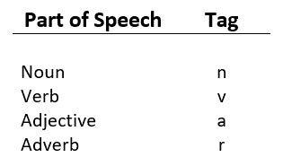
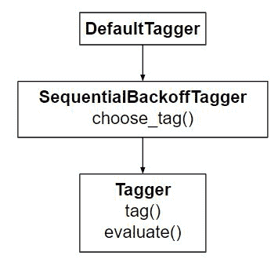

# NLP |词性–默认标注

> 原文:[https://www . geesforgeks . org/NLP-词性-默认-标记/](https://www.geeksforgeeks.org/nlp-part-of-speech-default-tagging/)

**什么是词性标注？**
这是一个将句子转换成形式的过程——单词列表，元组列表(其中每个元组都有一个形式*(单词，标签)*)。的标记是词性标记，表示该词是否是名词、形容词、动词等。

**默认标注**是词性标注的基本步骤。它是使用 DefaultTagger 类执行的。`DefaultTagger class`将‘标签’作为单个参数。 **NN** 是单数名词的标签。`DefaultTagger` 在使用最常见的词性标签时最有用。这就是为什么推荐使用名词标签的原因。



**代码#1:它是如何工作的？**

```py
# Loading Libraries
from nltk.tag import DefaultTagger

# Defining Tag
tagging = DefaultTagger('NN')

# Tagging
tagging.tag(['Hello', 'Geeks'])
```

**输出:**

```py
[('Hello', 'NN'), ('Geeks', 'NN')]

```

每个标记器都有一个`tag()`方法，该方法获取一个标记列表(通常是由单词标记器生成的单词列表)，其中每个标记都是一个单词。`tag()`返回一个标记令牌列表——一组*(单词，标记)*。

**默认标记器是如何工作的？**
是`SequentialBackoffTagger` 的子类，实现`choose_tag()`方法，有三个参数。

*   令牌列表
*   当前标记的索引，以选择标记。
*   先前标签的列表

**代码#2:标注句子**

```py
# Loading Libraries
from nltk.tag import DefaultTagger

# Defining Tag
tagging = DefaultTagger('NN')

tagging.tag_sents([['welcome', 'to', '.'], ['Geeks', 'for', 'Geeks']])
```

**输出:**

```py
[[('welcome', 'NN'), ('to', 'NN'), ('.', 'NN')],
 [('Geeks', 'NN'), ('for', 'NN'), ('Geeks', 'NN')]]

```

**注意:**标记句子列表中的每个标记(在上面的代码中)都是 **NN** ，就像我们使用的`DefaultTagger class`一样。

**代码#3:说明如何卸载。**

```py
from nltk.tag import untag
untag([('Geeks', 'NN'), ('for', 'NN'), ('Geeks', 'NN')])
```

**输出:**

```py
['Geeks', 'for', 'Geeks']

```