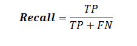

# NLP |用 Regex 进行部分解析

> 原文:[https://www . geesforgeks . org/NLP-partial-parsing-with-regex/](https://www.geeksforgeeks.org/nlp-partial-parsing-with-regex/)

*   定义语法来解析 3 种短语类型。
*   查找可选限定词后跟一个或多个名词的 ChunkRule 类用于名词短语。
*   要在名词块的前面添加一个形容词，可以使用 MergeRule 类。
*   任何一个输入单词都是由介词短语组成的。
*   跟在动词后面的可选语气词(如 should)被组块成动词短语。

**代码#1 :**

```
chunker = RegexpParser(r'''
                       NP:
                           # chunk optional determiner with nouns
                           {<DT>?<NN.*>+}

                           # merge adjective with noun chunk
                           <JJ>{}<NN.*>                            

                       PP:
                           # chunk preposition
                           {<IN>} 
                       VP:
                           # chunk optional modal with verb
                           {<MD>?<VB.*>} ''')

from nltk.corpus import conll2000

score = chunker.evaluate(conll2000.chunked_sents())

print ("Accuracy : ", score.accuracy())
```

**输出:**

```
Accuracy : 0.6148573545757688

```

**treebank_chunk** 语料库是 treebank 语料库的特殊版本，它提供了 chunked_sents()方法。由于其文件格式，常规的树库语料库不能提供这种方法。

**代码#2:使用树库 _ 组块**

```
from nltk.corpus import treebank_chunk

treebank_score = chunker.evaluate(
        treebank_chunk.chunked_sents())

print ("Accuracy : ", treebank_score.accuracy()
```

**输出:**

```
Accuracy : 0.49033970276008493

```

**组块得分度量**
它提供除准确性之外的度量。在组块中
精确表示有多少是正确的。
回忆意味着与总组块数相比，组块人在找到正确组块方面做得有多好。

**代码#3:组块得分度量**

```
print ("Precision : ", score.precision())

print ("\nRecall : ", score.recall())

print ("\nLength for missed one : ", len(score.missed()))

print ("\nLength for incorrect one : ", len(score.incorrect()))

print ("\nLength for correct one : ", len(score.correct()))

print ("\nLength for guessed one : ", len(score.guessed()))
```

**输出:**

```
Precision : 0.60201948127375

Recall : 0.606072502505847

Length for missed one : 47161

Length for incorrect one : 47967

Length for correct one : 119720

Length for guessed one : 120526

```