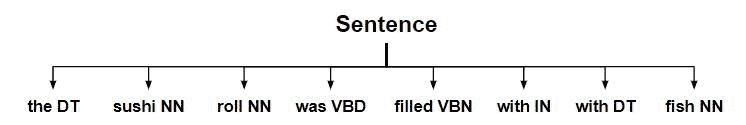
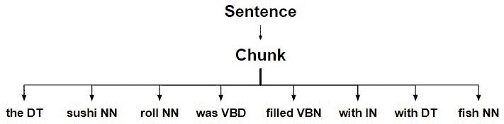
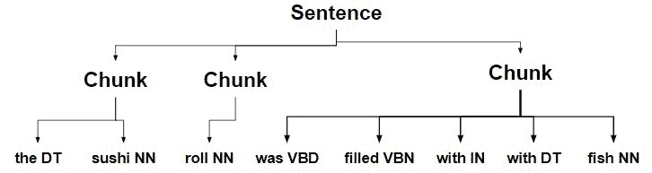
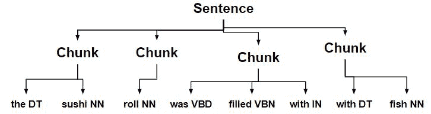

# NLP |拆分和合并组块

> 原文:[https://www . geesforgeks . org/NLP-拆分-合并-组块/](https://www.geeksforgeeks.org/nlp-splitting-and-merging-chunks/)

**SplitRule 类:**它基于为此目的指定的分割模式来分割块。它被指定为<神经网络。* > }{ <。* >即两边被图案包围的两个相对的花括号。

**MergeRule 类:**它基于第一个组块的结束和第二个组块的开始将两个组块合并在一起。它被指定为<神经网络。* > {} <。* >即花括号相向。

### 如何执行这些步骤的示例

*   **Starting with the sentence tree**.
    

*   **Chunking complete sentence**.
    
*   **Chunks are split into multiple chunks**.
    
*   **Chunk with a determiner is split into separate chunks.**
    
*   **以名词结尾的组块与下一个组块合并。**
    

**代码# 1–构建树**

```py
from nltk.chunk import RegexpParser
chunker = RegexpParser(r'''
NP:
{<DT><.*>*<NN.*>}
<NN.*>}{<.*>
<.*>}{<DT>
<NN.*>{}<NN.*>
''')
sent = [('the', 'DT'), ('sushi', 'NN'), ('roll', 'NN'), ('was', 'VBD'), 
        ('filled', 'VBN'), ('with', 'IN'), ('the', 'DT'), ('fish', 'NN')]
chunker.parse(sent)
```

**输出:**

```py
Tree('S', [Tree('NP', [('the', 'DT'), ('sushi', 'NN'), ('roll', 'NN')]), 
Tree('NP', [('was', 'VBD'), ('filled', 'VBN'), ('with', 'IN')]), 
Tree('NP', [('the', 'DT'), ('fish', 'NN')])])

```

**代码# 2–拆分合并**

```py
# Loading Libraries
from nltk.chunk.regexp import ChunkString, ChunkRule, ChinkRule
from nltk.tree import Tree
from nltk.chunk.regexp import MergeRule, SplitRule

# Chunk String
chunk_string = ChunkString(Tree('S', sent))
print ("Chunk String : ", chunk_string)

# Applying Chunk Rule
ur = ChunkRule('<DT><.*>*<NN.*>', 'chunk determiner to noun')
ur.apply(chunk_string)
print ("\nApplied ChunkRule : ", chunk_string)

# Splitting
sr1 = SplitRule('<NN.*>', '<.*>', 'split after noun')
sr1.apply(chunk_string)
print ("\nSplitting Chunk String : ", chunk_string)

sr2 = SplitRule('<.*>', '<DT>', 'split before determiner')
sr2.apply(chunk_string)
print ("\nFurther Splitting Chunk String : ", chunk_string)

# Merging
mr = MergeRule('<NN.*>', '<NN.*>', 'merge nouns')
mr.apply(chunk_string)
print ("\nMerging Chunk String : ", chunk_string)

# Back to Tree
chunk_string.to_chunkstruct()
```

**输出:**

```py
Chunk String :   <DT>  <NN>  <NN>  <VBD>  <VBN>  <IN>  <DT>  <NN> 

Applied ChunkRule :  {<DT>  <NN>  <NN>  <VBD>  <VBN>  <IN>  <DT>  <NN>}

Splitting Chunk String :  {<DT>  <NN>}{<NN>}{<VBD>  <VBN>  <IN>  <DT>  <NN>}

Further Splitting Chunk String :  {<DT>  <NN>}{<NN>}{<VBD>  <VBN>  <IN>}{<DT>  <NN>}

Merging Chunk String :  {<DT>  <NN>  <NN>}{<VBD>  <VBN>  <IN>}{<DT>  <NN>}

Tree('S', [Tree('CHUNK', [('the', 'DT'), ('sushi', 'NN'), ('roll', 'NN')]), 
          Tree('CHUNK', [('was', 'VBD'), ('filled', 'VBN'), ('with', 'IN')]), 
          Tree('CHUNK', [('the', 'DT'), ('fish', 'NN')])])

```