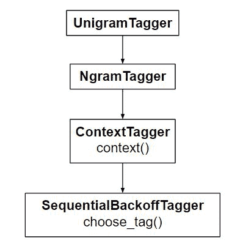

# NLP |训练 Unigram Tagger

> 原文:[https://www.geeksforgeeks.org/nlp-training-unigram-tagger/](https://www.geeksforgeeks.org/nlp-training-unigram-tagger/)

单个令牌被称为 ***Unigram*** ，例如–hello；电影；编码。本文聚焦于 **unigram tagger** 。

**Unigram Tagger:** 为了确定词性标签，它只使用一个单词。`UnigramTagger` 继承自`ContextTagger`的子类 NgramTagger，后者继承自`SequentialBackoffTagger`。所以，`UnigramTagger` 是一个基于单个单词上下文的标记器。



**代码#1 :** 训练 UnigramTagger。

```py
# Loading Libraries
from nltk.tag import UnigramTagger
from nltk.corpus import treebank
```

**代码#2 :** 使用树库语料库的前 1000 个标记句子作为数据进行训练。

```py
# Using data
train_sents = treebank.tagged_sents()[:1000]

# Initializing
tagger = UnigramTagger(train_sents)

# Lets see the first sentence 
# (of the treebank corpus) as list   
treebank.sents()[0]
```

**输出:**

```py
['Pierre',
 'Vinken',
 ', ',
 '61',
 'years',
 'old',
 ', ',
 'will',
 'join',
 'the',
 'board',
 'as',
 'a',
 'nonexecutive',
 'director',
 'Nov.',
 '29',
 '.']

```

**代码#3 :** 训练后查找标记结果。

```py
tagger.tag(treebank.sents()[0])
```

**输出:**

```py
[('Pierre', 'NNP'),
 ('Vinken', 'NNP'),
 (', ', ', '),
 ('61', 'CD'),
 ('years', 'NNS'),
 ('old', 'JJ'),
 (', ', ', '),
 ('will', 'MD'),
 ('join', 'VB'),
 ('the', 'DT'),
 ('board', 'NN'),
 ('as', 'IN'),
 ('a', 'DT'),
 ('nonexecutive', 'JJ'),
 ('director', 'NN'),
 ('Nov.', 'NNP'),
 ('29', 'CD'),
 ('.', '.')]

```

**代码是如何工作的？**
`UnigramTagger` 从标记句子列表中构建上下文模型。因为*unigrammatagger*是从`ContextTagger`继承的，所以它必须实现一个`context()`方法，而不是提供一个`choose_tag()`方法，该方法采用相同的三个参数 a `choose_tag()`。上下文令牌用于创建模型，并在模型创建后查找最佳标签。这在上图中也有图解说明。

**覆盖上下文模型–**
所有标记者，从`ContextTagger` 继承而不是训练自己的模型，可以采用预先构建的模型。这个模型只是一个 Python 字典，将上下文关键字映射到一个标签。上下文关键字(在 UnigramTagger 的情况下是单个单词)将取决于`ContextTagger subclass`从其`context()`方法返回的内容。

**代码#4 :** 覆盖上下文模型

```py
tagger = UnigramTagger(model ={'Pierre': 'NN'})

tagger.tag(treebank.sents()[0])
```

**输出:**

```py
[('Pierre', 'NN'),
 ('Vinken', None),
 (', ', None),
 ('61', None),
 ('years', None),
 ('old', None),
 (', ', None),
 ('will', None),
 ('join', None),
 ('the', None),
 ('board', None),
 ('as', None),
 ('a', None),
 ('nonexecutive', None),
 ('director', None),
 ('Nov.', None),
 ('29', None),
 ('.', None)]

```