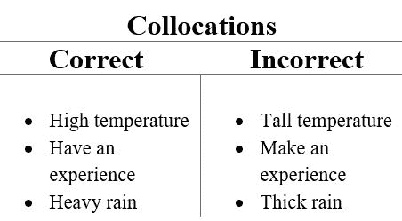

# NLP |词语搭配

> 原文:[https://www.geeksforgeeks.org/nlp-word-collocations/](https://www.geeksforgeeks.org/nlp-word-collocations/)

**搭配**是两个或多个经常一起出现的词，例如–*美国*。还有很多其他词可以排在联合之后，比如英国和联合航空。如同自然语言处理的许多方面一样，上下文是非常重要的。而对于搭配来说，语境就是一切。
在搭配的情况下，上下文将是单词列表形式的文档。在这个单词列表中发现搭配意味着找到在整个文本中频繁出现的常用短语。


**数据链接–**[巨蟒与圣杯剧本](https://github.com/teropa/nlp/blob/master/resources/corpora/webtext/grail.txt)

**代码#1:加载库**

```py
from nltk.corpus import webtext

# use to find bigrams, which are pairs of words
from nltk.collocations import BigramCollocationFinder
from nltk.metrics import BigramAssocMeasures
```

**代码#2 :** 让我们找到搭配

```py
# Loading the data 
words = [w.lower() for w in webtext.words(
    'C:\\Geeksforgeeks\\python_and_grail.txt')]

biagram_collocation = BigramCollocationFinder.from_words(words)
biagram_collocation.nbest(BigramAssocMeasures.likelihood_ratio, 15)
```

**输出:**

```py
[("'", 's'),
 ('arthur', ':'),
 ('#', '1'),
 ("'", 't'),
 ('villager', '#'),
 ('#', '2'),
 (']', '['),
 ('1', ':'),
 ('oh', ', '),
 ('black', 'knight'),
 ('ha', 'ha'),
 (':', 'oh'),
 ("'", 're'),
 ('galahad', ':'),
 ('well', ', ')]

```

正如我们在上面的代码中看到的，以这种方式查找位置不是很有用。因此，下面的代码是一个改进的版本，添加了一个单词过滤器来删除标点符号和停止单词。

**代码#3 :**

```py
from nltk.corpus import stopwords

stopset = set(stopwords.words('english'))
filter_stops = lambda w: len(w) < 3 or w in stopset

biagram_collocation.apply_word_filter(filter_stops)
biagram_collocation.nbest(BigramAssocMeasures.likelihood_ratio, 15)
```

**输出:**

```py
[('black', 'knight'),
 ('clop', 'clop'),
 ('head', 'knight'),
 ('mumble', 'mumble'),
 ('squeak', 'squeak'),
 ('saw', 'saw'),
 ('holy', 'grail'),
 ('run', 'away'),
 ('french', 'guard'),
 ('cartoon', 'character'),
 ('iesu', 'domine'),
 ('pie', 'iesu'),
 ('round', 'table'),
 ('sir', 'robin'),
 ('clap', 'clap')]

```

**它在代码中是如何工作的？**

*   **bigrammocolympicfinder**构建两个频率分布:
    *   每个单词一个
    *   另一个是大人物。
*   频率分布基本上是一个增强的 Python 字典，其中键是被计数的内容，值是计数。
*   任何过滤功能都通过消除任何未通过过滤的单词来减小大小
*   使用过滤功能来消除所有一个或两个字符的单词和所有英语停用单词，会产生更干净的结果。
*   过滤后，搭配查找器就可以查找搭配了。

**代码#4 :** 处理三胞胎而不是对。

```py
# Loading Libraries
from nltk.collocations import TrigramCollocationFinder
from nltk.metrics import TrigramAssocMeasures

# Loading data - text file
words = [w.lower() for w in webtext.words(
    'C:\Geeksforgeeks\\python_and_grail.txt')]

trigram_collocation = TrigramCollocationFinder.from_words(words)
trigram_collocation.apply_word_filter(filter_stops)
trigram_collocation.apply_freq_filter(3)

trigram_collocation.nbest(TrigramAssocMeasures.likelihood_ratio, 15)
```

**输出:**

```py
[('clop', 'clop', 'clop'),
 ('mumble', 'mumble', 'mumble'),
 ('squeak', 'squeak', 'squeak'),
 ('saw', 'saw', 'saw'),
 ('pie', 'iesu', 'domine'),
 ('clap', 'clap', 'clap'),
 ('dona', 'eis', 'requiem'),
 ('brave', 'sir', 'robin'),
 ('heh', 'heh', 'heh'),
 ('king', 'arthur', 'music'),
 ('hee', 'hee', 'hee'),
 ('holy', 'hand', 'grenade'),
 ('boom', 'boom', 'boom'),
 ('...', 'dona', 'eis'),
 ('already', 'got', 'one')]

```