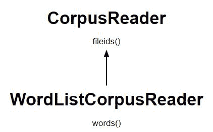

# NLP \ word list 语料库

> 原文:[https://www.geeksforgeeks.org/nlp-wordlist-corpus/](https://www.geeksforgeeks.org/nlp-wordlist-corpus/)

**什么是语料库？**
语料库可以定义为文本文档的集合。它可以被认为只是一个目录中的一堆文本文件，通常与文本文件的许多其他目录放在一起。

**如何创建词表语料库？**

*   它是最简单的公司阅读器类之一。*   此类提供对包含单词列表或每行一个单词的文件的访问*   Wordlist 文件可以是一个 CSV 文件或一个 txt 文件，每行有一个单词。在我们的**词表文件**

    ```py
    we have added : 
    geeks
    for
    geeks
    welcomes
    you
    to
    nlp
    articles
    ```

    *   给出两个论据*   包含文件的目录路径*   list of filenames

    **代码#1:创建单词列表语料库**

    ```py
    from nltk.corpus.reader import WordListCorpusReader
    x = WordListCorpusReader('.', ['C:\\Users\\dell\\Desktop\\wordlist.txt'])
    x.words()

    x.fileids()
    ```

    **输出:**

    ```py
    ['geeks', 'for', 'geeks', 'welcomes', 'you', 'to', 'nlp', 'articles']

    ['C:\\Users\\dell\\Desktop\\wordlist.txt']

    ```

    

    **代码#2:访问原始数据。**

    ```py
    x.raw()

    from nltk.tokenize import line_tokenize
    print ("Wordlist : ", line_tokenize(x.raw()))
    ```

    **输出:**

    ```py
    'geeks\r\nfor\r\ngeeks\r\nwelcomes\r\nyou\r\nto\r\nnlp\r\narticles'

    Wordlist : ['geeks', 'for', 'geeks', 'welcomes', 'you', 'to', 'nlp', 'articles']
    ```

    **代码#3:访问姓名词表语料库**

    ```py
    # Accessing pre-defined wordlist
    from nltk.corpus import names

    print ("Path : ", names.fileids())

    print ("\nNo. of female names : ", len(names.words('female.txt')))

    print ("\nNo. of male names : ", len(names.words('male.txt')))
    ```

    **输出:**

    ```py
    Path :  ['female.txt', 'male.txt']

    No. of female names :  5001

    No. of male names :  2943
    ```

    **代码#4:访问英语词表语料库**

    ```py
    # Accessing pre-defined wordlist
    from nltk.corpus import words

    print ("File : ", words.fileids())

    print ("\nNo. of female names : ", len(words.words('en-basic')))

    print ("\nNo. of male names : ", len(words.words('en')))
    ```

    **输出:**

    ```py
    File :  ['en', 'en-basic']

    No. of female names :  850

    No. of male names :  235886
    ```