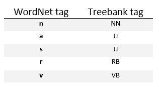

# 用于标注的 NLP | WordNet】

> 原文:[https://www.geeksforgeeks.org/nlp-wordnet-for-tagging/](https://www.geeksforgeeks.org/nlp-wordnet-for-tagging/)

WordNet 是专门为自然语言处理设计的词汇数据库，即英语词典。



**代码#1:创建类在 WordNet 中查找单词。**

```
from nltk.tag import SequentialBackoffTagger
from nltk.corpus import wordnet
from nltk.probability import FreqDist

class WordNetTagger(SequentialBackoffTagger):

    '''
    >>> wt = WordNetTagger()
    >>> wt.tag(['food', 'is', 'great'])
    [('food', 'NN'), ('is', 'VB'), ('great', 'JJ')]
    '''

    def __init__(self, *args, **kwargs):

        SequentialBackoffTagger.__init__(self, *args, **kwargs)
        self.wordnet_tag_map = {
        'n': 'NN',
        's': 'JJ',
        'a': 'JJ',
        'r': 'RB',
        'v': 'VB'
        }

    def choose_tag(self, tokens, index, history):

    word = tokens[index]
    fd = FreqDist()

    for synset in wordnet.synsets(word):
        fd[synset.pos()] += 1

    return self.wordnet_tag_map.get(fd.max())
```

这个 WordNetTagger 类将计算一个单词在 Synsets 中找到的每个 POS 标签的数量，然后，最常见的标签是使用内部映射的 treebank 标签。

**代码#2:使用简单的 WordNetTagger()**

```
from taggers import WordNetTagger
from nltk.corpus import treebank

# Initializing
default_tag = DefaultTagger('NN')

# initializing training and testing set    
train_data = treebank.tagged_sents()[:3000]
test_data = treebank.tagged_sents()[3000:]

wn_tagging = WordNetTagger()
a = wn_tagger.evaluate(test_data)

print ("Accuracy of WordNetTagger : ", a)
```

**输出:**

```
Accuracy of WordNetTagger : 0.17914876598160262

```

使用代码 3，我们可以提高准确性。
**代码#3:位于 NgramTagger 回退链末端的 WordNetTagger 类**

```
from taggers import WordNetTagger
from nltk.corpus import treebank
from tag_util import backoff_tagger
from nltk.tag import UnigramTagger, BigramTagger, TrigramTagger

# Initializing
default_tag = DefaultTagger('NN')

# initializing training and testing set    
train_data = treebank.tagged_sents()[:3000]
test_data = treebank.tagged_sents()[3000:]

tagger = backoff_tagger(train_data,
                        [UnigramTagger, BigramTagger,
                         TrigramTagger], backoff = wn_tagger)

a = tagger.evaluate(test_data)

print ("Accuracy : ", a)
```

**输出:**

```
Accuracy : 0.8848262464925534

```