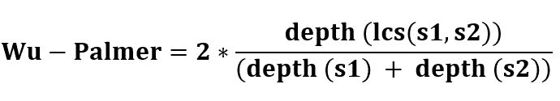

# NLP | Wu palm er–WordNet 相似度

> 原文:[https://www . geesforgeks . org/NLP-Wu palm er-wordnet-similarity/](https://www.geeksforgeeks.org/nlp-wupalmer-wordnet-similarity/)

*****吴&帕相似度*** 如何起作用？
它通过考虑 WordNet 分类法中两个同集合的深度以及 LCS(最小公共包含者)的深度来计算相关性。** 

****

**分数可以是 0 < score <= 1\. The score can never be zero because the depth of the LCS is never zero (the depth of the root of taxonomy is one). 
它根据词义的相似程度以及同音异义词在超音树中相对于彼此出现的位置来计算相似度。
**代码#1:介绍 synset**** 

## **蟒蛇 3**

```py
from nltk.corpus import wordnet

syn1 = wordnet.synsets('hello')[0]
syn2 = wordnet.synsets('selling')[0]

print ("hello name :  ", syn1.name())
print ("selling name :  ", syn2.name())
```

****输出:**** 

```py
hello name :   hello.n.01
selling name :   selling.n.01
```

 ****代码#2:吴相似度**** 

## **蟒蛇 3**

```py
syn1.wup_similarity(syn2)
```

****输出:**** 

```py
0.26666666666666666
```

***你好*和*卖*明显有 27%相似！这是因为它们在两者之间有共同的上位名。

**代码#3:我们来检查一下中间的上位词。**** 

## **蟒蛇 3**

```py
sorted(syn1.common_hypernyms(syn2))
```

****输出:**** 

```py
[Synset('abstraction.n.06'), Synset('entity.n.01')]
```

**用于计算相似性的核心指标之一是最短路径，即两个 Synsets 和它们的共同上音之间的距离。

**代码#4:我们来了解一下 hypernerm 的用法。**** 

## **蟒蛇 3**

```py
ref = syn1.hypernyms()[0]
print ("Self comparison : ",
       syn1.shortest_path_distance(ref))

print ("Distance of hello from greeting : ",
       syn1.shortest_path_distance(syn2))

print ("Distance of greeting from hello : ",
       syn2.shortest_path_distance(syn1))
```

****输出:**** 

```py
Self comparison :  1
Distance of hello from greeting :  11
Distance of greeting from hello :  11
```

****注:**相似度得分很高，即因为不太相似，所以相距很多步。这里提到的代码使用“名词”，但人们可以使用任何词性。**