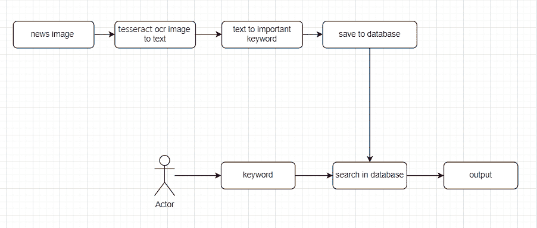

# 项目构想——使用 NLP

从旧报纸上搜索新闻

> 原文:[https://www . geesforgeks . org/project-idea-search-news-from-old-press-use-NLP/](https://www.geeksforgeeks.org/project-idea-searching-news-from-old-newspaper-using-nlp/)

我们知道报纸是丰富的知识来源。当一个人需要某个特定话题或主题的一些信息时，他会在网上搜索，但很难从**地区地方报纸**上获得与我们搜索相关的所有旧新闻文章。因为不是每个地方报纸都提供在线搜索。在这篇文章中，我们将提出一个解决这个问题的想法。

## 什么项目？

*   本项目使用旧区域报纸的**图像或报纸图像**的 pdf 作为数据库的输入。
*   该模型将使用 **Pytesseract 从图像中提取文本。**
*   《侏儒怪》中的文字将会被 **NLP** 的实践所清理，以简化和消除对我们没有帮助的词语(**停止词语**)。
*   数据将以**键值对**的形式保存，其中键有图像路径，值在图像中有关键字。
*   **搜索**:当用户访问网站时，他会在搜索框中键入主题名称或实体名称，然后报纸的图像会加载到屏幕上。

## 为什么是 NLP？

报纸文章包含许多文章、介词和其他对我们没有用的停止词，所以 NLP 帮助我们删除那些停止词。这也有助于获得独特的词汇。

### 使用的技术:

*   我是 NLTK
*   计算机编程语言

### 使用的工具:

*   Google colab

### **使用的库:**

*   **侏儒:**图像转文字。
*   **NLTK:** 文本预处理，过滤。
*   **熊猫:**储存数据帧。

## 用例图



## 逐步实施:

#### 库安装

首先，在 colab 上安装所需的库。

## 蟒蛇 3

```
!pip install nltk
!pip install pytesseract

!sudo apt install tesseract-ocr

# to check if it installed properly
# !which tesseract
# pytesseract.pytesseract.tesseract_cmd = (
#     r'/usr/bin/tesseract'
# )
```

让我们导入所有必要的库:

## 蟒蛇 3

```
import io
import glob
import os
from PIL import Image
import cv2
import pytesseract 
# /usr/bin/tesseract
import pandas as pd
import nltk
nltk.download('popular')
nltk.download('stopwords')
nltk.download('wordnet')
from nltk.tokenize import RegexpTokenizer
from nltk.corpus import stopwords
from nltk.stem.wordnet import WordNetLemmatizer
from IPython.display import Image
from google.colab.patches import cv2_imshow
```

### 前置功能

这将清理文本以获得重要的名称、关键词等。停止词和重复词被下面的函数删除。

## 蟒蛇 3

```
def pre(text):
    text = text.lower()
    tokenizer = RegexpTokenizer(r'\w+')
    new_words = tokenizer.tokenize(text)
    stop_words = list(stopwords.words("english"))
    filtered_words = []

    for w in new_words:
        if w not in stop_words:
            filtered_words.append(w)
    unique = []

    for w in filtered_words:
        if w not in unique:
            unique.append(w)
    res = ' '.join([str(elem) for elem in unique])
    res = res.lower()

    return res
```

### to_df 函数

当给定图像路径作为参数时，它返回文本变量中的预处理文本。然后，该文本作为参数传递给 pre()。这个函数返回带有文件名和重要文本的字典。

## 计算机编程语言

```
def to_df(imgno):
  text = pytesseract.image_to_string(imgno)
  out = pre(text)
  data = {'filename':imgno,
          'text':out}
  return data
```